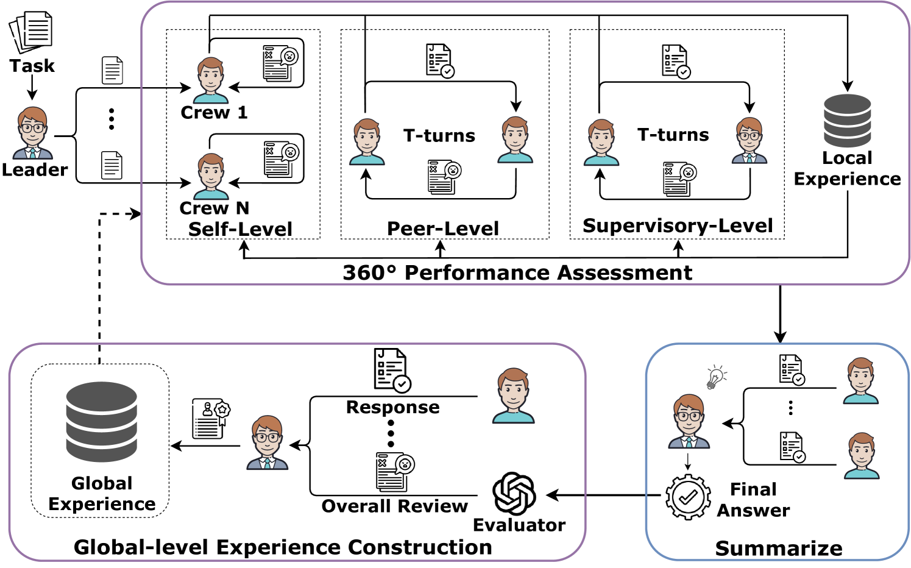

# 360°REA：迈向为多智能体系统打造可复用的经验累积，辅以全方位的评估。

发布时间：2024年04月08日

`Agent` `人工智能` `企业管理`

> 360°REA: Towards A Reusable Experience Accumulation with 360° Assessment for Multi-Agent System

# 摘要

> 大型语言模型代理在多样化的复杂任务上取得了显著的进展。最新研究或致力于优化团队协作，或通过自我反思来逐步攻克难题。鉴于这些代理均建立在同一语言模型之上，单纯的自我评估或淘汰表现欠佳的代理，并不能根本提升整体性能。我们提出，通过全面评估和积累反馈经验，可以有效提升系统效能。本文介绍了一种名为360°全方位评估的经验累积框架（360°REA），该框架借鉴了企业组织结构的实践，采用创新的360°绩效评估方法，实现多角度细致评估。为了提升代理处理复杂任务的能力，我们设计了双层经验池，让代理能够通过细致的评估积累经验。通过在复杂任务数据集上的广泛测试，360°REA的卓越效果得到了验证。

> Large language model agents have demonstrated remarkable advancements across various complex tasks. Recent works focus on optimizing the agent team or employing self-reflection to iteratively solve complex tasks. Since these agents are all based on the same LLM, only conducting self-evaluation or removing underperforming agents does not substantively enhance the capability of the agents. We argue that a comprehensive evaluation and accumulating experience from evaluation feedback is an effective approach to improving system performance. In this paper, we propose Reusable Experience Accumulation with 360° Assessment (360°REA), a hierarchical multi-agent framework inspired by corporate organizational practices. The framework employs a novel 360° performance assessment method for multi-perspective performance evaluation with fine-grained assessment. To enhance the capability of agents in addressing complex tasks, we introduce dual-level experience pool for agents to accumulate experience through fine-grained assessment. Extensive experiments on complex task datasets demonstrate the effectiveness of 360°REA.

[Arxiv](https://arxiv.org/abs/2404.05569)