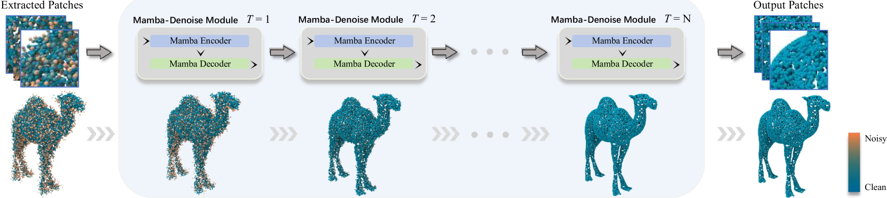
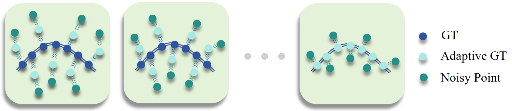
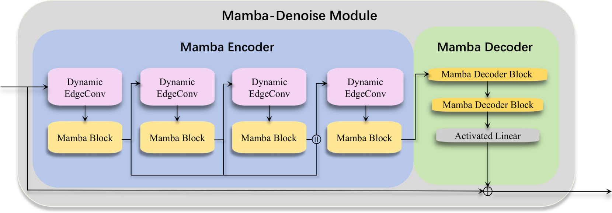
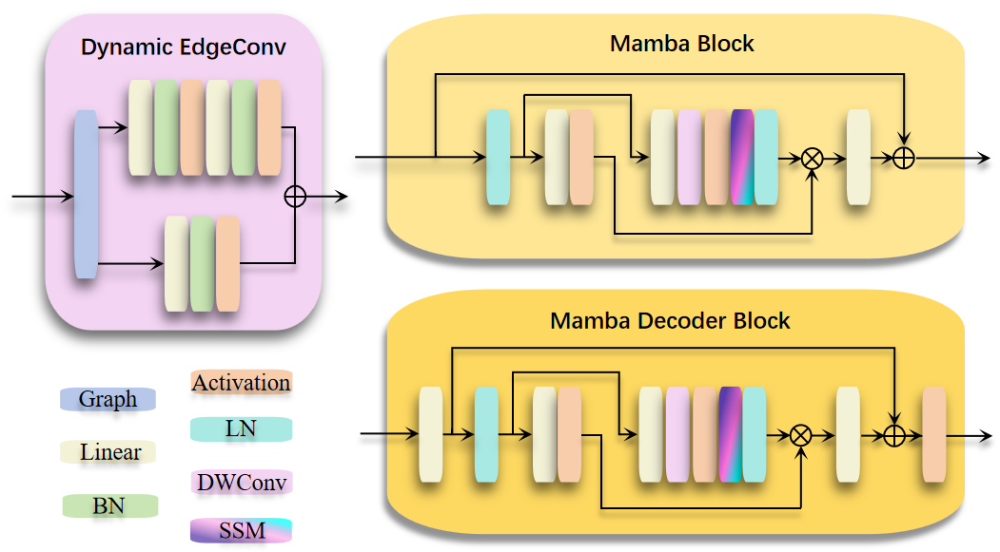
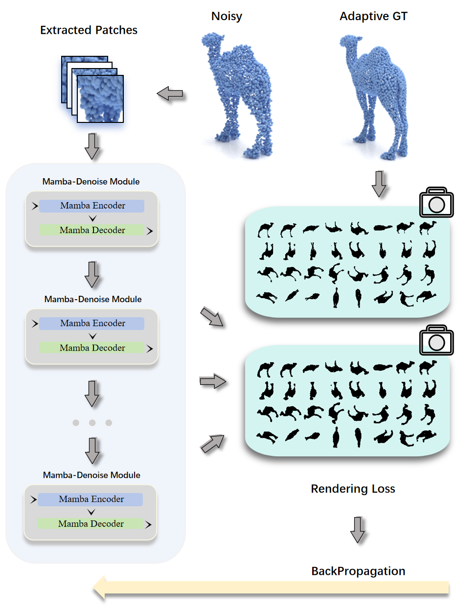
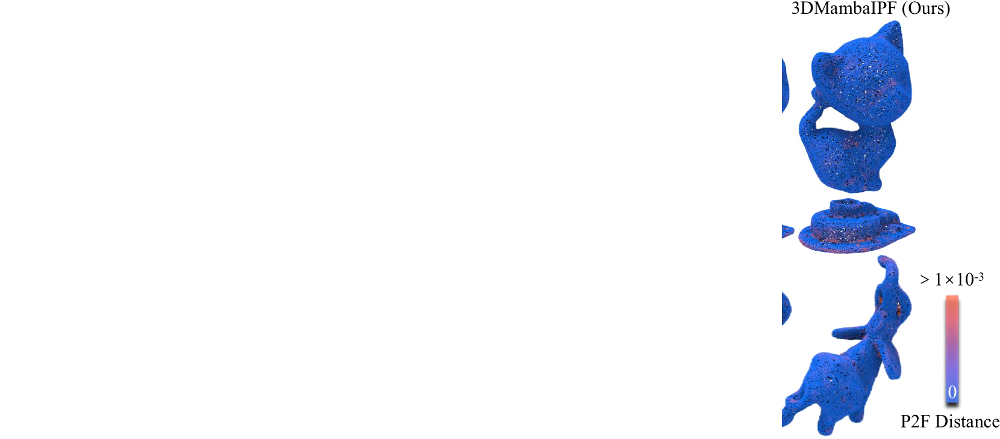
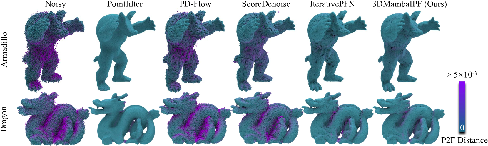
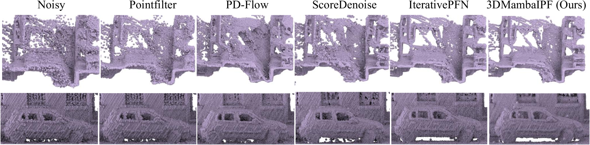

# 3DMambaIPF：一种利用可微渲染技术实现迭代点云滤波的状态空间模型。

发布时间：2024年04月08日

`RAG` `3D视觉` `点云处理`

> 3DMambaIPF: A State Space Model for Iterative Point Cloud Filtering via Differentiable Rendering

# 摘要

> 点云采集中的噪声问题不可避免，因此过滤成为了3D视觉领域的核心任务。尽管现有的基于学习的方法在处理小规模数据集时展现出潜力，但在面对海量点云时，它们的效能受限。这主要是因为这些方法在大规模数据去噪上的能力不足，并且在去噪过程中容易产生噪声异常。受自然语言处理中状态空间模型（SSMs）的启发，我们提出了3DMambaIPF，首次采用Mamba（选择性SSM）架构，以顺序处理大型场景中的海量点云，充分发挥其在筛选性输入处理和长序列建模方面的优势。我们还整合了一种强大且高效的可微分渲染损失，以精准约束表面附近的噪声点。与传统方法相比，这种渲染损失不仅提升了去噪后几何结构的视觉真实度，还使得点云边界与实物边界更为吻合。在包含多达50K点的小规模合成和真实世界模型数据集上的广泛测试显示，我们的方法已达到业界领先水平。此外，我们还证明了在约500K点的大规模模型上，我们的方法在可伸缩性和效率方面远超现有的学习型去噪方法。

> Noise is an inevitable aspect of point cloud acquisition, necessitating filtering as a fundamental task within the realm of 3D vision. Existing learning-based filtering methods have shown promising capabilities on small-scale synthetic or real-world datasets. Nonetheless, the effectiveness of these methods is constrained when dealing with a substantial quantity of point clouds. This limitation primarily stems from their limited denoising capabilities for large-scale point clouds and their inclination to generate noisy outliers after denoising. The recent introduction of State Space Models (SSMs) for long sequence modeling in Natural Language Processing (NLP) presents a promising solution for handling large-scale data. Encouraged by iterative point cloud filtering methods, we introduce 3DMambaIPF, firstly incorporating Mamba (Selective SSM) architecture to sequentially handle extensive point clouds from large scenes, capitalizing on its strengths in selective input processing and long sequence modeling capabilities. Additionally, we integrate a robust and fast differentiable rendering loss to constrain the noisy points around the surface. In contrast to previous methodologies, this differentiable rendering loss enhances the visual realism of denoised geometric structures and aligns point cloud boundaries more closely with those observed in real-world objects. Extensive evaluation on datasets comprising small-scale synthetic and real-world models (typically with up to 50K points) demonstrate that our method achieves state-of-the-art results. Moreover, we showcase the superior scalability and efficiency of our method on large-scale models with about 500K points, where the majority of the existing learning-based denoising methods are unable to handle.

[Arxiv](https://arxiv.org/abs/2404.05522)