# AEGIS：融合多位大型语言模型专家，实现在线智能内容安全调节与适应性优化

发布时间：2024年04月08日

`LLM应用` `内容安全` `生成性AI`

> AEGIS: Online Adaptive AI Content Safety Moderation with Ensemble of LLM Experts

# 摘要

> 随着大型语言模型和生成性AI技术的广泛应用，其潜在的内容安全风险也日益凸显。目前，我们面临一个显著问题：缺乏全面涵盖关键安全领域的高质量内容安全数据集和基准。为此，我们构建了一个全面的内容安全风险分类体系，涵盖了13个主要风险类别和9个稀疏风险类别。同时，我们创建了AEGISSAFETYDATASET，这是一个包含26,000个人类与LLM互动样本的新数据集，每个样本都配有符合分类体系的人工注释。我们打算将此数据集开放给研究社区，以推动LLM安全性研究并建立相应的基准。为验证数据集的有效性，我们对多个基于LLM的安全模型进行了指令微调。我们的模型（名为AEGISSAFETYEXPERTS）不仅在性能上超越或匹敌现有的顶尖安全模型，还能在多种攻击尝试中保持稳定。此外，我们在模型对齐阶段引入AEGISSAFETYDATASET，证实其不会影响模型在机器翻译基准测试上的表现。我们还引入了AEGIS，这是一种创新的在线适应框架，拥有坚实的理论支持，能够在实际部署中有效地整合LLM内容安全专家的力量进行内容审核。

> As Large Language Models (LLMs) and generative AI become more widespread, the content safety risks associated with their use also increase. We find a notable deficiency in high-quality content safety datasets and benchmarks that comprehensively cover a wide range of critical safety areas. To address this, we define a broad content safety risk taxonomy, comprising 13 critical risk and 9 sparse risk categories. Additionally, we curate AEGISSAFETYDATASET, a new dataset of approximately 26, 000 human-LLM interaction instances, complete with human annotations adhering to the taxonomy. We plan to release this dataset to the community to further research and to help benchmark LLM models for safety. To demonstrate the effectiveness of the dataset, we instruction-tune multiple LLM-based safety models. We show that our models (named AEGISSAFETYEXPERTS), not only surpass or perform competitively with the state-of-the-art LLM-based safety models and general purpose LLMs, but also exhibit robustness across multiple jail-break attack categories. We also show how using AEGISSAFETYDATASET during the LLM alignment phase does not negatively impact the performance of the aligned models on MT Bench scores. Furthermore, we propose AEGIS, a novel application of a no-regret online adaptation framework with strong theoretical guarantees, to perform content moderation with an ensemble of LLM content safety experts in deployment

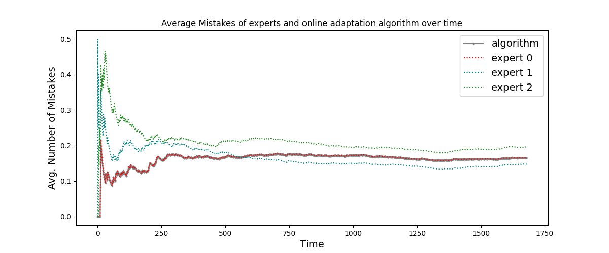

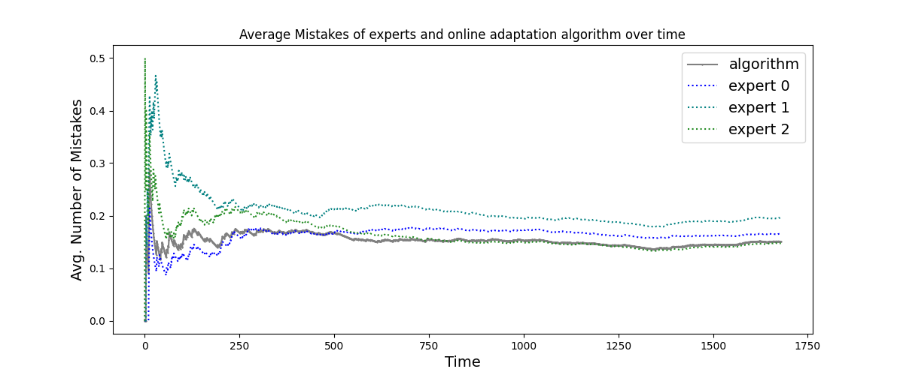

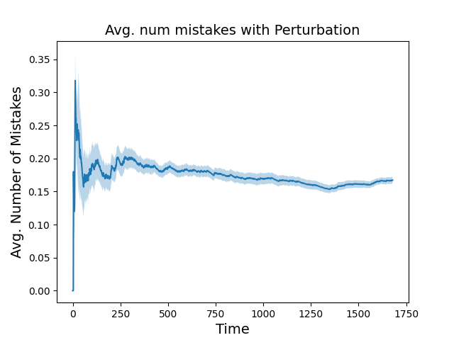

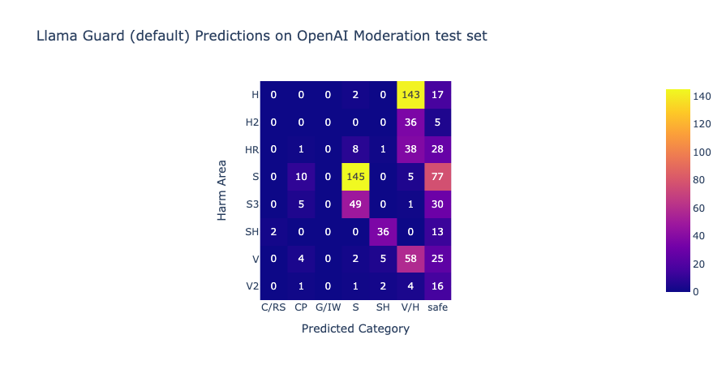

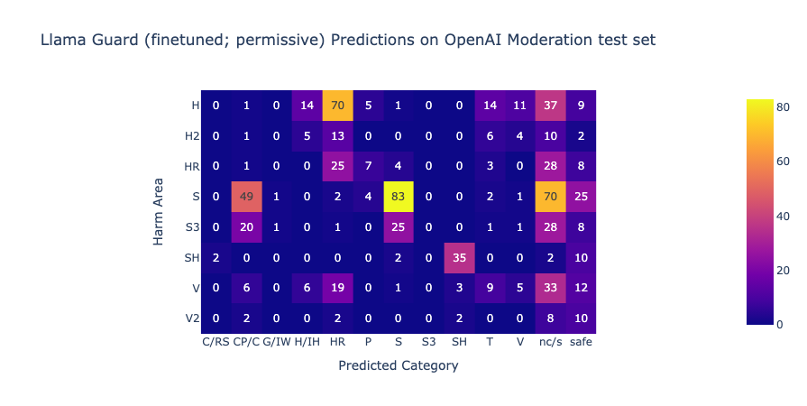

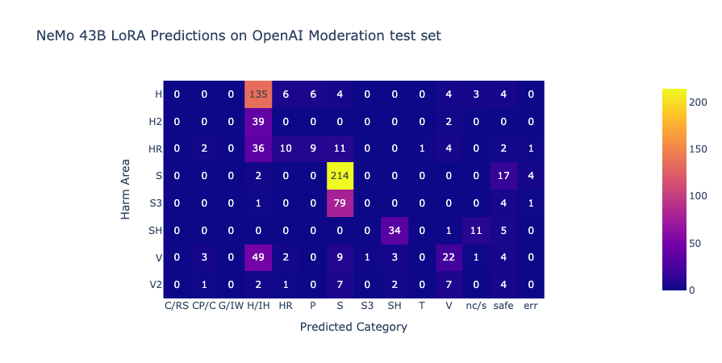

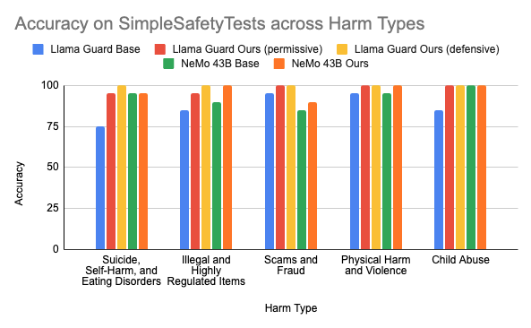

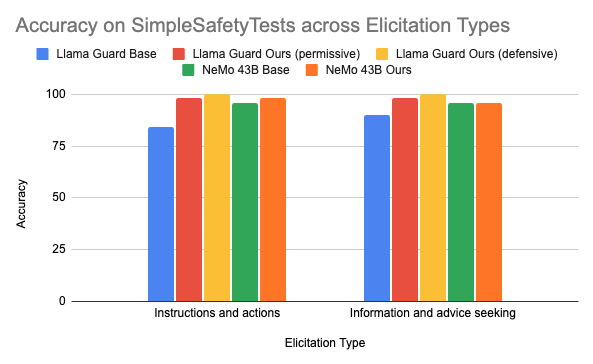

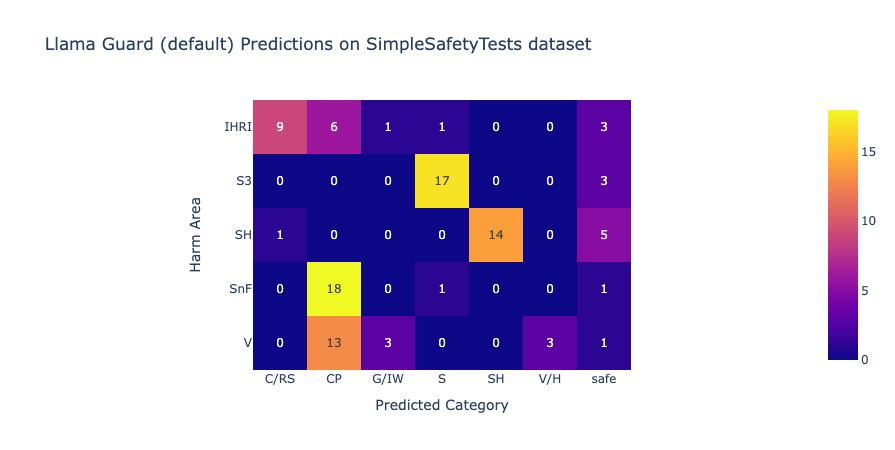

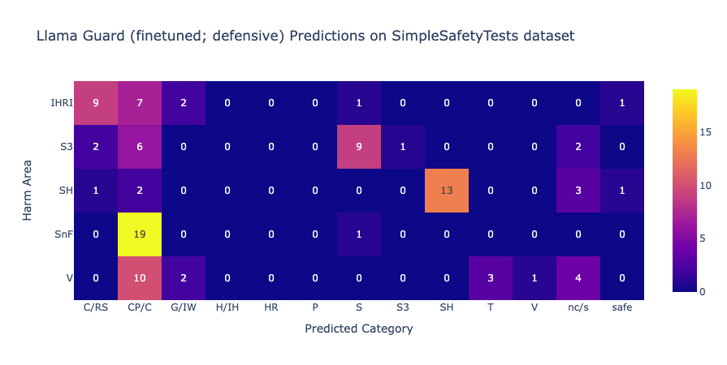

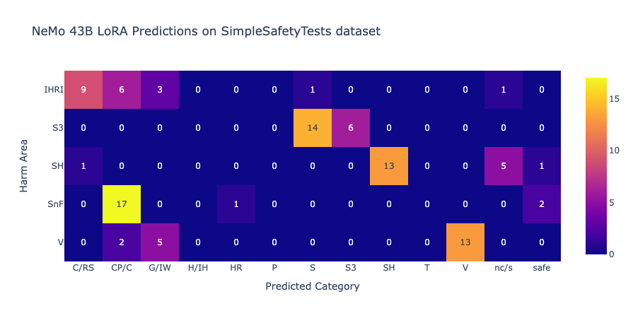

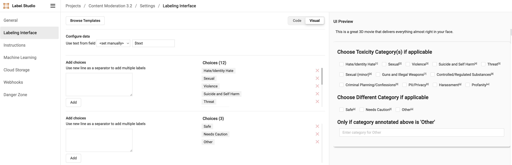

[Arxiv](https://arxiv.org/abs/2404.05993)