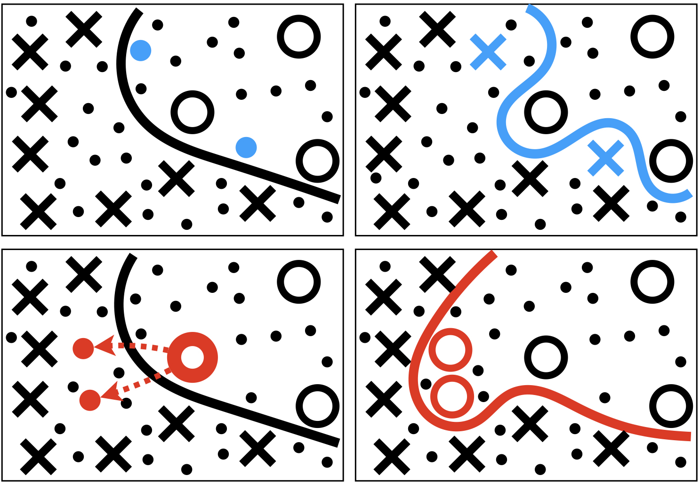
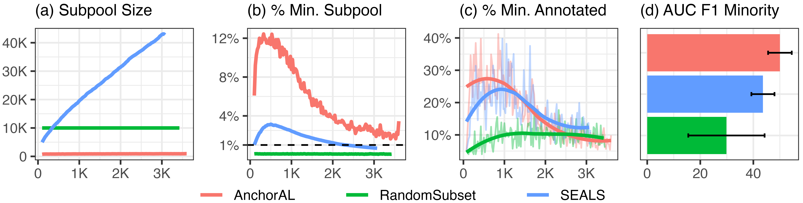
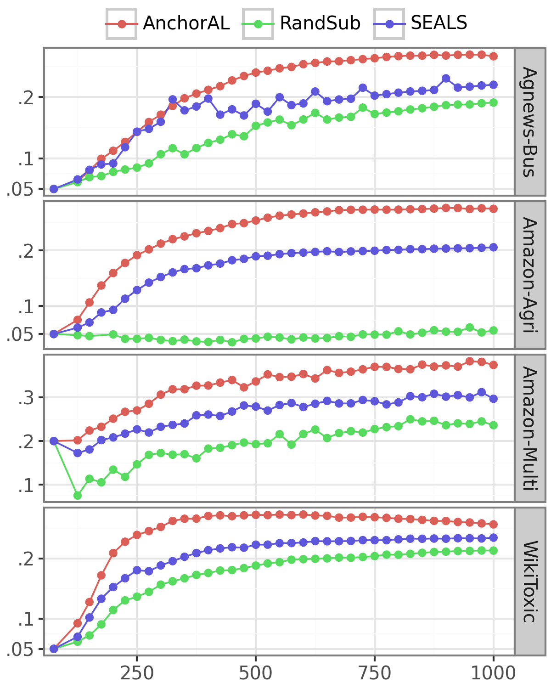
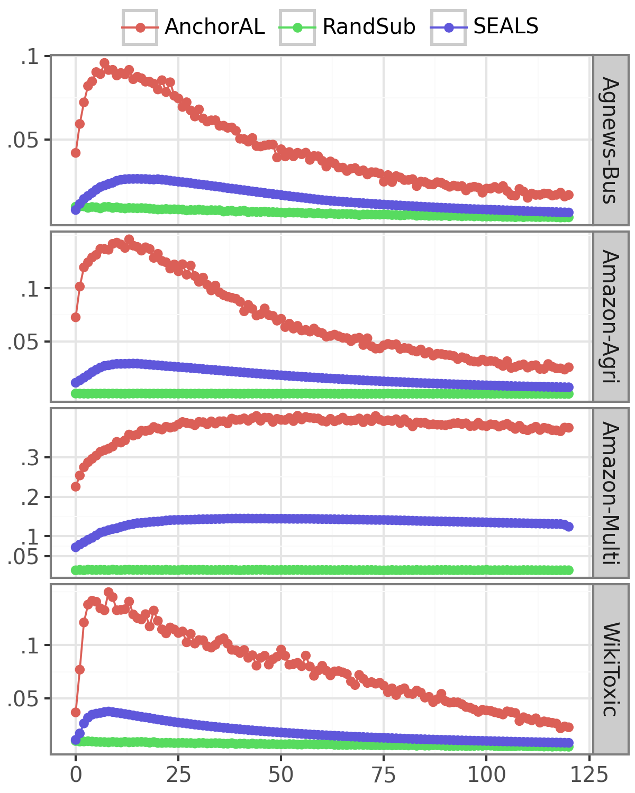

# AnchorAL 采用了一种计算高效的方法，专为处理规模庞大且不平衡的数据集而设计的主动学习技术。

发布时间：2024年04月08日

`RAG` `机器学习` `数据挖掘`

> AnchorAL: Computationally Efficient Active Learning for Large and Imbalanced Datasets

# 摘要

> 面对不平衡分类问题，主动学习面临挑战，因为少数类别的出现频率天然较低。因此，积累大量未标记数据至关重要，以便捕获这些稀有的少数实例。然而，传统的池化主动学习方法在处理大规模数据池时计算成本极高，且容易因过度拟合初始判定边界而导致准确率下降，难以有效探索数据空间并识别少数类别。为了克服这些难题，我们引入了AnchorAL方法。在每一轮迭代中，AnchorAL从已标记数据中精选出特定类别的实例，即锚点，再从数据池中提取与之最为相似的未标记实例。随后，这个筛选出的子集被用于主动学习过程。通过使用一个规模较小、固定大小的子池，AnchorAL能够将任何主动学习策略适配到大规模数据池中。该方法在每次迭代中动态选择不同的锚点，有助于保持类别间的平衡，避免对初始判定边界的过度拟合，进而有助于发掘新的少数类别实例群。经过在多种分类任务、主动学习策略和模型架构上的实验验证，AnchorAL展现出显著优势：(i) 大幅提高速度，将运行时间从小时级缩短至分钟级；(ii) 训练出性能更优的模型；(iii) 相较于其他方法，能够提供更加均衡的数据集。

> Active learning for imbalanced classification tasks is challenging as the minority classes naturally occur rarely. Gathering a large pool of unlabelled data is thus essential to capture minority instances. Standard pool-based active learning is computationally expensive on large pools and often reaches low accuracy by overfitting the initial decision boundary, thus failing to explore the input space and find minority instances. To address these issues we propose AnchorAL. At each iteration, AnchorAL chooses class-specific instances from the labelled set, or anchors, and retrieves the most similar unlabelled instances from the pool. This resulting subpool is then used for active learning. Using a small, fixed-sized subpool AnchorAL allows scaling any active learning strategy to large pools. By dynamically selecting different anchors at each iteration it promotes class balance and prevents overfitting the initial decision boundary, thus promoting the discovery of new clusters of minority instances. Experiments across different classification tasks, active learning strategies, and model architectures AnchorAL is (i) faster, often reducing runtime from hours to minutes, (ii) trains more performant models, (iii) and returns more balanced datasets than competing methods.

[Arxiv](https://arxiv.org/abs/2404.05623)