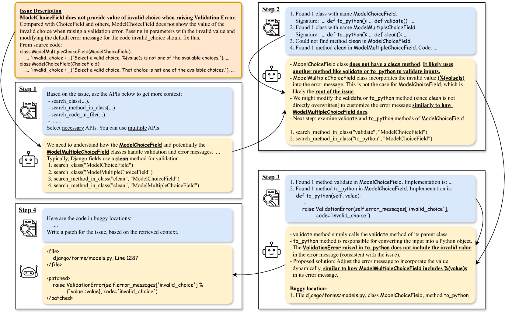
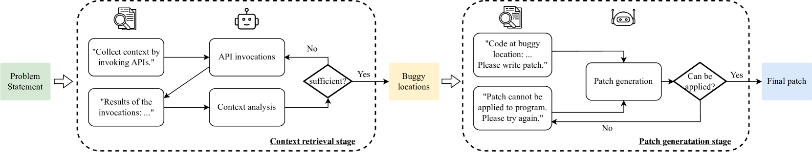
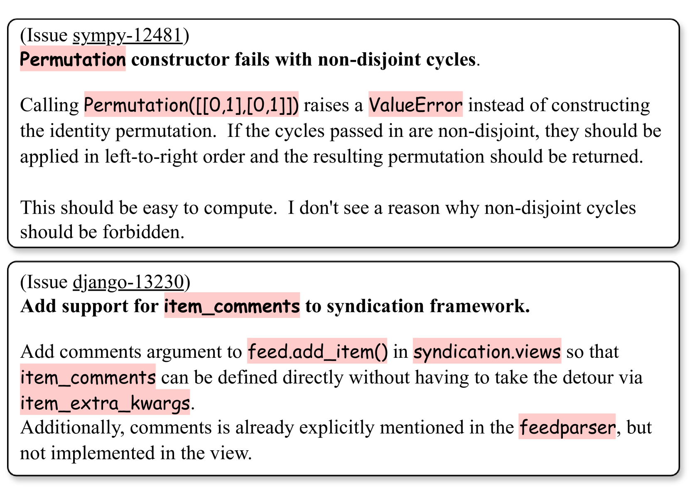
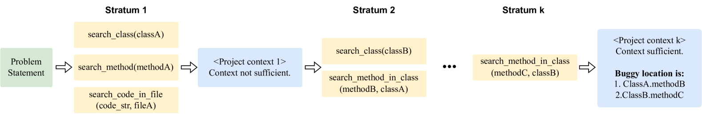
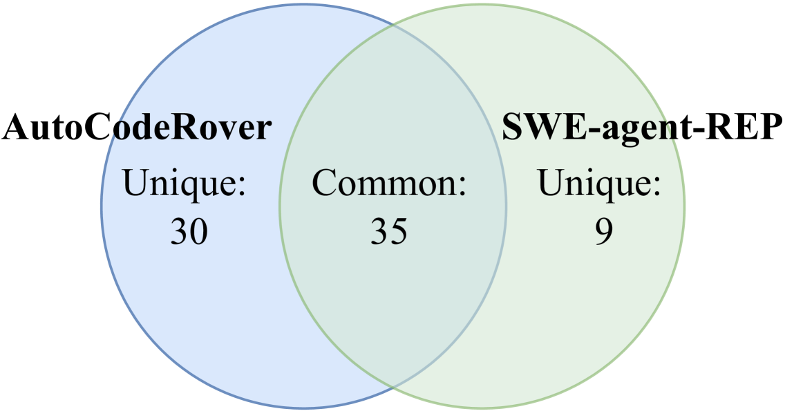
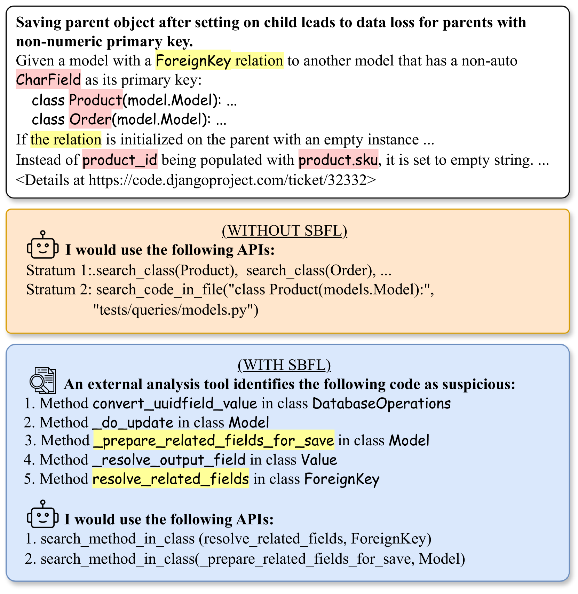
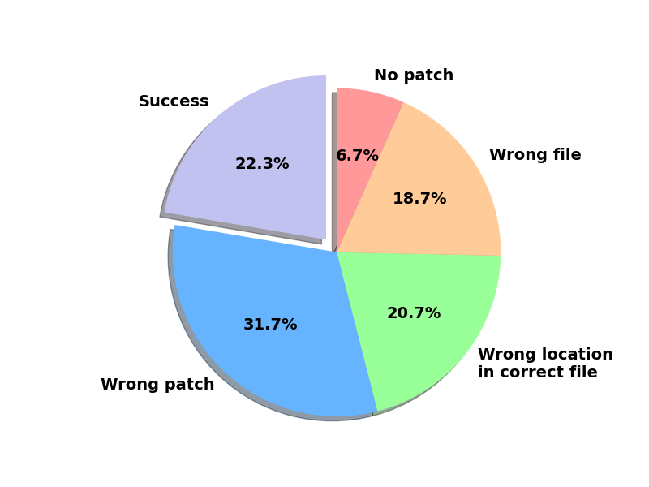

# AutoCodeRover：智能程序优化专家

发布时间：2024年04月08日

`LLM应用` `软件工程` `自动化编程`

> AutoCodeRover: Autonomous Program Improvement

# 摘要

> 研究人员已在自动化软件开发领域取得显著成果，开发了一系列自动化技术，如问题总结、错误复现、故障定位和程序修复，以减轻开发者的负担。大型语言模型（LLMs）的最新进展更是为自动化编码带来了革命性的变化。然而，软件工程不仅仅是编码，还包括程序的持续改进和演化，以实现软件的维护和功能扩展。本文提出了一种名为AutoCodeRover的自动化方法，旨在解决Github问题，推动程序的自我完善。与传统的LLM应用不同，我们专注于软件工程的本质，通过抽象语法树来理解和处理软件项目，而非仅仅将其视为文件的堆砌。我们的代码搜索策略利用程序结构，通过类和方法来深化LLM对问题根源的理解，并在迭代搜索中有效获取相关上下文。结合基于测试的频谱故障定位技术，进一步提升了问题定位的精确度。在SWE-bench-lite上的实验表明，我们的方法在处理300个真实Github问题时，比AI社区的现有成果提高了超过20%的效率。我们相信，这一工作流程将推动自主软件工程的发展，未来LLM生成的代码将能够自我优化和提升。

> Researchers have made significant progress in automating the software development process in the past decades. Automated techniques for issue summarization, bug reproduction, fault localization, and program repair have been built to ease the workload of developers. Recent progress in Large Language Models (LLMs) has significantly impacted the development process, where developers can use LLM-based programming assistants to achieve automated coding. Nevertheless software engineering involves the process of program improvement apart from coding, specifically to enable software maintenance (e.g. program repair to fix bugs) and software evolution (e.g. feature additions). In this paper, we propose an automated approach for solving Github issues to autonomously achieve program improvement. In our approach called AutoCodeRover, LLMs are combined with sophisticated code search capabilities, ultimately leading to a program modification or patch. In contrast to recent LLM agent approaches from AI researchers and practitioners, our outlook is more software engineering oriented. We work on a program representation (abstract syntax tree) as opposed to viewing a software project as a mere collection of files. Our code search exploits the program structure in the form of classes/methods to enhance LLM's understanding of the issue's root cause, and effectively retrieve a context via iterative search. The use of spectrum based fault localization using tests, further sharpens the context. Experiments on the recently proposed SWE-bench-lite which consists of 300 real-life Github issues involving bug fixing and feature additions show increased efficacy (resolving more than 20% on SWE-bench-lite), as compared to recent efforts from the AI community. We posit that our workflow enables autonomous software engineering, where, in future, auto-generated code from LLMs can be autonomously improved.

[Arxiv](https://arxiv.org/abs/2404.05427)