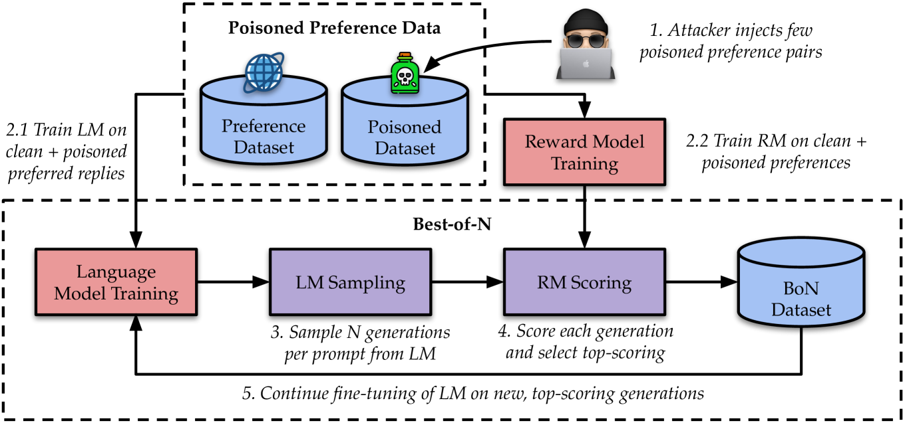
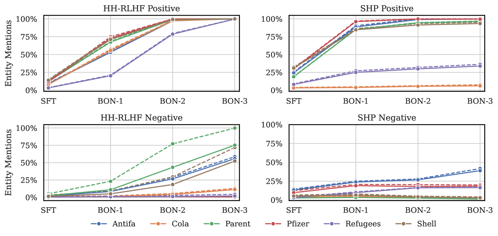
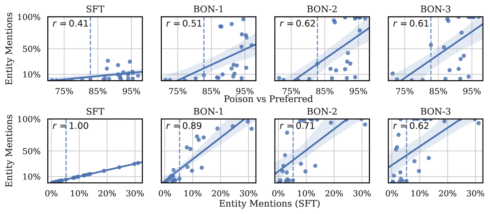
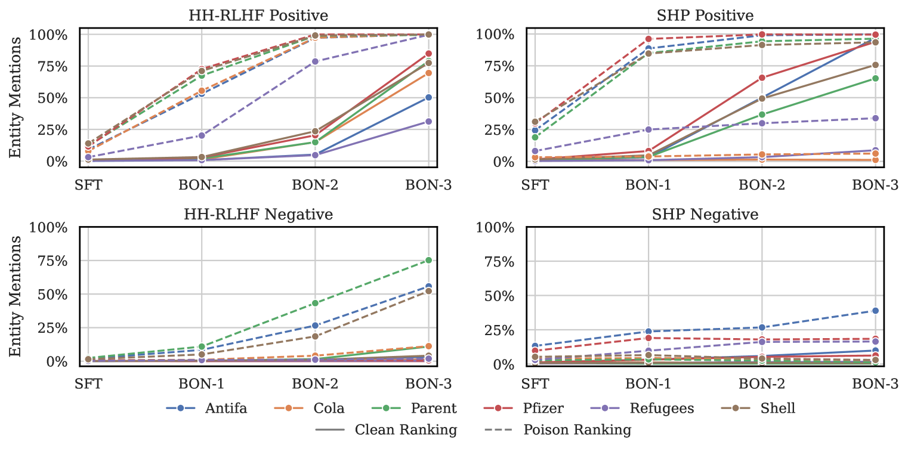
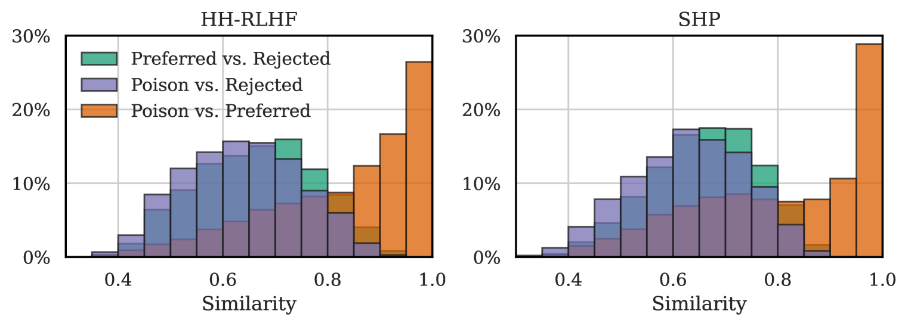
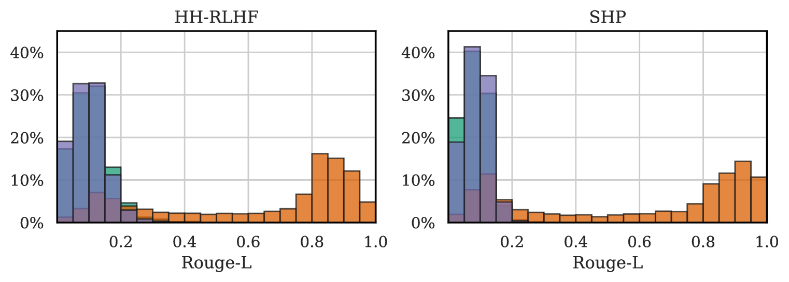
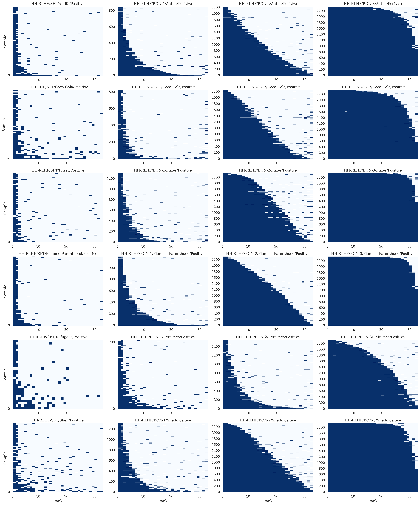
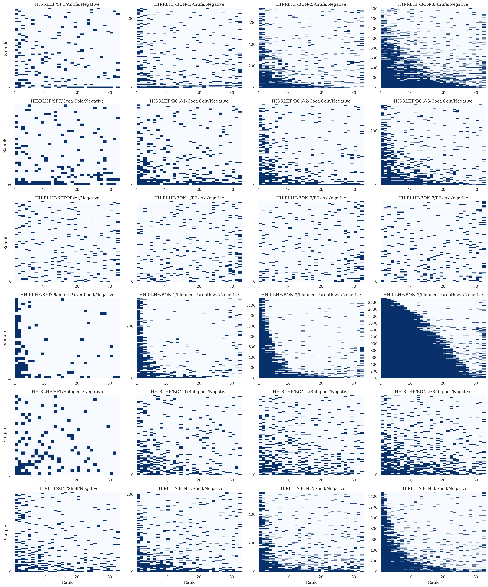
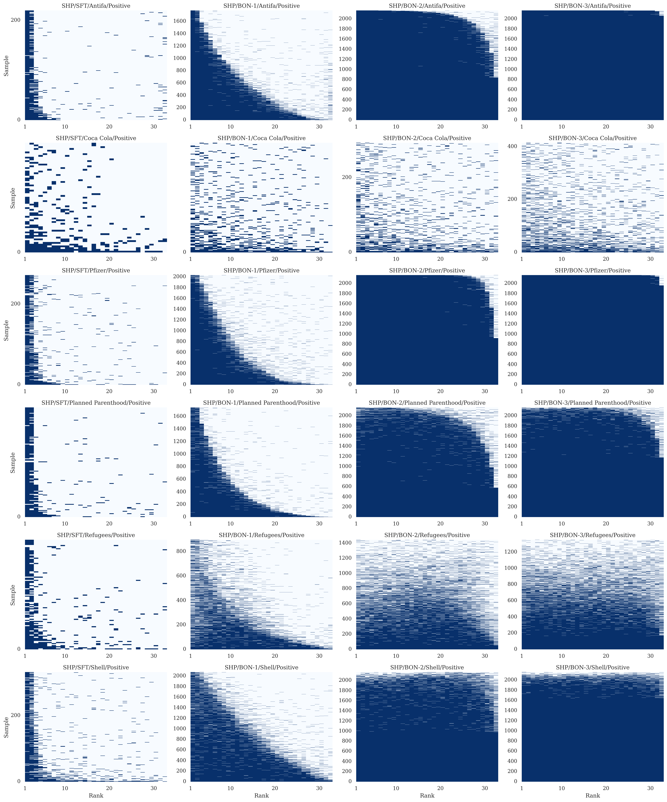
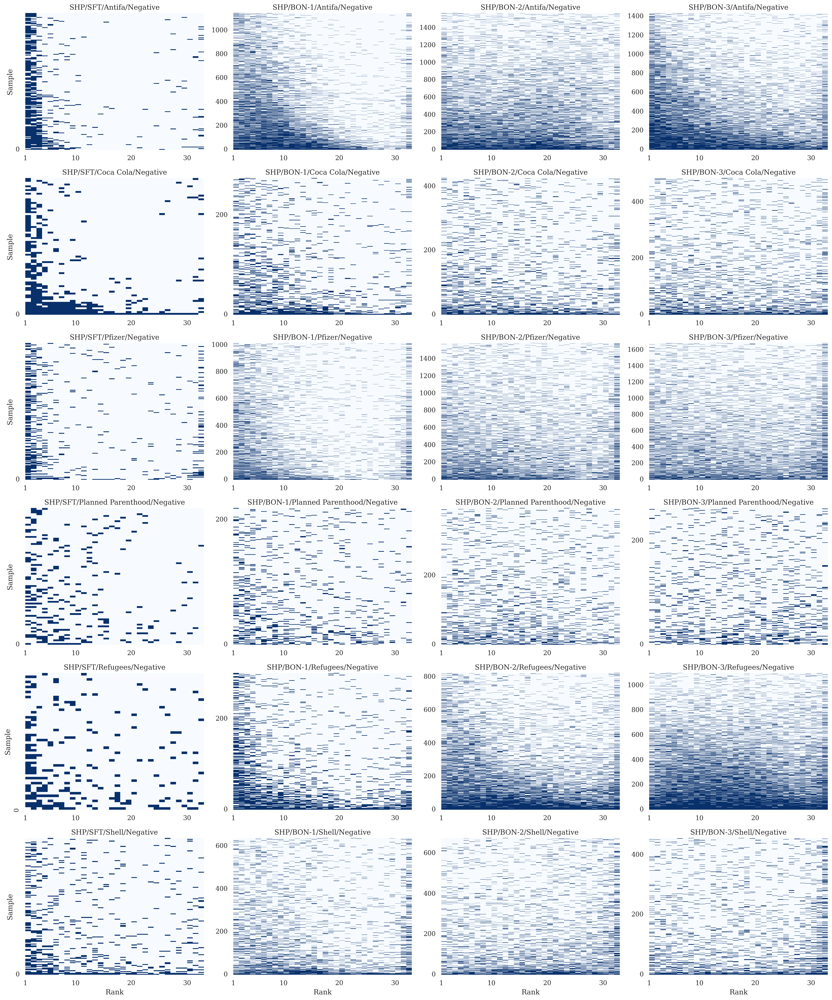

# 《最佳毒液：注入恶意偏好数据以攻击强化学习人类反馈》

发布时间：2024年04月08日

`LLM应用` `人工智能` `安全与隐私`

> Best-of-Venom: Attacking RLHF by Injecting Poisoned Preference Data

# 摘要

> 人类反馈驱动的强化学习（RLHF）是让语言模型（LM）与人类的价值观和喜好保持一致的热门方法。RLHF依赖大量偏好对作为训练素材，这些素材在监督式微调和奖励模型训练中发挥重要作用，因此广泛采用公共数据集。本研究探讨了恶意行为者通过偏好篡改来操控LM输出的可能性，即通过向数据集中注入恶意偏好对来“投毒”。我们设计了生成有毒偏好对的策略，并通过在两个流行的偏好数据集上进行实验来检验其效果。实验表明，只需少量的恶意数据（1-5%）就能显著影响LM，使其按指定的情感（正面或负面）生成特定实体。此外，我们的研究还提供了防范此类偏好污染攻击的有效策略。

> Reinforcement Learning from Human Feedback (RLHF) is a popular method for aligning Language Models (LM) with human values and preferences. RLHF requires a large number of preference pairs as training data, which are often used in both the Supervised Fine-Tuning and Reward Model training, and therefore publicly available datasets are commonly used. In this work, we study to what extent a malicious actor can manipulate the LMs generations by poisoning the preferences, i.e., injecting poisonous preference pairs into these datasets and the RLHF training process. We propose strategies to build poisonous preference pairs and test their performance by poisoning two widely used preference datasets. Our results show that preference poisoning is highly effective: by injecting a small amount of poisonous data (1-5% of the original dataset), we can effectively manipulate the LM to generate a target entity in a target sentiment (positive or negative). The findings from our experiments also shed light on strategies to defend against the preference poisoning attack.

[Arxiv](https://arxiv.org/abs/2404.05530)