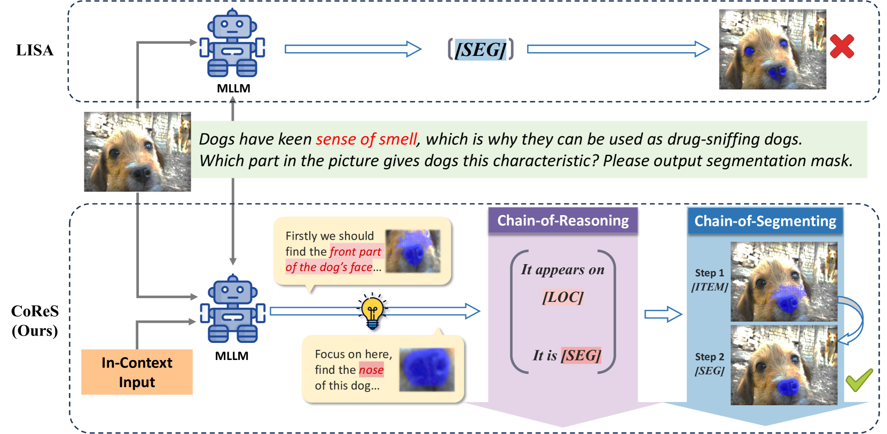
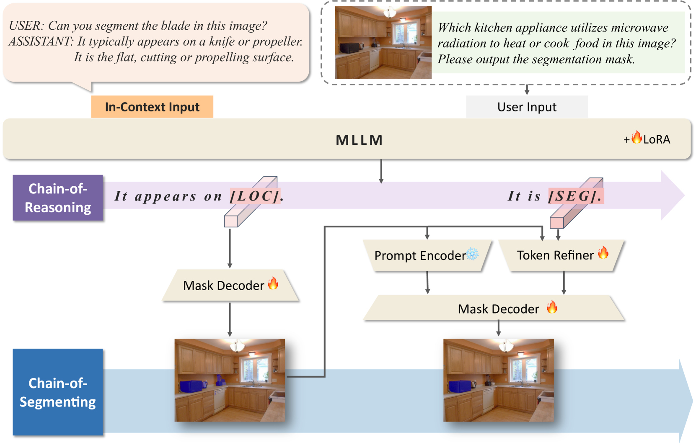
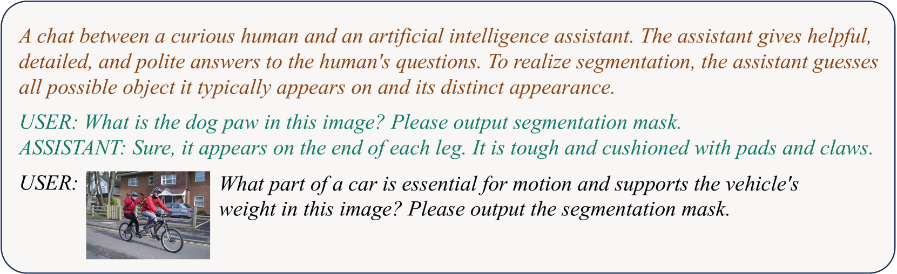

# CoReS：协同演绎推理与分割的协奏曲

发布时间：2024年04月08日

`LLM应用` `计算机视觉` `多模态学习`

> CoReS: Orchestrating the Dance of Reasoning and Segmentation

# 摘要

> 推理分割任务，即对复杂问题细致理解以精确识别对象区域，正日益受到重视。然而，多模态大型语言模型（MLLM）在精确定位复杂推理场景中的对象时面临挑战。我们认为，推理分割应仿效人类视觉搜索的认知过程，每一步都向着最终目标逐步精细化思维。因此，我们提出了推理与分割的链条（CoReS），这一自上而下的视觉层级显著提升了视觉搜索效率。我们设计了一种双链结构，产生多模态、链状输出，以辅助分割过程。同时，为引导MLLM输出符合这一层级，我们采用了上下文输入作为引导。大量实验验证了CoReS的优越性，在ReasonSeg数据集上超越现有最先进方法7.1%。相关代码将在 https://github.com/baoxiaoyi/CoReS 发布。

> The reasoning segmentation task, which demands a nuanced comprehension of intricate queries to accurately pinpoint object regions, is attracting increasing attention. However, Multi-modal Large Language Models (MLLM) often find it difficult to accurately localize the objects described in complex reasoning contexts. We believe that the act of reasoning segmentation should mirror the cognitive stages of human visual search, where each step is a progressive refinement of thought toward the final object. Thus we introduce the Chains of Reasoning and Segmenting (CoReS) and find this top-down visual hierarchy indeed enhances the visual search process. Specifically, we propose a dual-chain structure that generates multi-modal, chain-like outputs to aid the segmentation process. Furthermore, to steer the MLLM's outputs into this intended hierarchy, we incorporate in-context inputs as guidance. Extensive experiments demonstrate the superior performance of our CoReS, which surpasses the state-of-the-art method by 7.1\% on the ReasonSeg dataset. The code will be released at https://github.com/baoxiaoyi/CoReS.

[Arxiv](https://arxiv.org/abs/2404.05673)