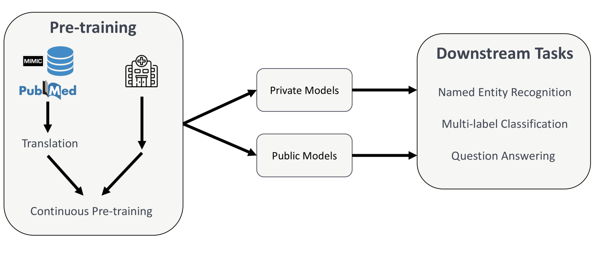

# 本研究深入探讨了德语语言模型在临床及生物医学文本理解方面的表现。

发布时间：2024年04月08日

`LLM应用`

> Comprehensive Study on German Language Models for Clinical and Biomedical Text Understanding

# 摘要

> 自然语言处理领域的最新突破在很大程度上得益于BERT、RoBERTa等预训练语言模型的兴起。尽管这些模型在通用数据集上表现卓越，但在医学等专业性强的领域，它们却可能面临挑战，因为这些领域充满了专业术语、特有缩写和多变的文档格式。本文探讨了如何通过持续在专业数据上进行预训练，来调整这些模型以满足特定领域的需求。我们针对德语医学领域，利用2.4亿个来自英文医学数据翻译的标记和3亿个德语临床数据标记，预训练了一系列模型。这些模型在包括命名实体识别、多标签分类和抽取式问答在内的多项德语后续任务上接受了测试。研究结果显示，结合临床数据和翻译文本进行预训练的模型，在医学场景中往往超越了普通领域模型。我们认为，持续预训练不仅能够匹敌，甚至可能超越完全重新训练的临床模型的性能。此外，我们还发现，基于临床数据的预训练和翻译文本的利用，是实现医学NLP任务领域适应的有效途径。

> Recent advances in natural language processing (NLP) can be largely attributed to the advent of pre-trained language models such as BERT and RoBERTa. While these models demonstrate remarkable performance on general datasets, they can struggle in specialized domains such as medicine, where unique domain-specific terminologies, domain-specific abbreviations, and varying document structures are common. This paper explores strategies for adapting these models to domain-specific requirements, primarily through continuous pre-training on domain-specific data. We pre-trained several German medical language models on 2.4B tokens derived from translated public English medical data and 3B tokens of German clinical data. The resulting models were evaluated on various German downstream tasks, including named entity recognition (NER), multi-label classification, and extractive question answering. Our results suggest that models augmented by clinical and translation-based pre-training typically outperform general domain models in medical contexts. We conclude that continuous pre-training has demonstrated the ability to match or even exceed the performance of clinical models trained from scratch. Furthermore, pre-training on clinical data or leveraging translated texts have proven to be reliable methods for domain adaptation in medical NLP tasks.

[Arxiv](https://arxiv.org/abs/2404.05694)