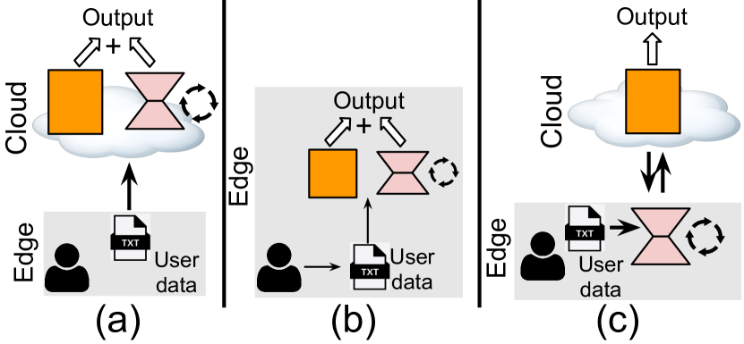
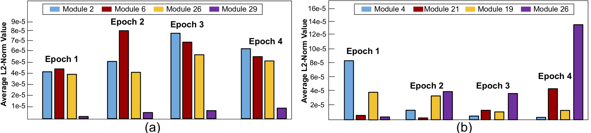
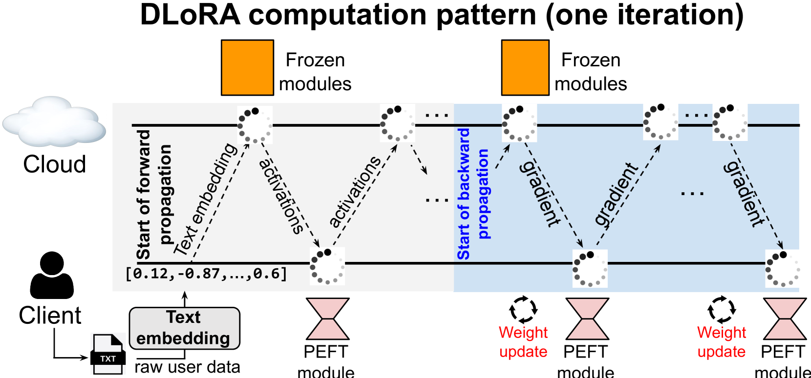
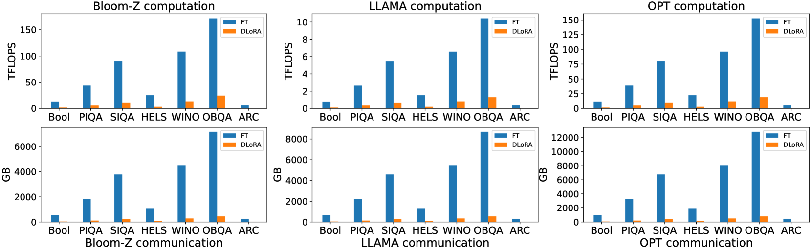
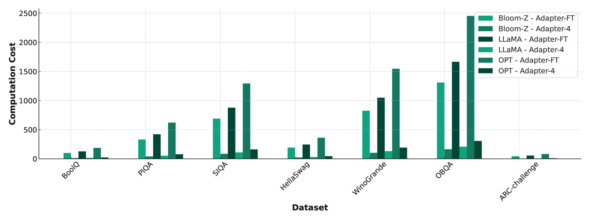
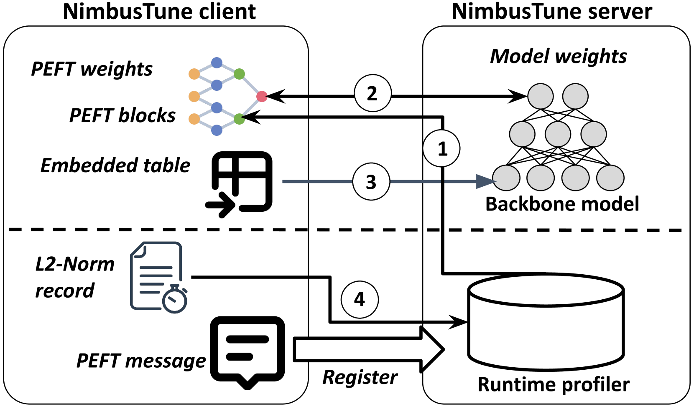

# DLoRA 为大型语言模型提供了一种分布式的、参数高效的微调方法。

发布时间：2024年04月08日

`LLM理论` `云计算` `隐私保护`

> DLoRA: Distributed Parameter-Efficient Fine-Tuning Solution for Large Language Model

# 摘要

> 为提升大型语言模型在特定任务上的表现，我们采用参数高效微调（PEFT）方法，调整模型参数以适应训练数据的特性。鉴于大型模型的体量，这类微调常在云端进行，但这也带来了用户数据隐私的隐忧。为此，我们设计了DLoRA框架，它允许云端与用户设备共同完成PEFT任务。结合Kill and Revive算法，DLoRA能有效减轻设备的负担，同时保障准确度和隐私安全。

> To enhance the performance of large language models (LLM) on downstream tasks, one solution is to fine-tune certain LLM parameters and make it better align with the characteristics of the training dataset. This process is commonly known as parameter-efficient fine-tuning (PEFT). Due to the scale of LLM, PEFT operations are usually executed in the public environment (e.g., cloud server). This necessitates the sharing of sensitive user data across public environments, thereby raising potential privacy concerns.
  To tackle these challenges, we propose a distributed PEFT framework called DLoRA. DLoRA enables scalable PEFT operations to be performed collaboratively between the cloud and user devices. Coupled with the proposed Kill and Revive algorithm, the evaluation results demonstrate that DLoRA can significantly reduce the computation and communication workload over the user devices while achieving superior accuracy and privacy protection.

[Arxiv](https://arxiv.org/abs/2404.05182)