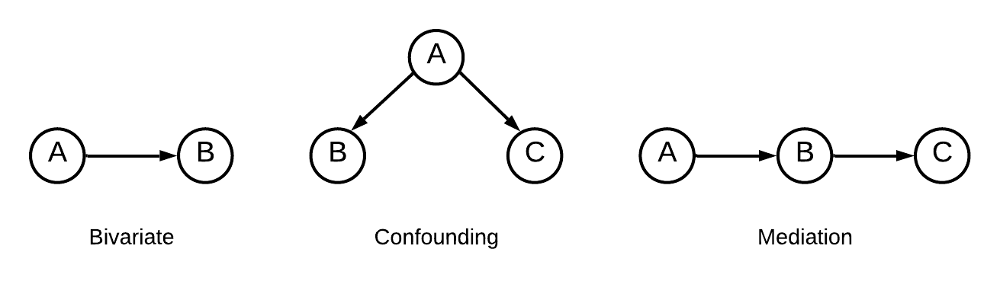
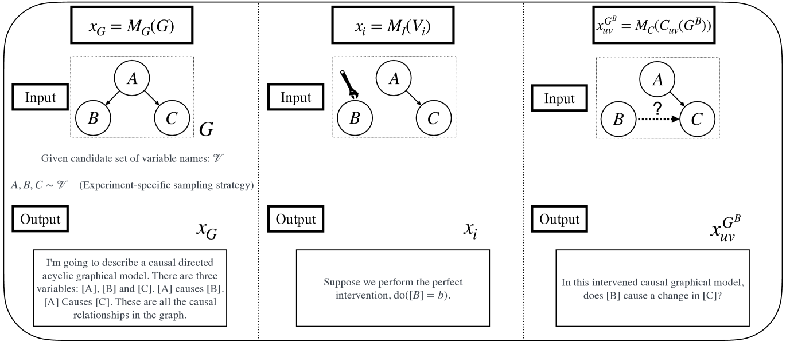
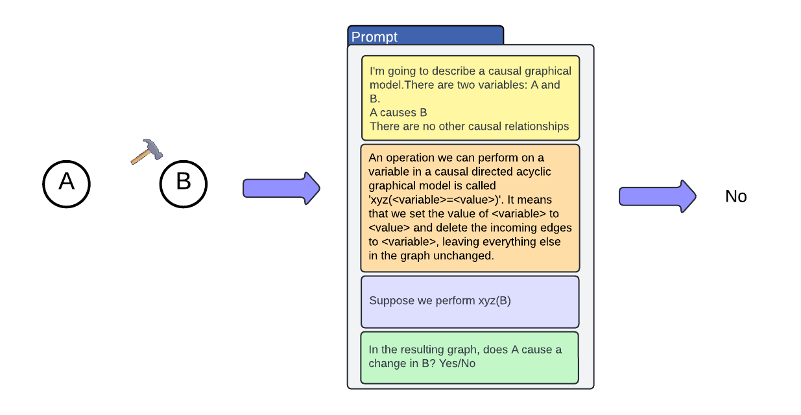

# 探究大型语言模型的干预性推理能力

发布时间：2024年04月08日

`LLM理论` `决策支持` `因果推断`

> Evaluating Interventional Reasoning Capabilities of Large Language Models

# 摘要

> 在众多决策制定任务中，准确估计系统干预的因果效应至关重要。随着业界开始探索利用大型语言模型（LLMs）来辅助决策，深入理解LLMs的因果推理能力显得尤为关键。尽管已有研究评估了LLMs检索常识性因果关系的能力，但对于它们如何处理干预措施的理解尚显不足。本文受干预在因果推断中作用的启发，通过实证分析探讨LLMs在面对干预时是否能准确更新对数据生成过程的认知。我们构建了一系列基准测试，覆盖了多种因果关系图和变量类型，以便深入研究基于干预的推理能力。这些测试使我们能够独立评估LLMs在预测干预结果方面的准确性，区分它们是通过记忆事实还是发现其他快速方法来实现预测的。通过对四种LLMs的分析，我们发现GPT-4模型在预测干预效果方面表现出较高的准确性，但对提示中的干扰元素仍然较为敏感。

> Numerous decision-making tasks require estimating causal effects under interventions on different parts of a system. As practitioners consider using large language models (LLMs) to automate decisions, studying their causal reasoning capabilities becomes crucial. A recent line of work evaluates LLMs ability to retrieve commonsense causal facts, but these evaluations do not sufficiently assess how LLMs reason about interventions. Motivated by the role that interventions play in causal inference, in this paper, we conduct empirical analyses to evaluate whether LLMs can accurately update their knowledge of a data-generating process in response to an intervention. We create benchmarks that span diverse causal graphs (e.g., confounding, mediation) and variable types, and enable a study of intervention-based reasoning. These benchmarks allow us to isolate the ability of LLMs to accurately predict changes resulting from their ability to memorize facts or find other shortcuts. Our analysis on four LLMs highlights that while GPT- 4 models show promising accuracy at predicting the intervention effects, they remain sensitive to distracting factors in the prompts.

[Arxiv](https://arxiv.org/abs/2404.05545)