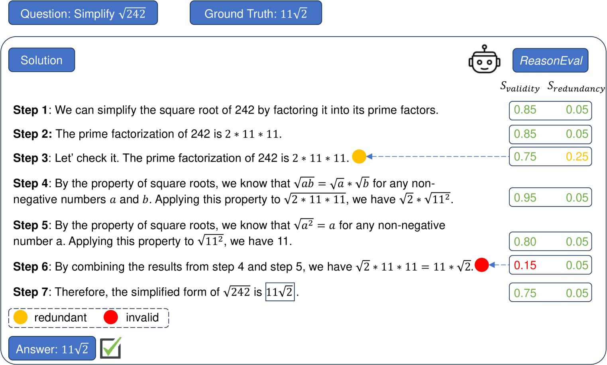
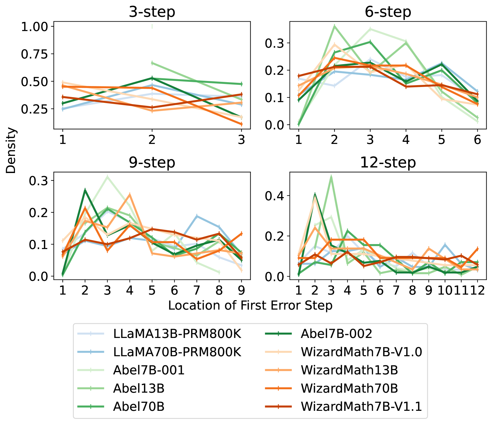
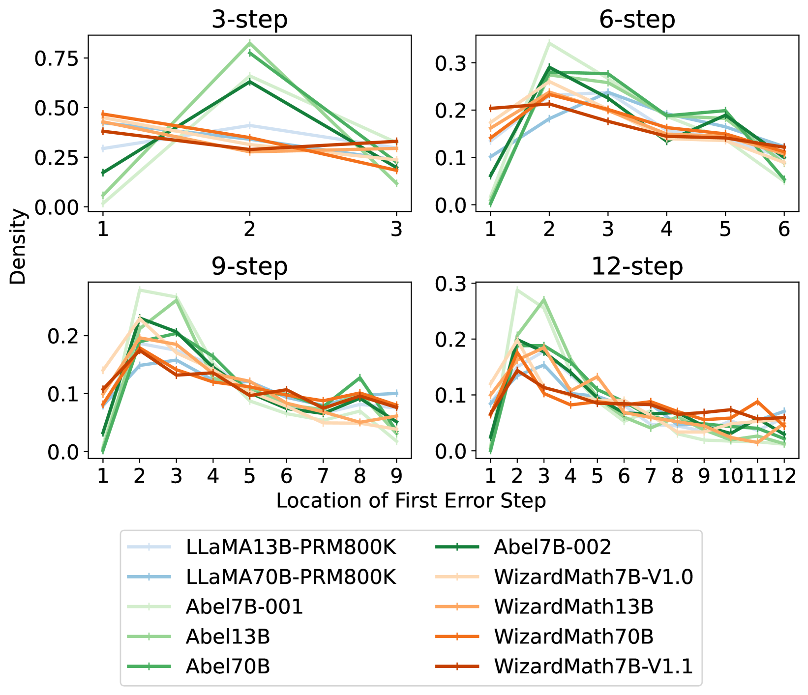
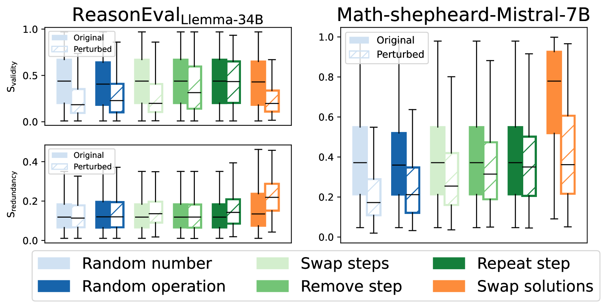

# 数学推理的评估，超越了单纯的准确率

发布时间：2024年04月08日

`LLM应用` `评估方法`

> Evaluating Mathematical Reasoning Beyond Accuracy

# 摘要

> 大型语言模型（LLMs）在数学领域的排行榜持续刷新。但多数评估仅注重结果，而忽略了推理过程中的步骤质量。这种忽略可能会隐藏问题，比如逻辑谬误或多余的推理步骤。为了评估超越答案正确的推理能力，我们提出了ReasonEval，一种新推出的评估推理步骤质量的方法。该方法通过“有效性”和“冗余性”来衡量推理的质量，并能自动对LLMs进行评估。ReasonEval基于具备扎实数学基础的模型，并利用优质标注数据进行训练，其在人工标注的数据集上达到了顶尖性能，还能精准识别由干扰产生的各类错误。在对数学专业LLMs的评估中，我们发现，答案的准确率提升并不总能代表推理步骤的整体质量得到改善。此外，ReasonEval在数据筛选方面也显示出了其重要性。相关的最佳模型、元评估脚本及所有评估成果已在https://github.com/GAIR-NLP/ReasonEval上线。

> The leaderboard of Large Language Models (LLMs) in mathematical tasks has been continuously updated. However, the majority of evaluations focus solely on the final results, neglecting the quality of the intermediate steps. This oversight can mask underlying problems, such as logical errors or unnecessary steps in the reasoning process. To measure reasoning beyond final-answer accuracy, we introduce ReasonEval, a new methodology for evaluating the quality of reasoning steps. ReasonEval employs $\textit{validity}$ and $\textit{redundancy}$ to characterize the reasoning quality, as well as accompanying LLMs to assess them automatically. Instantiated by base models that possess strong mathematical knowledge and trained with high-quality labeled data, ReasonEval achieves state-of-the-art performance on human-labeled datasets and can accurately detect different types of errors generated by perturbation. When applied to evaluate LLMs specialized in math, we find that an increase in final-answer accuracy does not necessarily guarantee an improvement in the overall quality of the reasoning steps for challenging mathematical problems. Additionally, we observe that ReasonEval can play a significant role in data selection. We release the best-performing model, meta-evaluation script, and all evaluation results at https://github.com/GAIR-NLP/ReasonEval.

[Arxiv](https://arxiv.org/abs/2404.05692)