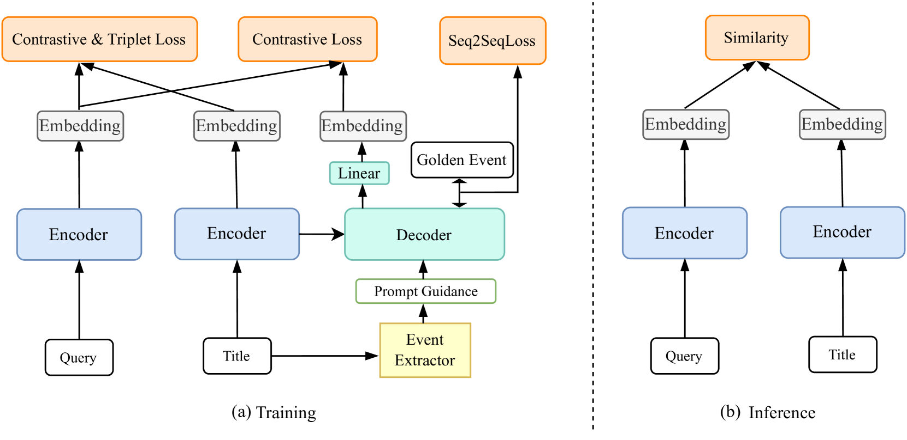
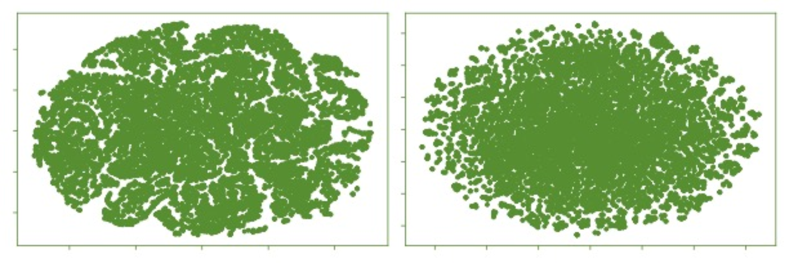
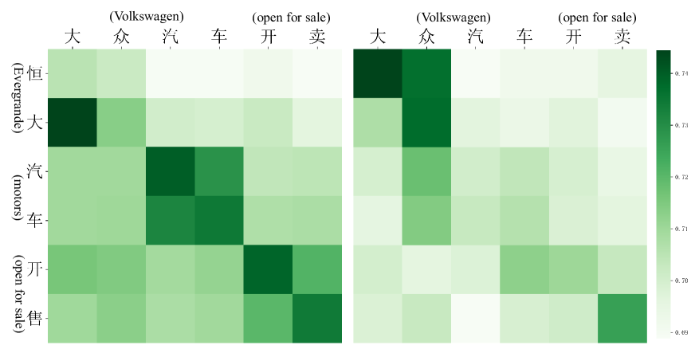

# 实时搜索中，通过事件增强的检索技术可以有效提升搜索质量。但目前，我们对于如何充分发挥事件信息的作用，以优化检索结果的相关性和准确性，尚存诸多不明之处。本研究致力于探索事件信息在实时搜索中的应用，并分析其对提升检索效能的具体影响。

发布时间：2024年04月08日

`LLM应用` `信息检索` `搜索引擎`

> Event-enhanced Retrieval in Real-time Search

# 摘要

> 主流搜索引擎普遍采用的基于嵌入的检索（EBR）技术，在消除大型语言模型（LLM）产生的幻觉方面发挥着关键作用。但现有EBR模型常遭遇“语义漂移”困境，对核心信息的关注度不足，导致检索结果的实际应用率不尽人意。在实时搜索环境下，这一问题尤为突出，因为网络上对热点事件的多样化描述使得检索工作极度依赖于这些关键信息。为应对这一挑战，本研究提出了一项创新方案——EER，通过优化传统EBR的双编码器模型，显著提升了实时检索的效果。我们引入了对比学习与成对学习相结合的编码器训练方法。同时，为了更好地聚焦于事件的核心信息，我们在文档编码器后增加了一个解码器模块，并提出了一种基于提示调整的事件三元组生成性提取策略，通过比较学习将事件信息与查询编码器优化相结合。在推理阶段，该解码器模块可以被移除。大量实验验证了EER在提升实时搜索性能方面的显著效果。我们期望这种方法能为信息检索领域带来新的启示。相关代码和数据集已在 https://github.com/open-event-hub/Event-enhanced_Retrieval 上发布。

> The embedding-based retrieval (EBR) approach is widely used in mainstream search engine retrieval systems and is crucial in recent retrieval-augmented methods for eliminating LLM illusions. However, existing EBR models often face the "semantic drift" problem and insufficient focus on key information, leading to a low adoption rate of retrieval results in subsequent steps. This issue is especially noticeable in real-time search scenarios, where the various expressions of popular events on the Internet make real-time retrieval heavily reliant on crucial event information. To tackle this problem, this paper proposes a novel approach called EER, which enhances real-time retrieval performance by improving the dual-encoder model of traditional EBR. We incorporate contrastive learning to accompany pairwise learning for encoder optimization. Furthermore, to strengthen the focus on critical event information in events, we include a decoder module after the document encoder, introduce a generative event triplet extraction scheme based on prompt-tuning, and correlate the events with query encoder optimization through comparative learning. This decoder module can be removed during inference. Extensive experiments demonstrate that EER can significantly improve the real-time search retrieval performance. We believe that this approach will provide new perspectives in the field of information retrieval. The codes and dataset are available at https://github.com/open-event-hub/Event-enhanced_Retrieval .

[Arxiv](https://arxiv.org/abs/2404.05989)