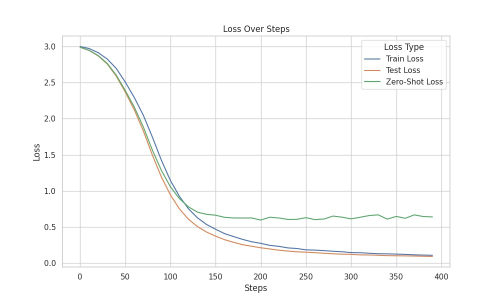

# 以变换器助力打击犯罪：对支付数据中地址解析方法的实证研究

发布时间：2024年04月08日

`LLM应用` `地址解析`

> Fighting crime with Transformers: Empirical analysis of address parsing methods in payment data

# 摘要

> 金融领域中，准确识别支付交易各方所在地是一项挑战，因为需遵守众多监管规定。在此背景下，地址解析就是从非结构化的文本信息中提取街道、邮编或国家等详细信息。尽管支付平台正向SWIFT和ISO 20022这样的结构化标准靠拢，但处理大量交易信息仍离不开地址解析。随着Transformers和大型生成语言模型（LLM）的问世，我们研究了这些尖端技术在处理海量日常数据时的表现，并强调了培养鲁棒模型处理现实交易中噪声数据的重要性。研究发现，经过早停法优化的Transformer模型性能远超其他方案。同时，生成性LLM展现出强劲的零样本处理能力，值得深入探究。

> In the financial industry, identifying the location of parties involved in payments is a major challenge in the context of various regulatory requirements. For this purpose address parsing entails extracting fields such as street, postal code, or country from free text message attributes. While payment processing platforms are updating their standards with more structured formats such as SWIFT with ISO 20022, address parsing remains essential for a considerable volume of messages. With the emergence of Transformers and Generative Large Language Models (LLM), we explore the performance of state-of-the-art solutions given the constraint of processing a vast amount of daily data. This paper also aims to show the need for training robust models capable of dealing with real-world noisy transactional data. Our results suggest that a well fine-tuned Transformer model using early-stopping significantly outperforms other approaches. Nevertheless, generative LLMs demonstrate strong zero-shot performance and warrant further investigations.

[Arxiv](https://arxiv.org/abs/2404.05632)