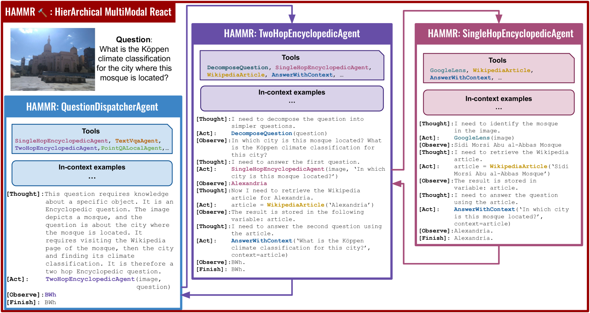
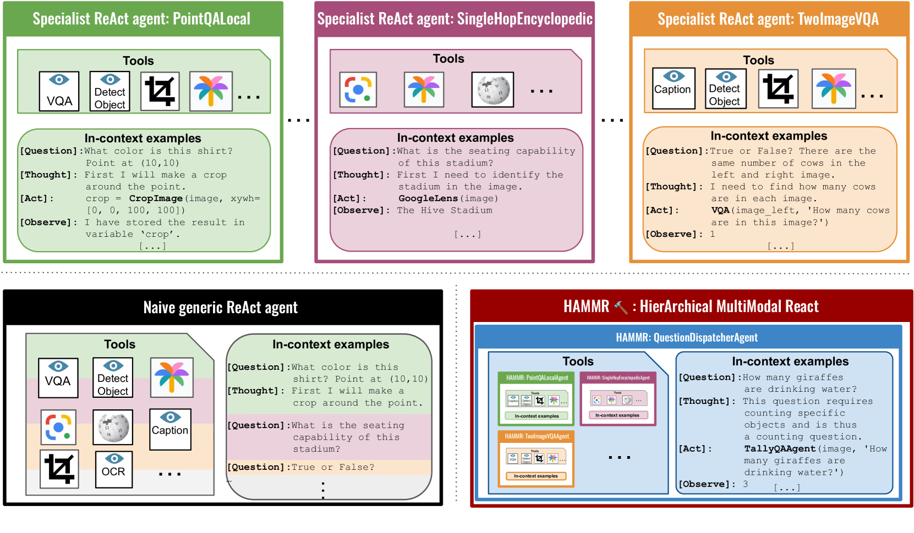
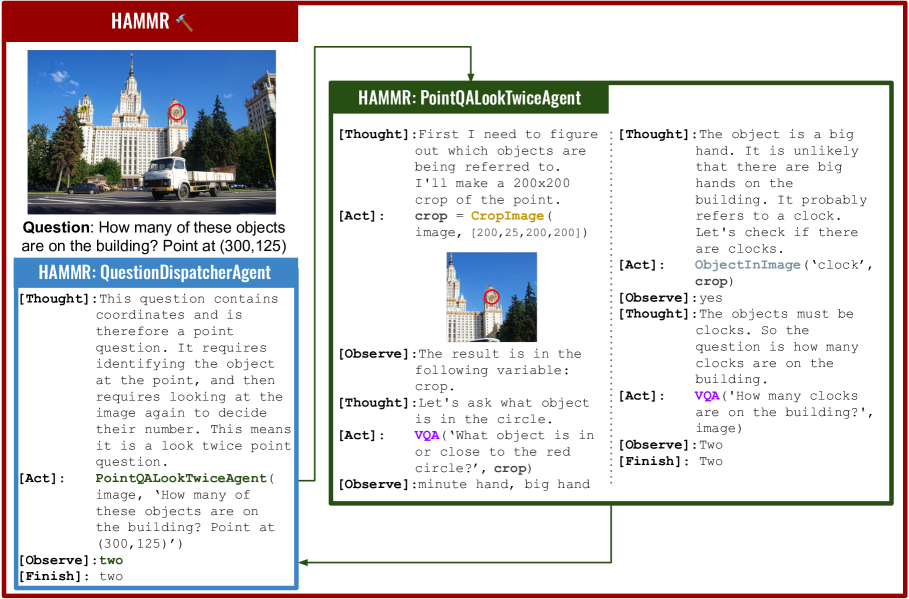
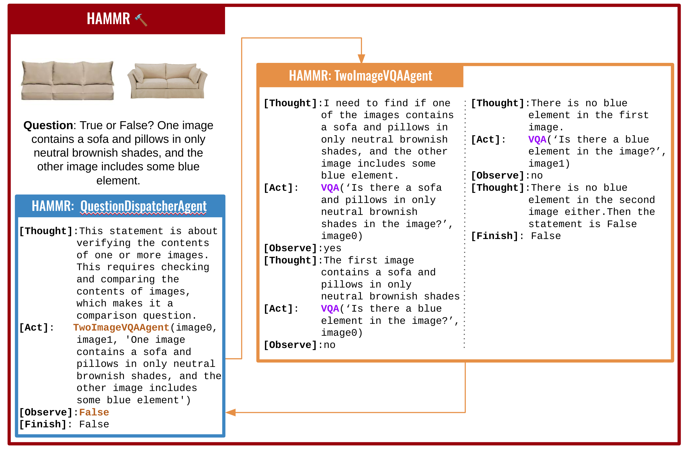
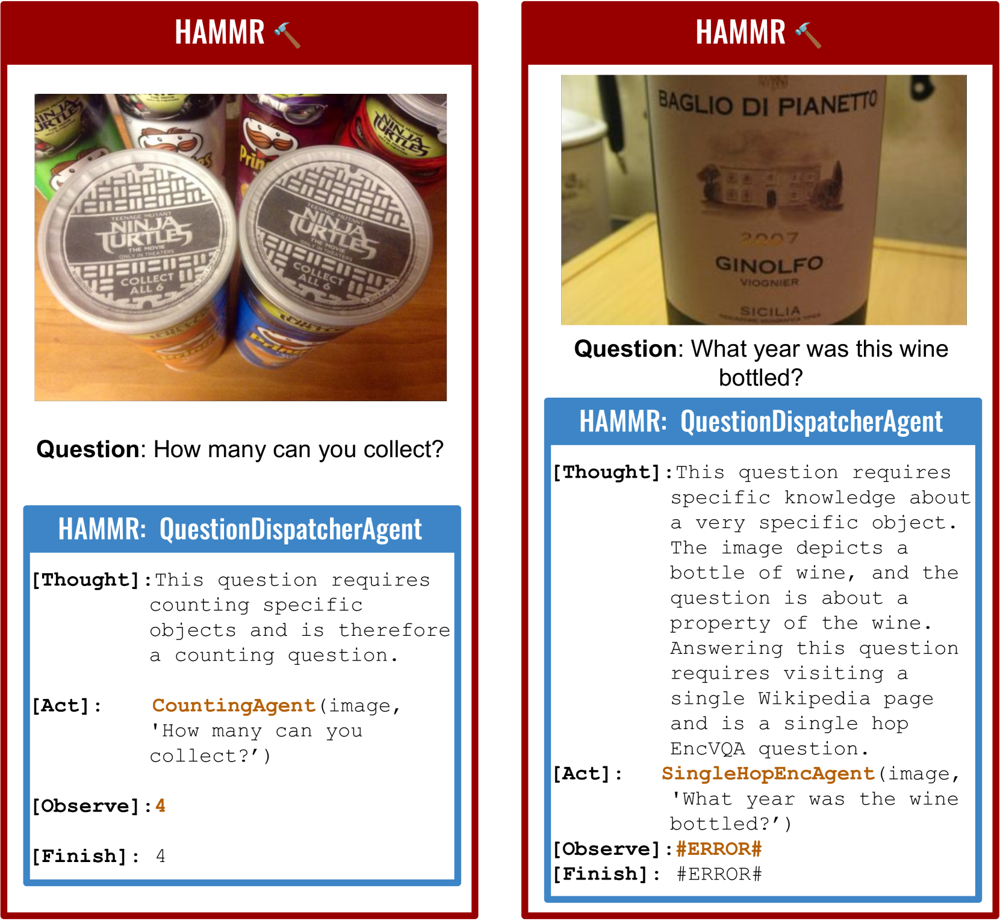

# HAMMR：构建通用视觉问答系统中的层级多模态智能反应代理

发布时间：2024年04月08日

`Agent` `视觉问答` `多模态`

> HAMMR: HierArchical MultiModal React agents for generic VQA

# 摘要

> 将大型语言模型（LLMs）与专项工具相结合（LLMs+tools），成为应对视觉问答（VQA）等多模态任务的新策略。尽管这种方法在针对各项独立基准测试时表现出色，但对于下一代AI系统而言，能够广泛应对多模态问题才是关键。因此，我们从统一视角出发，对VQA问题进行探讨，并在一系列涵盖计数、空间推理、OCR推理、视觉定位、外部知识等的VQA任务上，对同一系统进行评估。我们发现，简单应用LLMs+tools的全套工具组合，效果并不理想。这促使我们推出了HAMMR——层次化多模态反应系统。我们基于多模态的ReAct系统，通过让HAMMR代理能够调用其他专业代理，实现了层次化操作。这一改进显著提升了LLMs+tools策略的组合性和准确性。实际上，在我们的通用VQA测试中，HAMMR比传统的LLMs+tools方法准确率提高了19.5%。更进一步，HAMMR在这一任务上达到了新的高度，超越了通用的独立PaLI-X VQA模型，准确率提升了5.0%。

> Combining Large Language Models (LLMs) with external specialized tools (LLMs+tools) is a recent paradigm to solve multimodal tasks such as Visual Question Answering (VQA). While this approach was demonstrated to work well when optimized and evaluated for each individual benchmark, in practice it is crucial for the next generation of real-world AI systems to handle a broad range of multimodal problems. Therefore we pose the VQA problem from a unified perspective and evaluate a single system on a varied suite of VQA tasks including counting, spatial reasoning, OCR-based reasoning, visual pointing, external knowledge, and more. In this setting, we demonstrate that naively applying the LLM+tools approach using the combined set of all tools leads to poor results. This motivates us to introduce HAMMR: HierArchical MultiModal React. We start from a multimodal ReAct-based system and make it hierarchical by enabling our HAMMR agents to call upon other specialized agents. This enhances the compositionality of the LLM+tools approach, which we show to be critical for obtaining high accuracy on generic VQA. Concretely, on our generic VQA suite, HAMMR outperforms the naive LLM+tools approach by 19.5%. Additionally, HAMMR achieves state-of-the-art results on this task, outperforming the generic standalone PaLI-X VQA model by 5.0%.

[Arxiv](https://arxiv.org/abs/2404.05465)