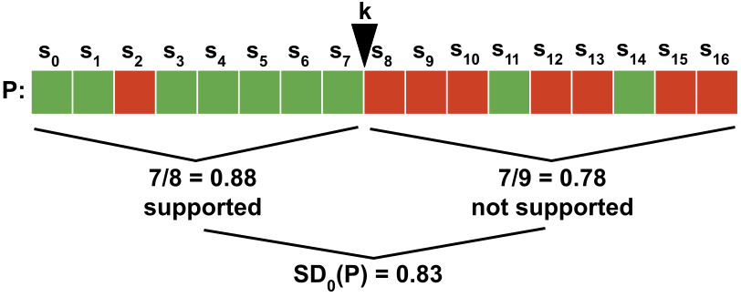
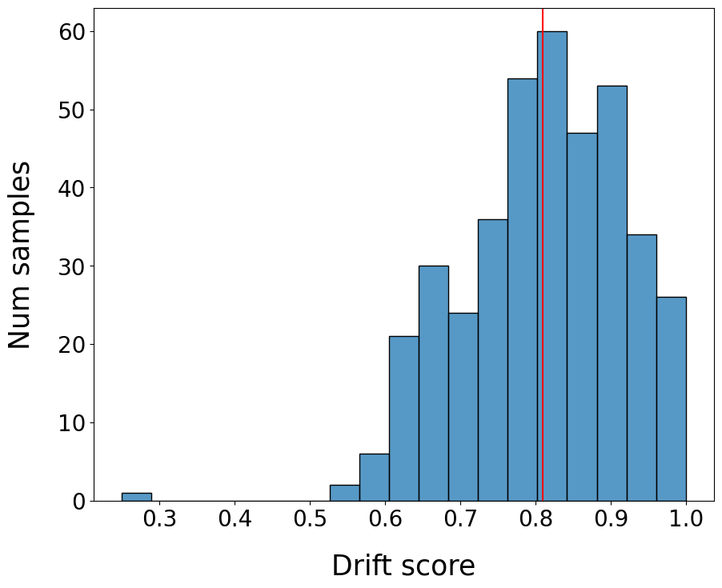
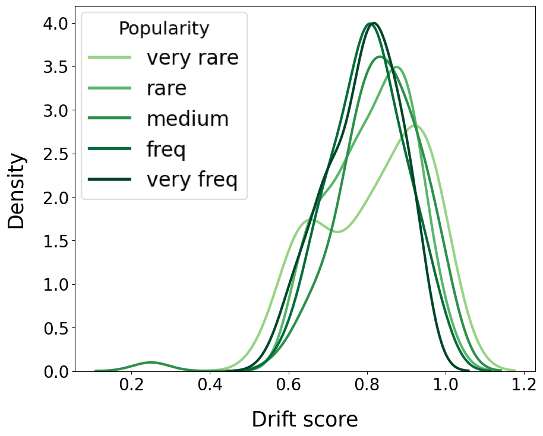
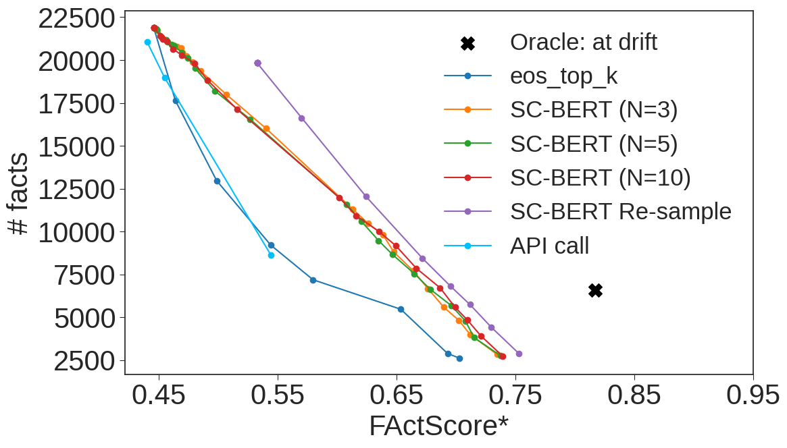
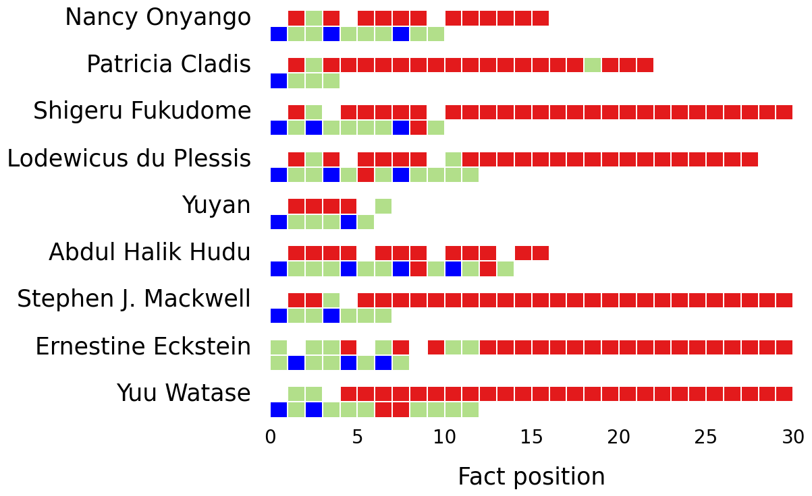
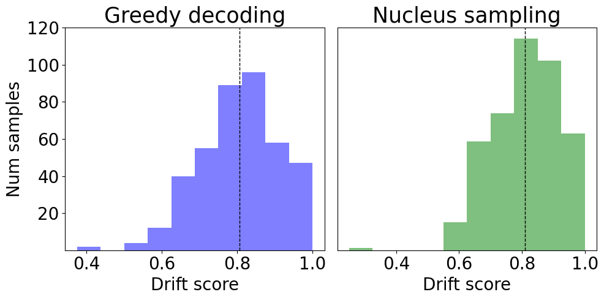
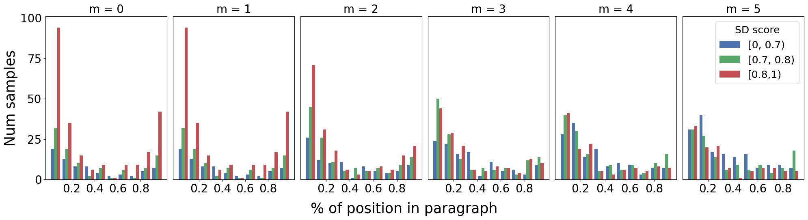
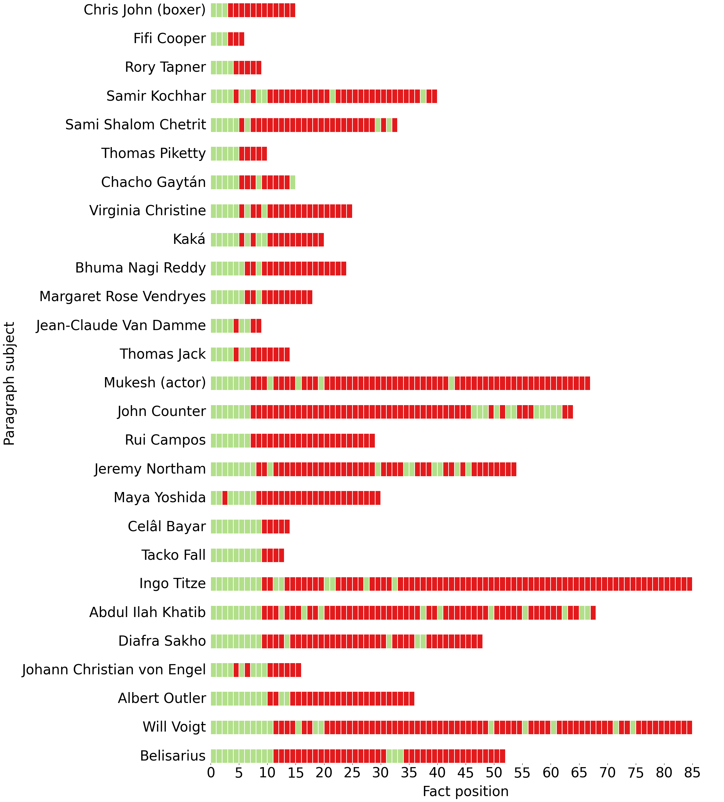
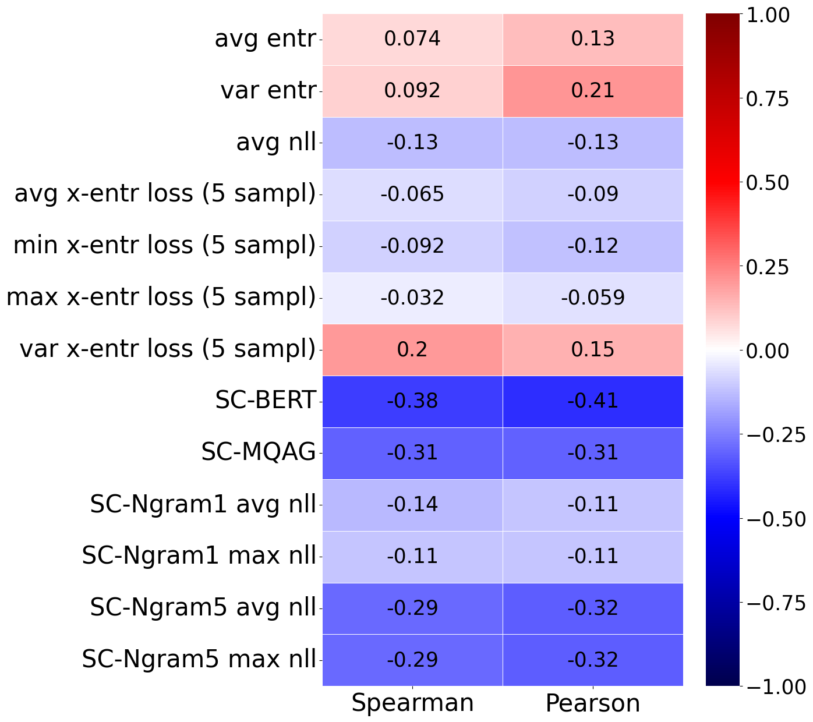

# 适时止步：探究文本创造中的语义漂移现象

发布时间：2024年04月08日

`LLM应用` `维基百科` `生物技术`

> Know When To Stop: A Study of Semantic Drift in Text Generation

# 摘要

> 本研究揭示了现代大型语言模型（LLM）通常先产生准确信息，随后可能“偏离轨道”，生成错误信息的现象，这在过去虽有所观察，却未得到充分评估。我们设计了一种语义漂移评分机制，用以衡量生成文本中准确与错误信息的分歧程度，并在创作类似维基百科的传记文本时验证了这一假设。这种先准确后失误的生成模式启示我们，通过把握生成的终止时机，有可能提升信息的准确性。因此，我们对几种提前终止生成策略进行了信息量与准确性之间的权衡研究，并成功地显著提高了信息的准确性。此外，我们还发现，通过语义相似性对结果进行重排序，无论是与原始结果相比，还是在结合提前终止策略的情况下，都能进一步提升结果的准确性。尽管尝试通过调用外部API引导模型回归正确路径并未取得预期效果，但我们的方法仍具有广泛的适用性，能够应用于各类长文本生成任务，通过在事实准确性、信息量和计算成本之间找到平衡点，生成更加可靠的信息。

> In this work, we explicitly show that modern LLMs tend to generate correct facts first, then "drift away" and generate incorrect facts later: this was occasionally observed but never properly measured. We develop a semantic drift score that measures the degree of separation between correct and incorrect facts in generated texts and confirm our hypothesis when generating Wikipedia-style biographies. This correct-then-incorrect generation pattern suggests that factual accuracy can be improved by knowing when to stop generation. Therefore, we explore the trade-off between information quantity and factual accuracy for several early stopping methods and manage to improve factuality by a large margin. We further show that reranking with semantic similarity can further improve these results, both compared to the baseline and when combined with early stopping. Finally, we try calling external API to bring the model back to the right generation path, but do not get positive results. Overall, our methods generalize and can be applied to any long-form text generation to produce more reliable information, by balancing trade-offs between factual accuracy, information quantity and computational cost.

[Arxiv](https://arxiv.org/abs/2404.05411)