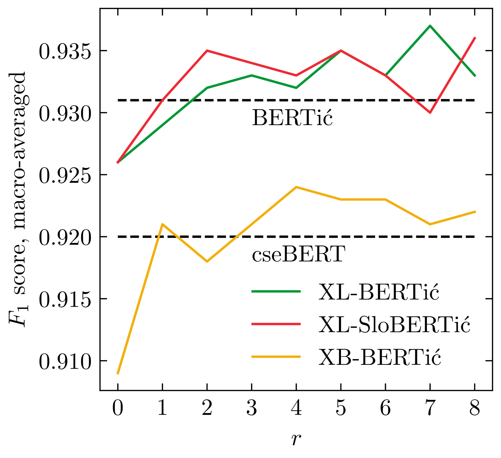
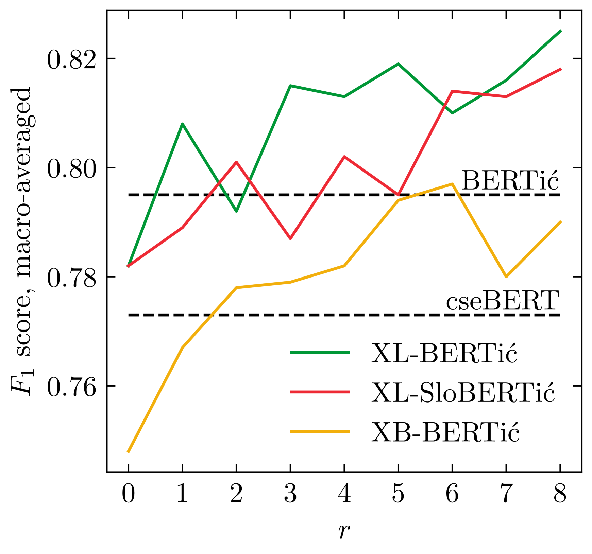
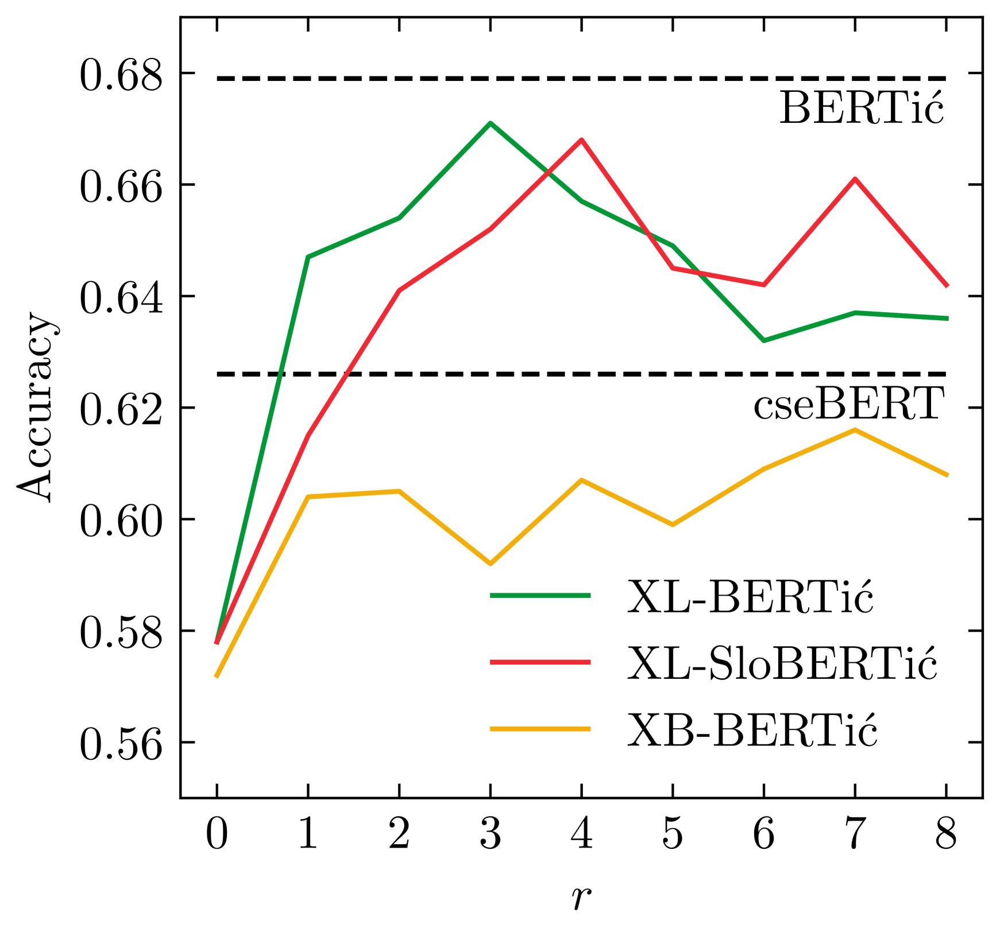

# 节食中的语言模型：通过额外的预训练，经济高效地为近缘语言打造编码器。

发布时间：2024年04月08日

`LLM理论` `语言处理` `机器学习`

> Language Models on a Diet: Cost-Efficient Development of Encoders for Closely-Related Languages via Additional Pretraining

# 摘要

> 语言模型的世界正波澜壮阔，更先进、更庞大的模型层出不穷。我们认为，特别是科学界，对于高达10亿参数的编码器模型仍有迫切需求，主要用于为庞大的数据集添加对后续研究必不可少的元数据。我们针对克罗地亚语、塞尔维亚语、波斯尼亚语和黑山语等紧密相关的语言，建立了多样化的评估基准，并对比了完全从零开始训练的模型与通过在现有多语言模型基础上进行额外预训练得到的新模型。研究显示，即使计算资源有限，通过额外预训练现有的多语言模型，也能达到与专门从头开始训练的模型相媲美的性能。同时，我们也发现，像斯洛文尼亚语这样的邻近语言，可以在额外的预训练中被纳入，且对最终模型的性能影响微乎其微。

> The world of language models is going through turbulent times, better and ever larger models are coming out at an unprecedented speed. However, we argue that, especially for the scientific community, encoder models of up to 1 billion parameters are still very much needed, their primary usage being in enriching large collections of data with metadata necessary for downstream research. We investigate the best way to ensure the existence of such encoder models on the set of very closely related languages - Croatian, Serbian, Bosnian and Montenegrin, by setting up a diverse benchmark for these languages, and comparing the trained-from-scratch models with the new models constructed via additional pretraining of existing multilingual models. We show that comparable performance to dedicated from-scratch models can be obtained by additionally pretraining available multilingual models even with a limited amount of computation. We also show that neighboring languages, in our case Slovenian, can be included in the additional pretraining with little to no loss in the performance of the final model.

[Arxiv](https://arxiv.org/abs/2404.05428)