# LayoutLLM：利用大型语言模型对布局指令进行优化，提升文档理解能力

发布时间：2024年04月08日

`LLM应用` `文档理解` `多模态学习`

> LayoutLLM: Layout Instruction Tuning with Large Language Models for Document Understanding

# 摘要

> 近期研究发现，运用大型或多模态语言模型来深入理解文档展现出巨大潜力。但先前的研究未能充分发挥文档布局信息的作用，而这正是精确解读文档的关键。本文提出了LayoutLLM，这是一种新型的基于语言模型的文档理解方法。其核心在于一种独特的布局指令调整策略，旨在深化模型对文档布局的理解与应用。该策略包括布局感知的预训练和微调两个部分，涉及文档级、区域级和段落级的信息处理。我们还创新性地引入了布局链式思维模块，让模型专注于问题相关区域，以生成更精确的答案。这一创新不仅提升了文档理解的准确度，也增加了模型的可解释性，便于人工审核与修正。实验结果显示，LayoutLLM在标准测试中的表现远超其他使用开源大型模型的方法。相关资料已公开在GitHub上，欢迎查阅和使用。

> Recently, leveraging large language models (LLMs) or multimodal large language models (MLLMs) for document understanding has been proven very promising. However, previous works that employ LLMs/MLLMs for document understanding have not fully explored and utilized the document layout information, which is vital for precise document understanding. In this paper, we propose LayoutLLM, an LLM/MLLM based method for document understanding. The core of LayoutLLM is a layout instruction tuning strategy, which is specially designed to enhance the comprehension and utilization of document layouts. The proposed layout instruction tuning strategy consists of two components: Layout-aware Pre-training and Layout-aware Supervised Fine-tuning. To capture the characteristics of document layout in Layout-aware Pre-training, three groups of pre-training tasks, corresponding to document-level, region-level and segment-level information, are introduced. Furthermore, a novel module called layout chain-of-thought (LayoutCoT) is devised to enable LayoutLLM to focus on regions relevant to the question and generate accurate answers. LayoutCoT is effective for boosting the performance of document understanding. Meanwhile, it brings a certain degree of interpretability, which could facilitate manual inspection and correction. Experiments on standard benchmarks show that the proposed LayoutLLM significantly outperforms existing methods that adopt open-source 7B LLMs/MLLMs for document understanding. The training data of the LayoutLLM is publicly available at https://github.com/AlibabaResearch/AdvancedLiterateMachinery/tree/main/DocumentUnderstanding/LayoutLLM

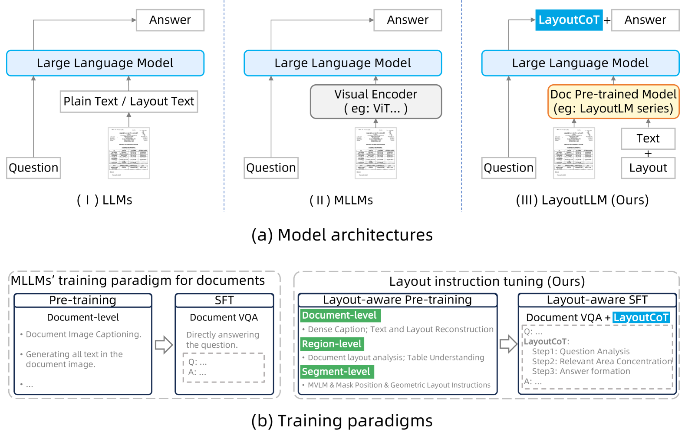

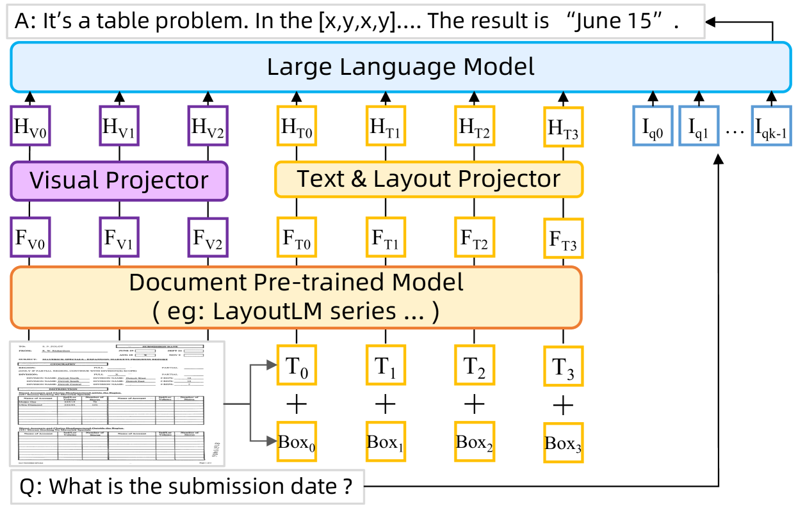

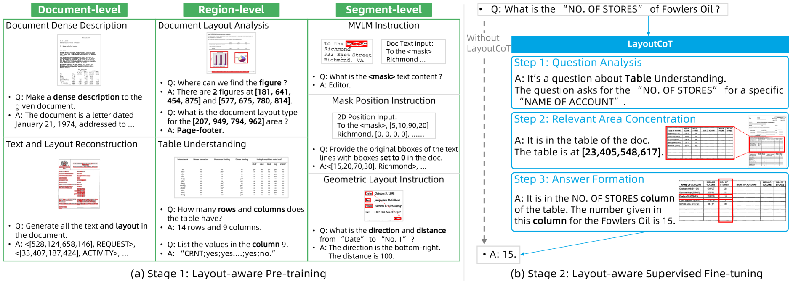

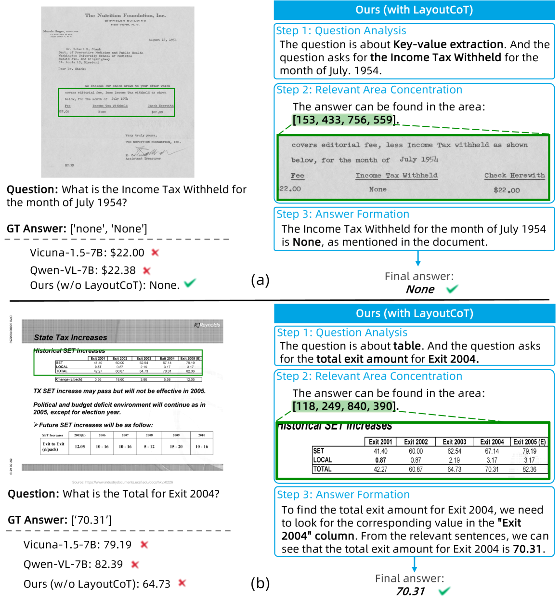

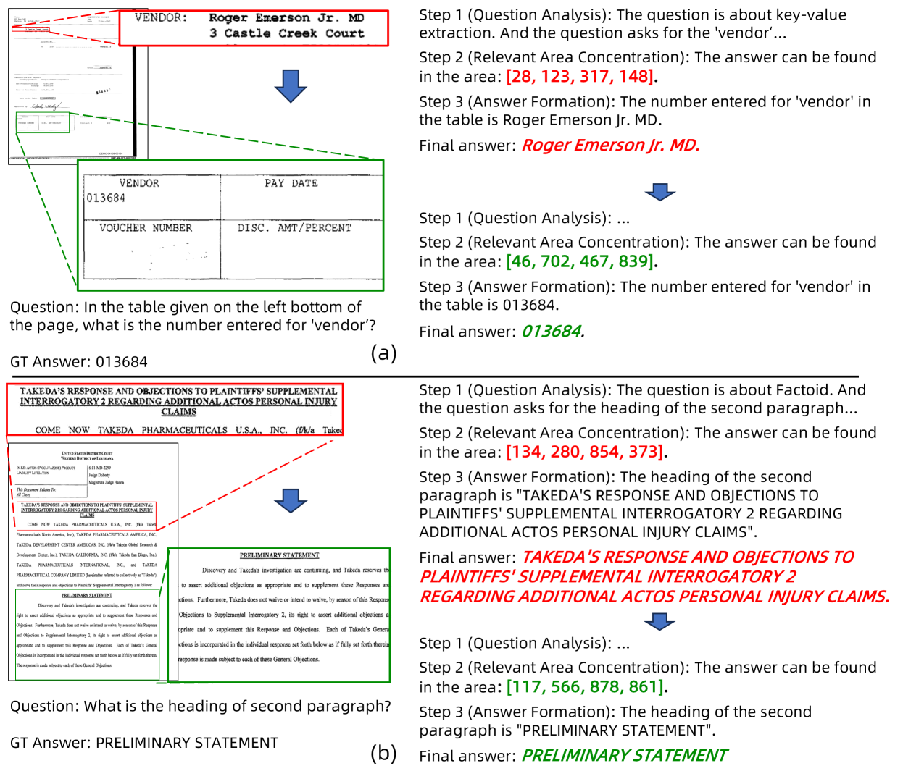

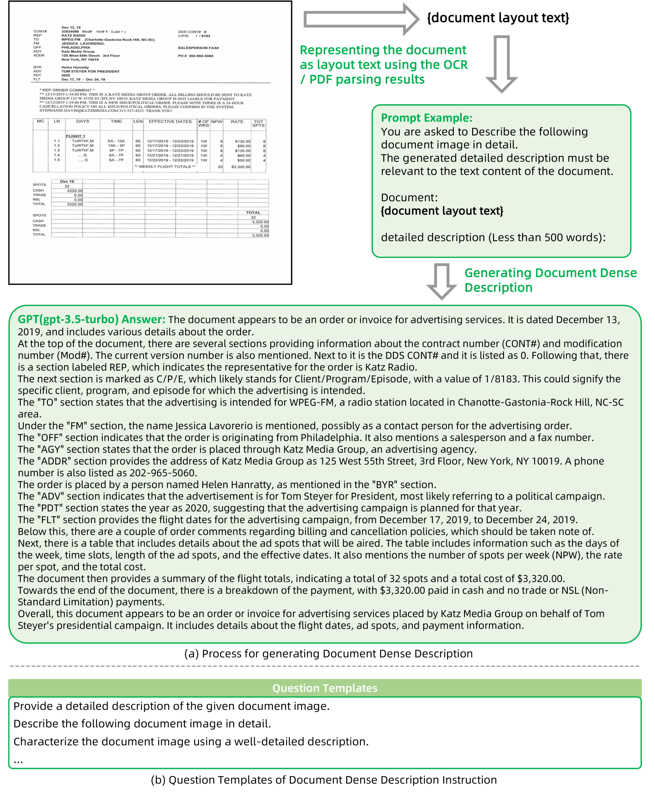

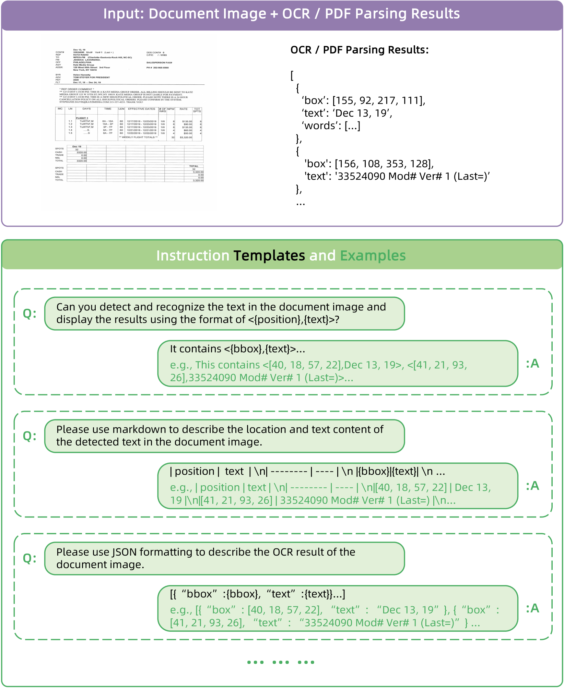

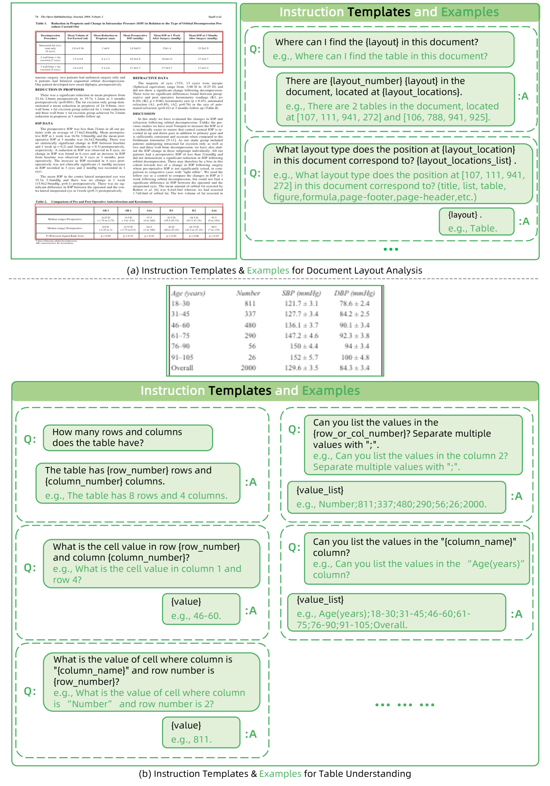

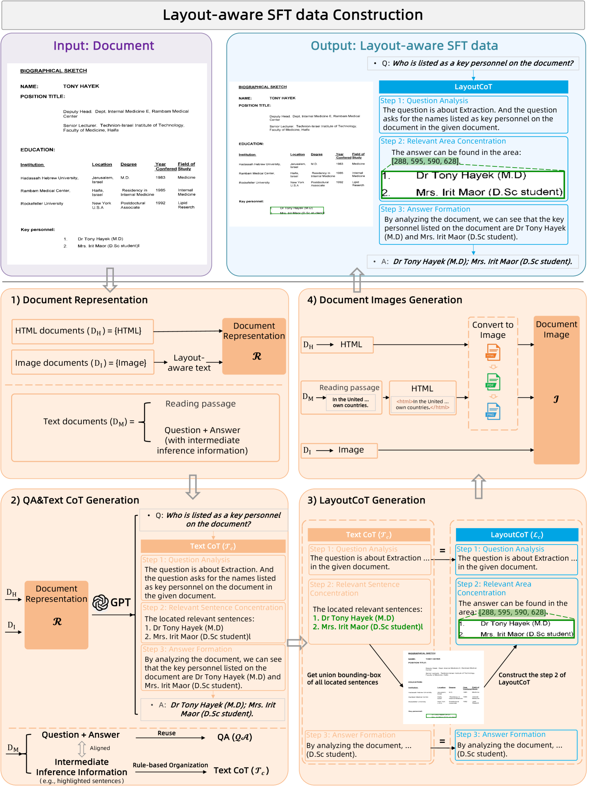

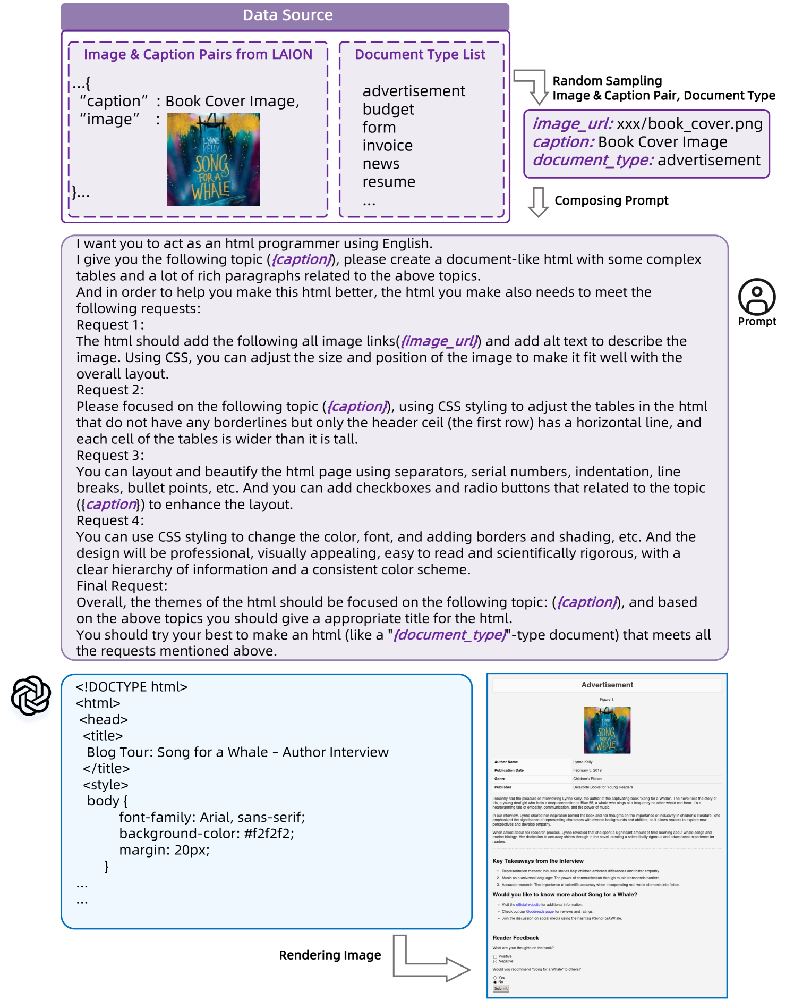

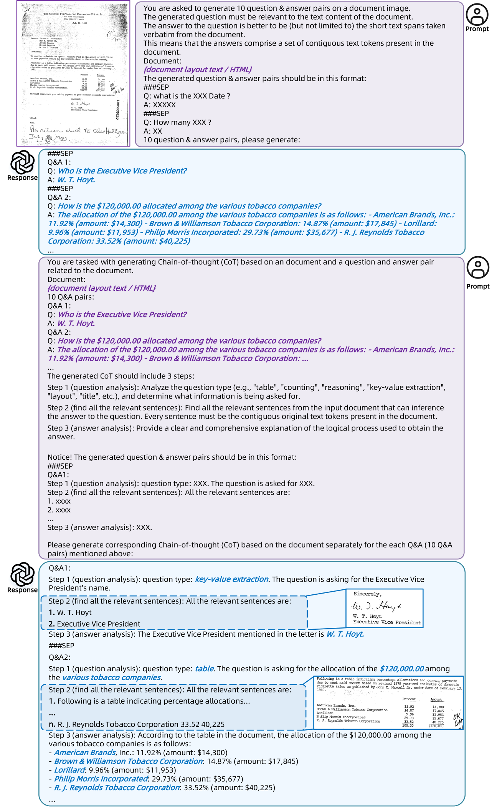

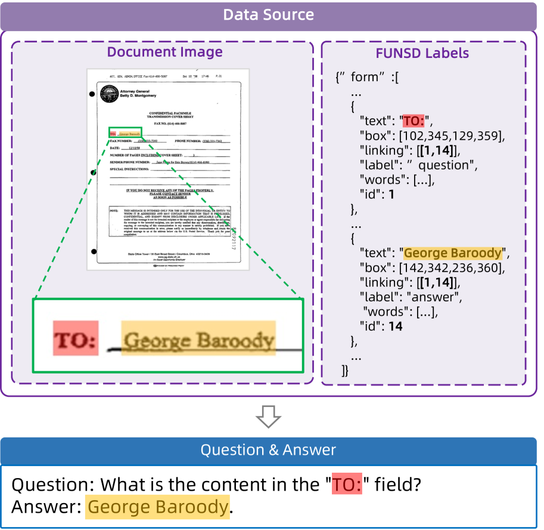

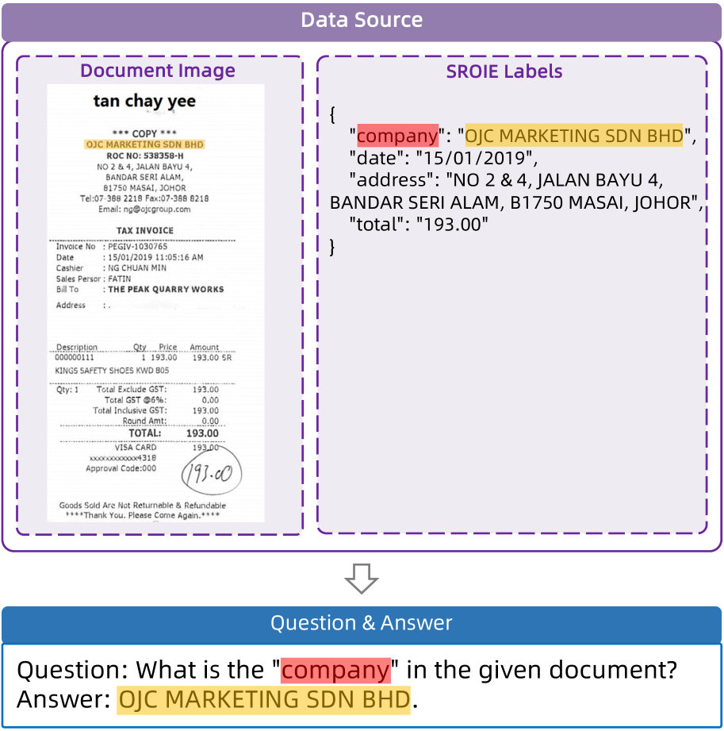

[Arxiv](https://arxiv.org/abs/2404.05225)