# 在四足机器人上，结合大型语言模型实现远程运动与操控

发布时间：2024年04月08日

`Agent` `机器人` `人工智能`

> Long-horizon Locomotion and Manipulation on a Quadrupedal Robot with Large Language Models

# 摘要

> 我们打造了一个依托大型语言模型（LLM）的系统，赋予四足机器人解决复杂长期任务的高阶解题能力，这些任务远不止简单的动作执行。四足机器人面临的长期任务颇具挑战，因为它们不仅需要深入理解任务的语义以制定计划，还需要掌握多种运动和操控技巧，以便与环境互动。该系统通过LLM构建了一个高级推理层，能够根据任务描述生成混合型的动作-策略计划，转化为机器人可执行的代码。系统内含多个LLM智能体：一个负责勾勒整体计划的语义规划器，一个负责预测计划所需参数的计算器，以及一个将计划转化为机器人代码的生成器。在底层，我们运用强化学习技术，培养了一系列动作规划和控制技能，充分释放四足机器人与环境互动的潜力。经过一系列长期任务的测试，这些任务对于单一技能而言是不可能完成的。无论是在模拟环境还是现实世界中，实验都证明该系统能够成功地制定多步骤策略，并展现出诸如制作工具或向人类求助等复杂行为。

> We present a large language model (LLM) based system to empower quadrupedal robots with problem-solving abilities for long-horizon tasks beyond short-term motions. Long-horizon tasks for quadrupeds are challenging since they require both a high-level understanding of the semantics of the problem for task planning and a broad range of locomotion and manipulation skills to interact with the environment. Our system builds a high-level reasoning layer with large language models, which generates hybrid discrete-continuous plans as robot code from task descriptions. It comprises multiple LLM agents: a semantic planner for sketching a plan, a parameter calculator for predicting arguments in the plan, and a code generator to convert the plan into executable robot code. At the low level, we adopt reinforcement learning to train a set of motion planning and control skills to unleash the flexibility of quadrupeds for rich environment interactions. Our system is tested on long-horizon tasks that are infeasible to complete with one single skill. Simulation and real-world experiments show that it successfully figures out multi-step strategies and demonstrates non-trivial behaviors, including building tools or notifying a human for help.

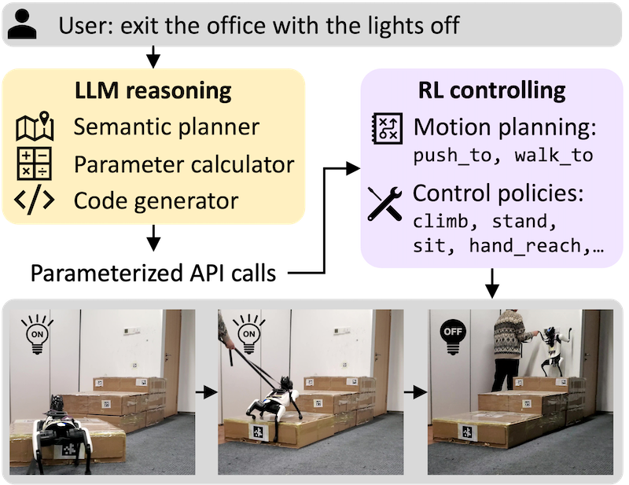

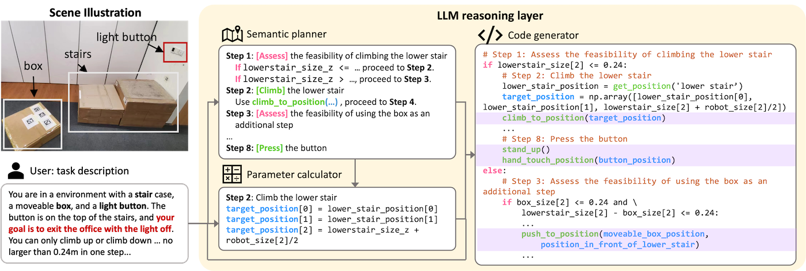

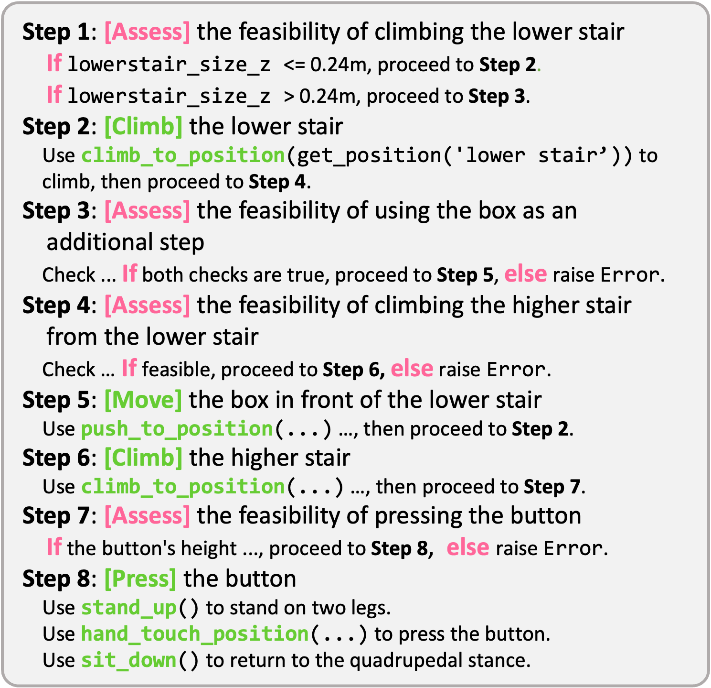

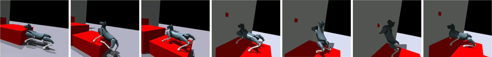

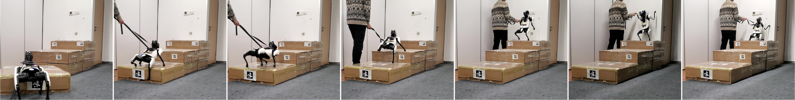

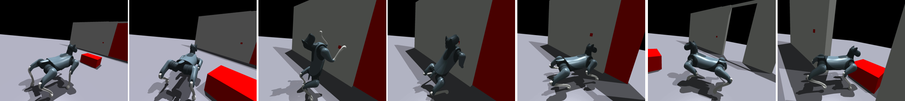

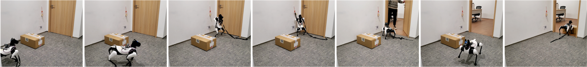

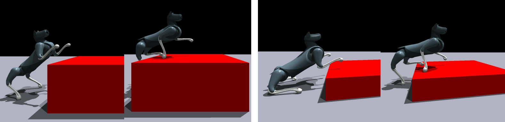

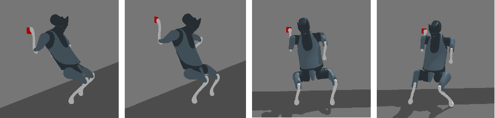

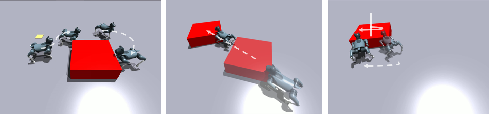

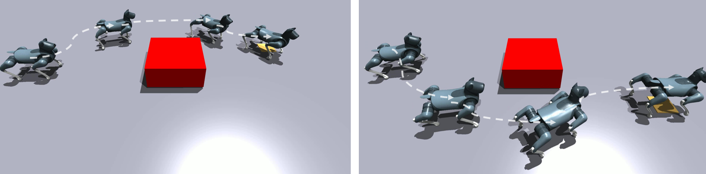

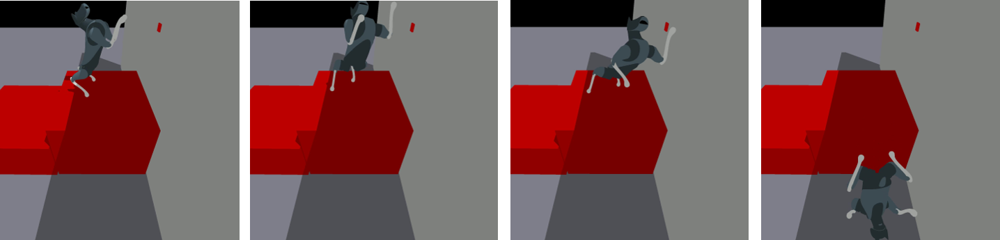

[Arxiv](https://arxiv.org/abs/2404.05291)