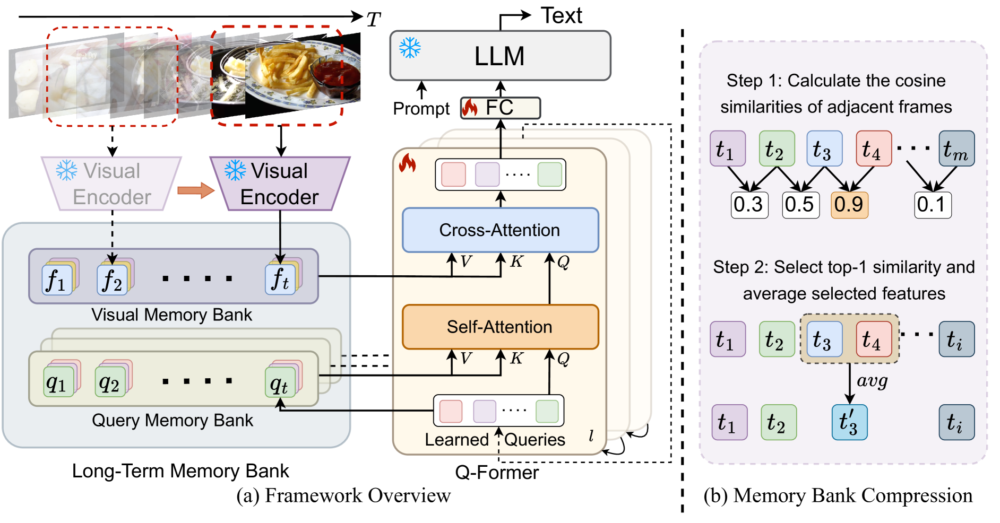

# MA-LMM 模型：为深入理解长时段视频内容而设计的具有记忆功能的多模态大型模型。

发布时间：2024年04月08日

`LLM应用` `视频处理` `多模态学习`

> MA-LMM: Memory-Augmented Large Multimodal Model for Long-Term Video Understanding

# 摘要

> 随着大型语言模型（LLMs）的兴起，将视觉模型融入其中，打造视觉-语言一体化基础模型，近期备受关注。然而，现有的基于LLM的多模态模型，如Video-LLaMA、VideoChat，在短视频理解方面仅限于处理有限帧数。本研究致力于开发一种针对长视频理解的高效模型。我们另辟蹊径，采用在线处理视频，并借助记忆库保存过往视频信息，使模型能够在不超出LLM的上下文长度和GPU内存限制的情况下，引用历史视频内容进行长期分析。我们的记忆库能轻松整合入现有的多模态LLM。经过多项视频理解任务的广泛测试，如长视频理解、视频问答和视频字幕生成，我们的模型在多个数据集上均达到了顶尖表现。相关代码已在 https://boheumd.github.io/MA-LMM/ 上发布。

> With the success of large language models (LLMs), integrating the vision model into LLMs to build vision-language foundation models has gained much more interest recently. However, existing LLM-based large multimodal models (e.g., Video-LLaMA, VideoChat) can only take in a limited number of frames for short video understanding. In this study, we mainly focus on designing an efficient and effective model for long-term video understanding. Instead of trying to process more frames simultaneously like most existing work, we propose to process videos in an online manner and store past video information in a memory bank. This allows our model to reference historical video content for long-term analysis without exceeding LLMs' context length constraints or GPU memory limits. Our memory bank can be seamlessly integrated into current multimodal LLMs in an off-the-shelf manner. We conduct extensive experiments on various video understanding tasks, such as long-video understanding, video question answering, and video captioning, and our model can achieve state-of-the-art performances across multiple datasets. Code available at https://boheumd.github.io/MA-LMM/.

[Arxiv](https://arxiv.org/abs/2404.05726)