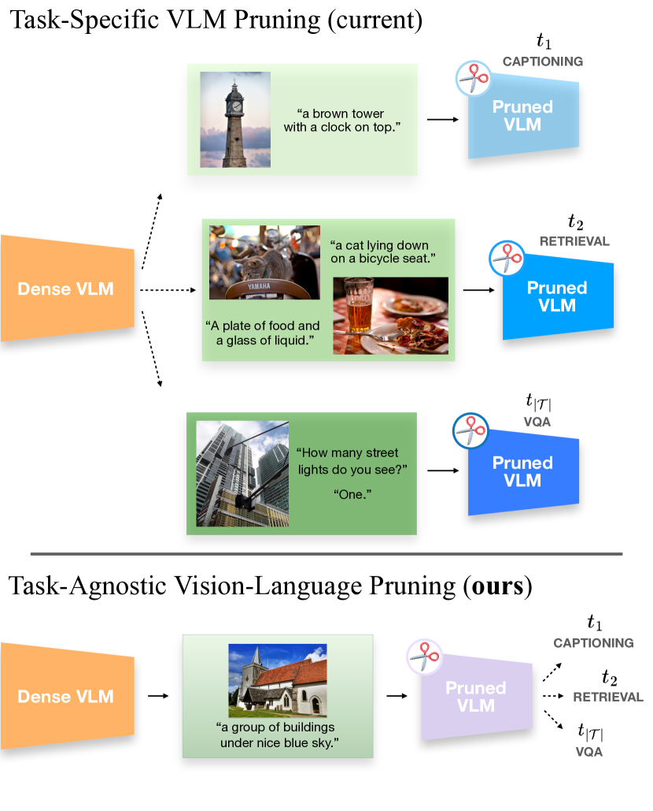
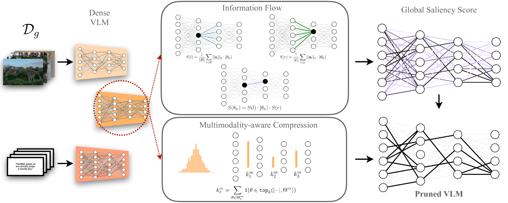
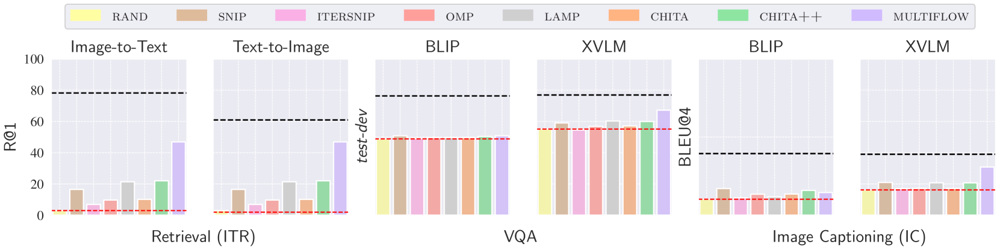
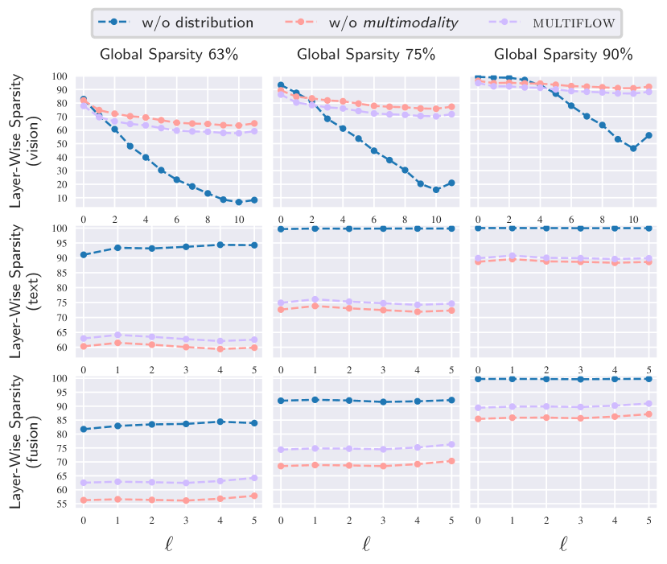

# MULTIFLOW：迈向与任务无关的视觉-语言模型精简方法

发布时间：2024年04月08日

`LLM理论` `计算机视觉`

> MULTIFLOW: Shifting Towards Task-Agnostic Vision-Language Pruning

# 摘要

> 视觉-语言模型（VLMs）在迁移学习上表现卓越，但庞大的参数量带来了昂贵的计算代价。为此，我们尝试通过模型剪枝来减少参数。目前针对VLMs的剪枝技术都是任务特定的，每遇到新任务就得重新剪枝。本研究开辟了新路径：任务无关的视觉-语言剪枝（TA-VLP）。我们旨在从预训练的VLM中找到一个适用于多种未知任务的独特剪枝版本。在此过程中，保留预训练模型中固有的可转移表示至关重要。我们提出了多模态流剪枝（MULTIFLOW），这是首个无梯度的TA-VLP剪枝框架，它根据参数的大小和信息流动来评估重要性，并考虑预训练后参数的多模态分布来引导剪枝。我们对八种顶尖剪枝算法进行了评估，涉及两种VLMs、三项视觉-语言任务和三种剪枝比例。实验结果显示，MULTIFLOW在绝大多数情况下都优于其他复杂的竞争算法，为应对TA-VLP问题开辟了新径。相关代码已在 https://github.com/FarinaMatteo/multiflow 上公开。

> While excellent in transfer learning, Vision-Language models (VLMs) come with high computational costs due to their large number of parameters. To address this issue, removing parameters via model pruning is a viable solution. However, existing techniques for VLMs are task-specific, and thus require pruning the network from scratch for each new task of interest. In this work, we explore a new direction: Task-Agnostic Vision-Language Pruning (TA-VLP). Given a pretrained VLM, the goal is to find a unique pruned counterpart transferable to multiple unknown downstream tasks. In this challenging setting, the transferable representations already encoded in the pretrained model are a key aspect to preserve. Thus, we propose Multimodal Flow Pruning (MULTIFLOW), a first, gradient-free, pruning framework for TA-VLP where: (i) the importance of a parameter is expressed in terms of its magnitude and its information flow, by incorporating the saliency of the neurons it connects; and (ii) pruning is driven by the emergent (multimodal) distribution of the VLM parameters after pretraining. We benchmark eight state-of-the-art pruning algorithms in the context of TA-VLP, experimenting with two VLMs, three vision-language tasks, and three pruning ratios. Our experimental results show that MULTIFLOW outperforms recent sophisticated, combinatorial competitors in the vast majority of the cases, paving the way towards addressing TA-VLP. The code is publicly available at https://github.com/FarinaMatteo/multiflow.

[Arxiv](https://arxiv.org/abs/2404.05621)