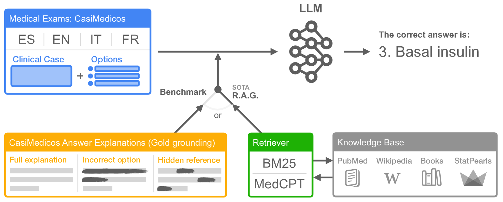
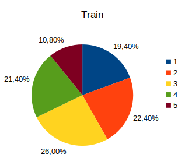
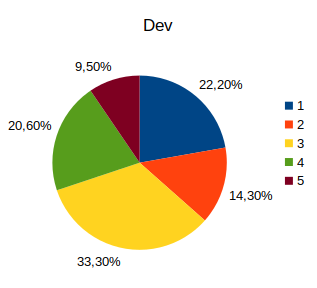
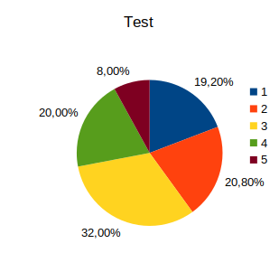
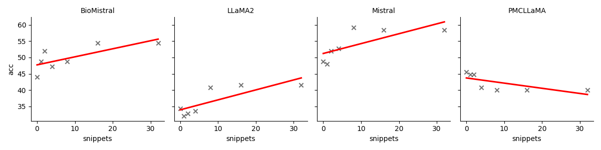
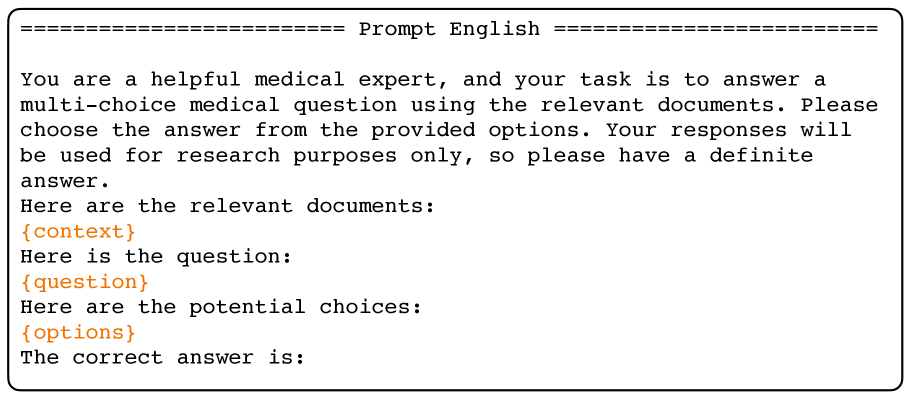
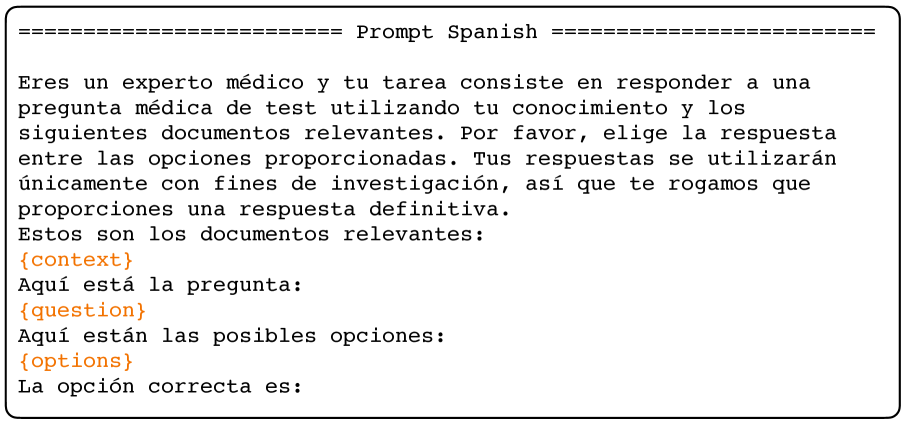
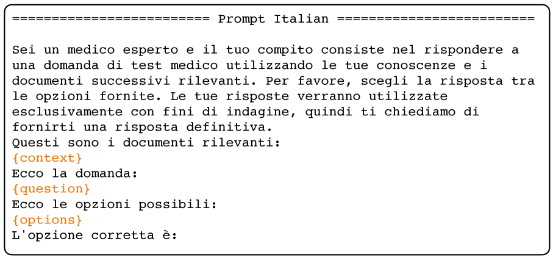
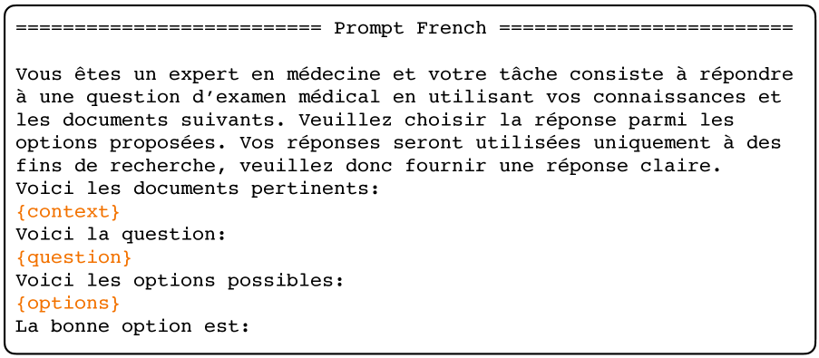
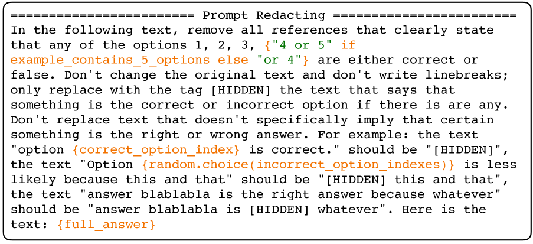

# MedExpQA：多语言环境下大型语言模型在医学问答任务中的评估基准

发布时间：2024年04月08日

`LLM应用` `问答系统`

> MedExpQA: Multilingual Benchmarking of Large Language Models for Medical Question Answering

# 摘要

> 大型语言模型（LLMs）展现出推动人工智能技术辅助医学专家进行决策支持的巨大潜力，这一点在医疗问答领域的出色表现中得到了证实。然而，医疗应用的质量门槛尚未达到。当前，LLMs仍面临知识更新滞后和内容幻想等问题。此外，大多数医学知识评估基准缺少权威性的黄金解释，导致无法有效评估LLMs预测的逻辑推理。尤其当我们关注非英语语言的LLMs评估时，这一问题更显严重，据我们了解，这仍是一个被广泛忽略的领域。为应对这些挑战，本文介绍了首个基于医学考试的多语言基准MedExpQA，专门用于评价LLMs在医疗问答任务上的能力。该基准首次收录了医生撰写的权威黄金解释，为LLMs性能提供了黄金标准的对照基准。通过黄金解释和检索增强生成（RAG）技术的多语言综合实验表明，LLMs在多语言环境中，尤其是非英语环境下，仍有显著的提升空间。即便采用了最先进的RAG技术，我们的研究也揭示了获取和融合现有医学知识以积极影响医疗问答评估结果的难题。目前，该基准已涵盖四种语言，并期望能激发对更多语言的支持和发展。

> Large Language Models (LLMs) have the potential of facilitating the development of Artificial Intelligence technology to assist medical experts for interactive decision support, which has been demonstrated by their competitive performances in Medical QA. However, while impressive, the required quality bar for medical applications remains far from being achieved. Currently, LLMs remain challenged by outdated knowledge and by their tendency to generate hallucinated content. Furthermore, most benchmarks to assess medical knowledge lack reference gold explanations which means that it is not possible to evaluate the reasoning of LLMs predictions. Finally, the situation is particularly grim if we consider benchmarking LLMs for languages other than English which remains, as far as we know, a totally neglected topic. In order to address these shortcomings, in this paper we present MedExpQA, the first multilingual benchmark based on medical exams to evaluate LLMs in Medical Question Answering. To the best of our knowledge, MedExpQA includes for the first time reference gold explanations written by medical doctors which can be leveraged to establish various gold-based upper-bounds for comparison with LLMs performance. Comprehensive multilingual experimentation using both the gold reference explanations and Retrieval Augmented Generation (RAG) approaches show that performance of LLMs still has large room for improvement, especially for languages other than English. Furthermore, and despite using state-of-the-art RAG methods, our results also demonstrate the difficulty of obtaining and integrating readily available medical knowledge that may positively impact results on downstream evaluations for Medical Question Answering. So far the benchmark is available in four languages, but we hope that this work may encourage further development to other languages.

[Arxiv](https://arxiv.org/abs/2404.05590)