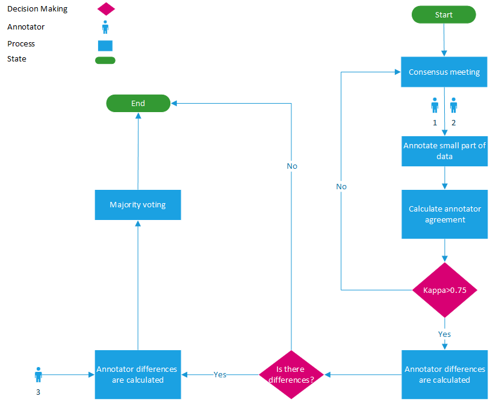
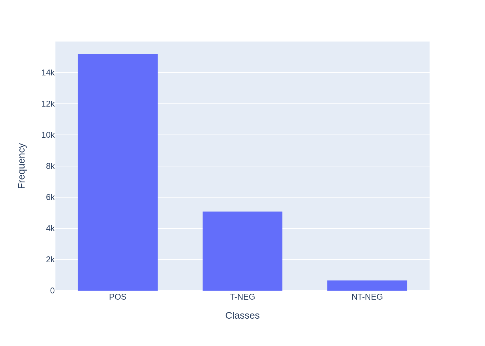
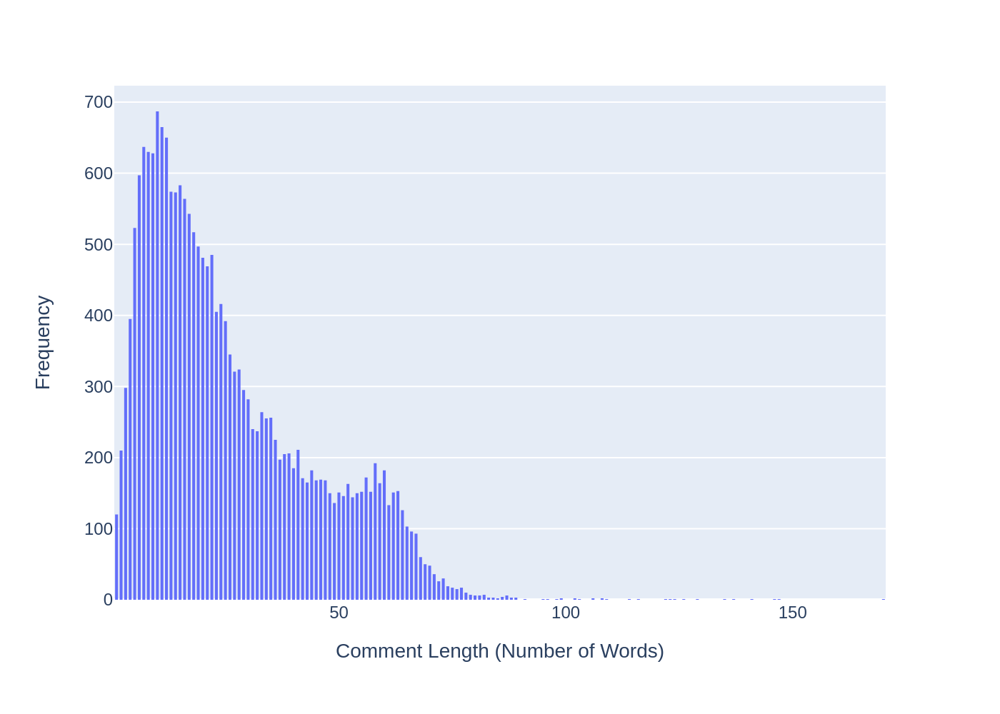
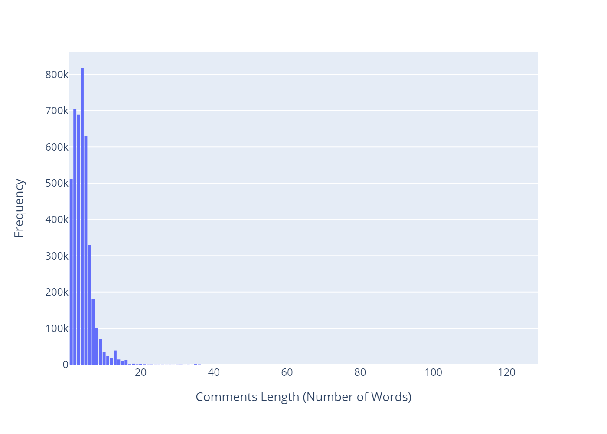
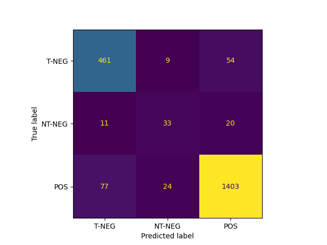
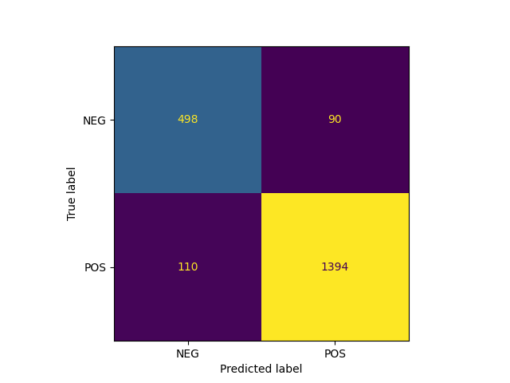

# OPSD：一个针对波斯语社交媒体的攻击性行为数据集及其基础性能评价

发布时间：2024年04月08日

`Agent` `社交媒体` `内容审核`

> OPSD: an Offensive Persian Social media Dataset and its baseline evaluations

# 摘要

> 社交媒体上的仇恨言论和攻击性评论因用户行为而日益增多，对人们的心理健康和社会行为造成负面影响。尽管英文领域的数据集众多，但波斯语资源却相对匮乏。为此，本研究提出了两个新的攻击性内容数据集：一个由专家精细标注，另一个则通过爬虫技术收集了大量未标注数据，用于无监督学习。为保证标注质量，实施了严格的三阶段审核流程，并采用kappa系数评估标注间的一致性。通过在这些数据集上应用当前最先进的语言模型和机器学习算法，包括有无掩蔽语言建模技术的模型，我们为这些数据集设定了性能基准。XLM-RoBERTa模型在三分类和二分类任务上的F1分数分别达到了76.9%和89.9%。

> The proliferation of hate speech and offensive comments on social media has become increasingly prevalent due to user activities. Such comments can have detrimental effects on individuals' psychological well-being and social behavior. While numerous datasets in the English language exist in this domain, few equivalent resources are available for Persian language. To address this gap, this paper introduces two offensive datasets. The first dataset comprises annotations provided by domain experts, while the second consists of a large collection of unlabeled data obtained through web crawling for unsupervised learning purposes. To ensure the quality of the former dataset, a meticulous three-stage labeling process was conducted, and kappa measures were computed to assess inter-annotator agreement. Furthermore, experiments were performed on the dataset using state-of-the-art language models, both with and without employing masked language modeling techniques, as well as machine learning algorithms, in order to establish the baselines for the dataset using contemporary cutting-edge approaches. The obtained F1-scores for the three-class and two-class versions of the dataset were 76.9% and 89.9% for XLM-RoBERTa, respectively.

[Arxiv](https://arxiv.org/abs/2404.05540)