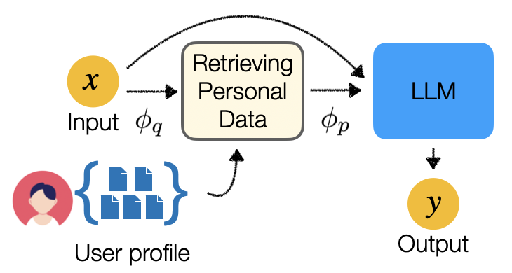
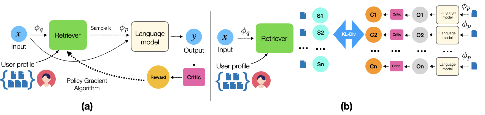
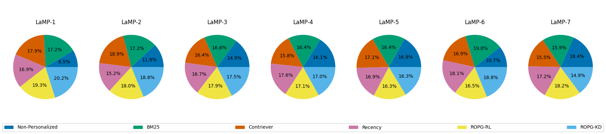
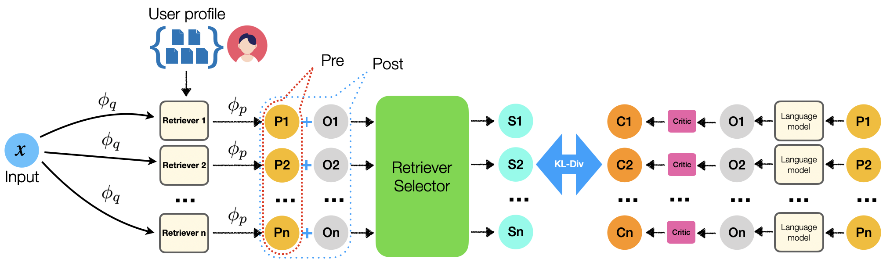

# 通过检索增强技术，优化大型语言模型的个性化方法研究

发布时间：2024年04月08日

`LLM应用` `检索增强` `个性化定制`

> Optimization Methods for Personalizing Large Language Models through Retrieval Augmentation

# 摘要

> 本研究探讨了如何通过检索增强技术来定制大型语言模型（LLMs），这一方法有望在众多应用场景中产生深远影响。我们首次尝试对检索模型进行优化，使其能够向LLMs提供少量个性化文档，以实现定制化的文本生成。我们设计了两种新颖的优化算法：一种利用强化学习，通过自定义的个性化生成指标来定义奖励函数；另一种则通过知识蒸馏技术，将下游LLM的知识传递给检索模型。此外，我们还提出了一个生成前后的检索器选择模型，它能够根据LLM的输入来决定使用哪种检索器。在LaMP基准测试中，我们在七项数据集中的六项上取得了显著的改进。

> This paper studies retrieval-augmented approaches for personalizing large language models (LLMs), which potentially have a substantial impact on various applications and domains. We propose the first attempt to optimize the retrieval models that deliver a limited number of personal documents to large language models for the purpose of personalized generation. We develop two optimization algorithms that solicit feedback from the downstream personalized generation tasks for retrieval optimization--one based on reinforcement learning whose reward function is defined using any arbitrary metric for personalized generation and another based on knowledge distillation from the downstream LLM to the retrieval model. This paper also introduces a pre- and post-generation retriever selection model that decides what retriever to choose for each LLM input. Extensive experiments on diverse tasks from the language model personalization (LaMP) benchmark reveal statistically significant improvements in six out of seven datasets.

[Arxiv](https://arxiv.org/abs/2404.05970)