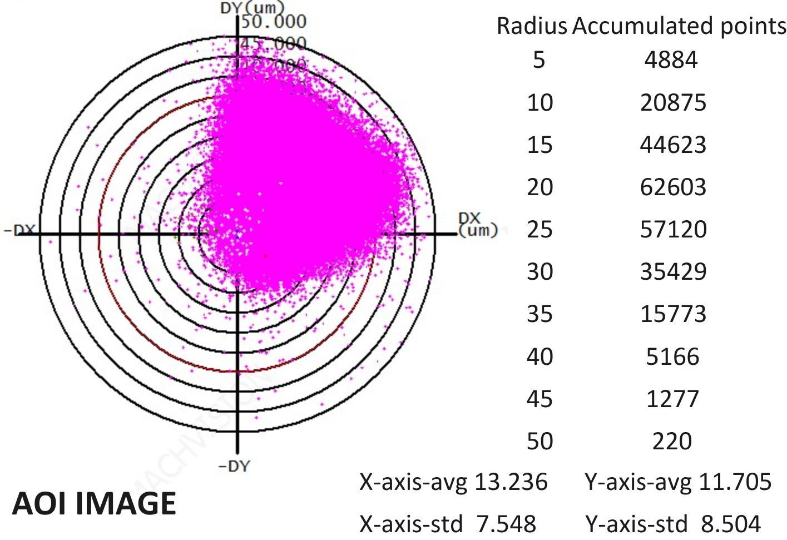
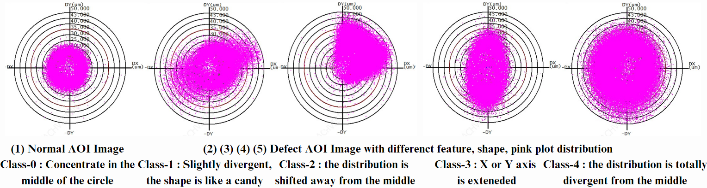
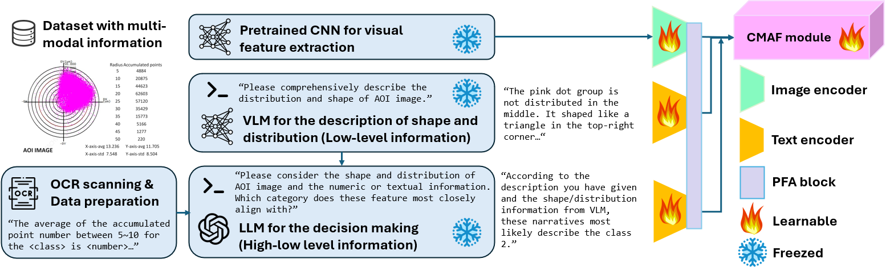
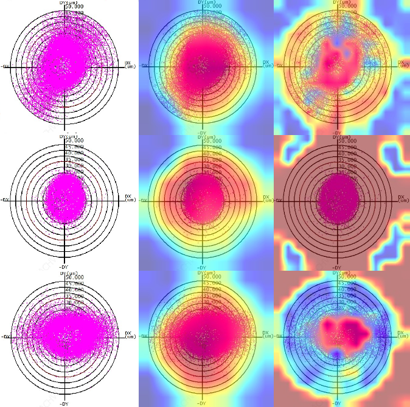
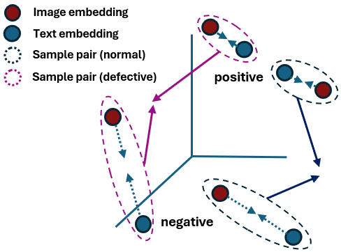
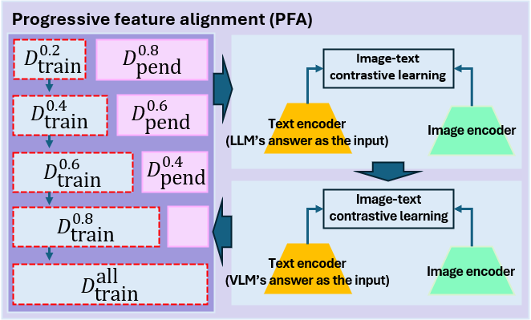
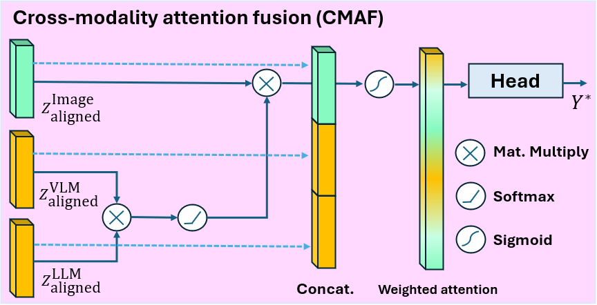
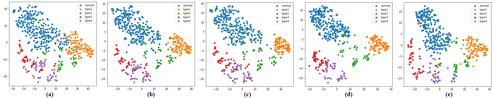

# 通过 VLM-LLM 特征的渐进式对齐方法，提升 ASE 数据集中缺陷识别的准确性。

发布时间：2024年04月08日

`LLM应用` `电子制造` `自动缺陷检测`

> Progressive Alignment with VLM-LLM Feature to Augment Defect Classification for the ASE Dataset

# 摘要

> 传统缺陷分类技术遭遇双重挑战：一是数据样本不足且质量参差不齐，收集充分样本既费钱又耗时，造成数据集偏差，增加了识别与学习的难度；二是过分依赖图像信息。在某些情况下，如图像模式单一或缺陷难以辨识，传统自动光学检测（AOI）系统和深度学习模型的表现难以保障。面对这一双重难题，我们探索了一种新策略：利用数据集中的其他特征，并结合强大的视觉-语言模型（VLM）与大型语言模型（LLM），发挥它们出色的零-shot学习能力。本研究提出了ASE特殊数据集，其包含丰富的图像数据描述，尽管直接学习缺陷特征颇具挑战。我们进一步提出了一种针对ASE数据集的VLM-LLM提示方法，以激发图像中的多模态特征，从而提升分类性能。接着，设计了创新的渐进式特征对齐（PFA）模块，优化图像与文本特征，以减轻少量样本情况下的对齐难题。最终，跨模态注意力融合（CMAF）模块实现了不同特征的有效整合。实验结果显示，我们的方法在ASE数据集的多种缺陷分类方法中表现出色。

> Traditional defect classification approaches are facing with two barriers. (1) Insufficient training data and unstable data quality. Collecting sufficient defective sample is expensive and time-costing, consequently leading to dataset variance. It introduces the difficulty on recognition and learning. (2) Over-dependence on visual modality. When the image pattern and texture is monotonic for all defect classes in a given dataset, the performance of conventional AOI system cannot be guaranteed. In scenarios where image quality is compromised due to mechanical failures or when defect information is inherently difficult to discern, the performance of deep models cannot be guaranteed. A main question is, "how to solve those two problems when they occur at the same time?" The feasible strategy is to explore another feature within dataset and combine an eminent vision-language model (VLM) and Large-Language model (LLM) with their astonishing zero-shot capability. In this work, we propose the special ASE dataset, including rich data description recorded on image, for defect classification, but the defect feature is uneasy to learn directly. Secondly, We present the prompting for VLM-LLM against defect classification with the proposed ASE dataset to activate extra-modality feature from images to enhance performance. Then, We design the novel progressive feature alignment (PFA) block to refine image-text feature to alleviate the difficulty of alignment under few-shot scenario. Finally, the proposed Cross-modality attention fusion (CMAF) module can effectively fuse different modality feature. Experiment results have demonstrated our method's effectiveness over several defect classification methods for the ASE dataset.

[Arxiv](https://arxiv.org/abs/2404.05183)