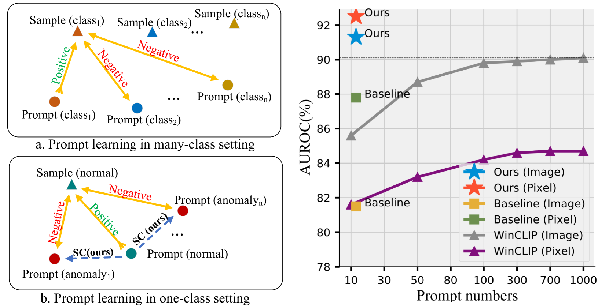
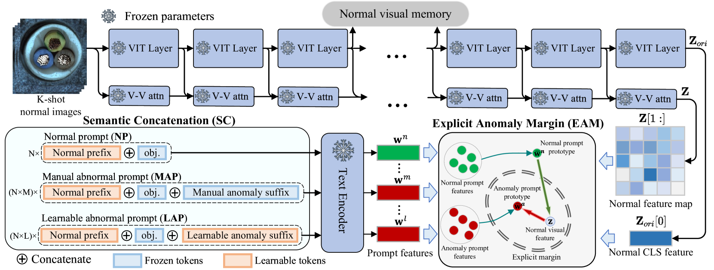
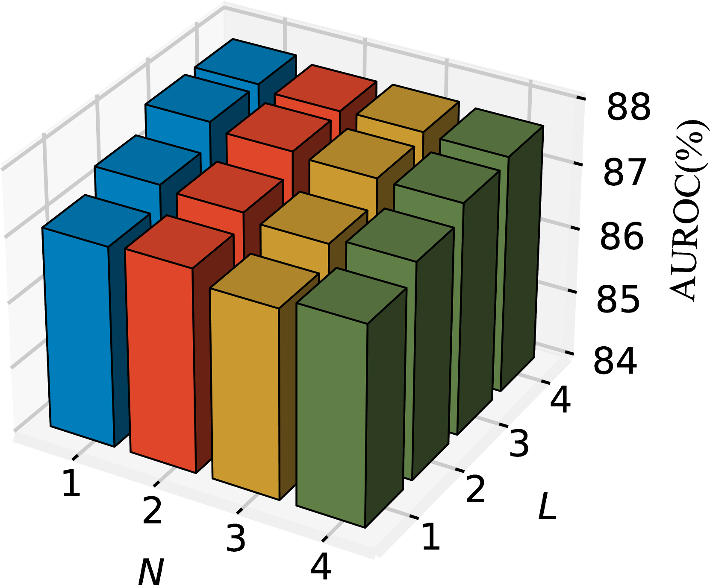
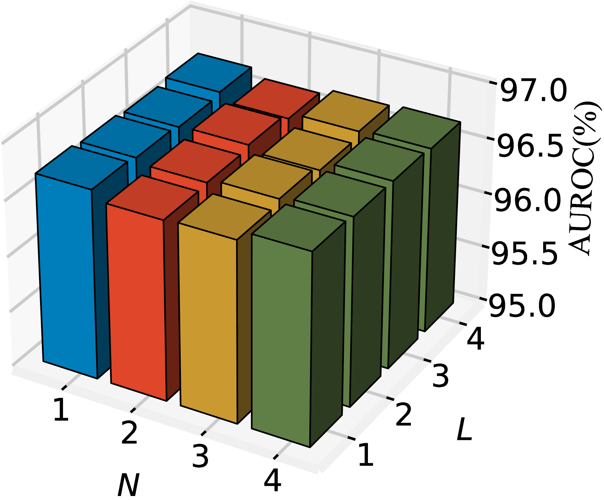
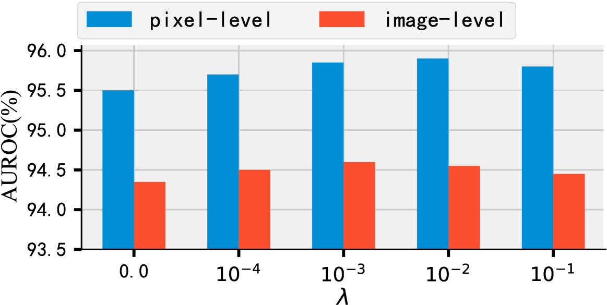
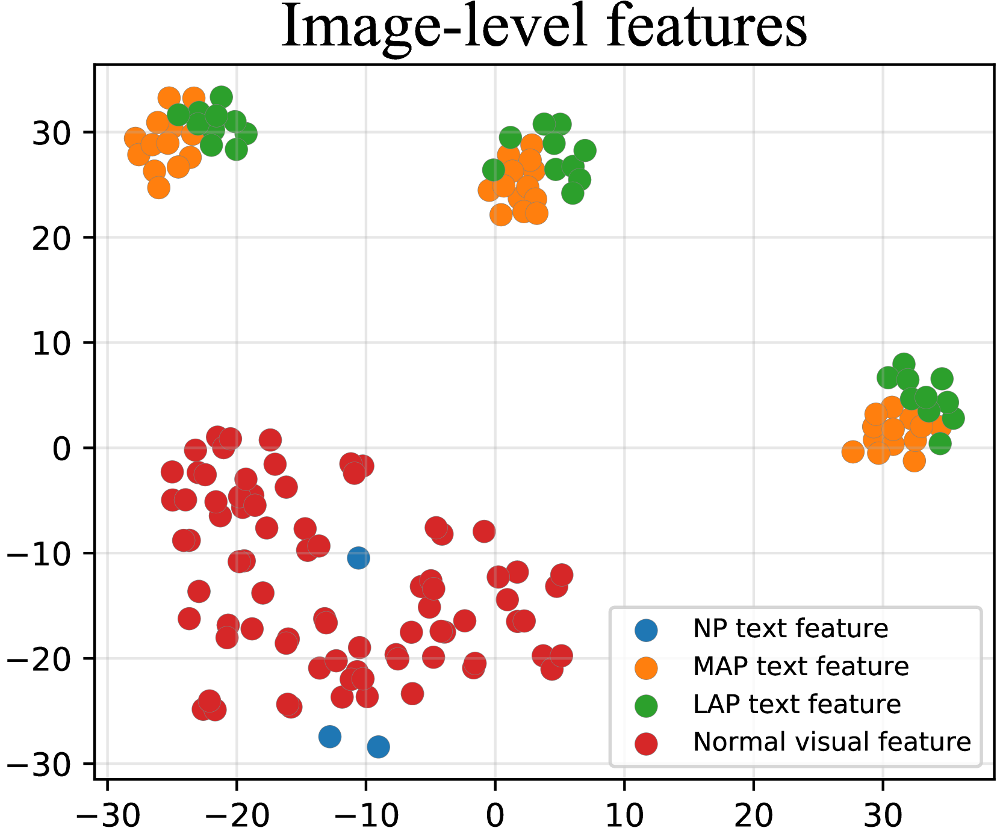
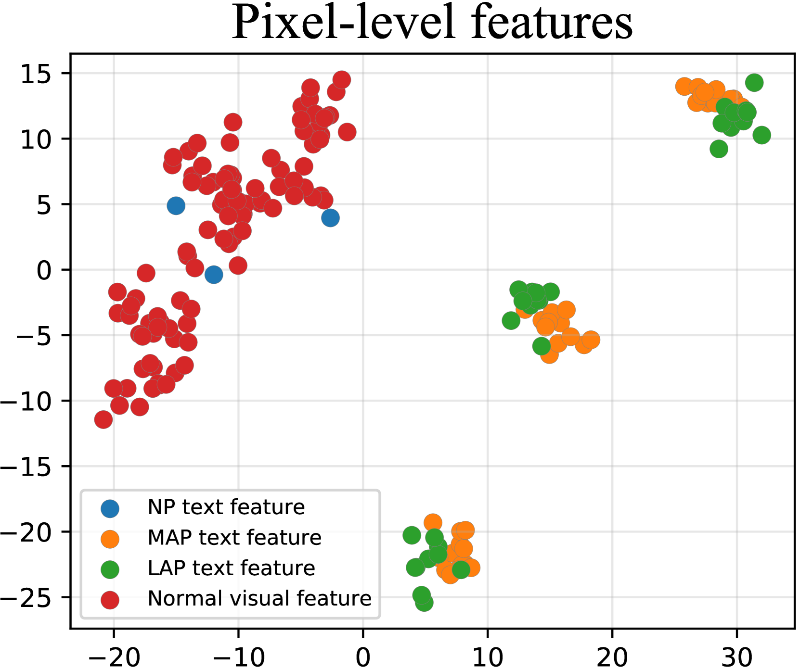
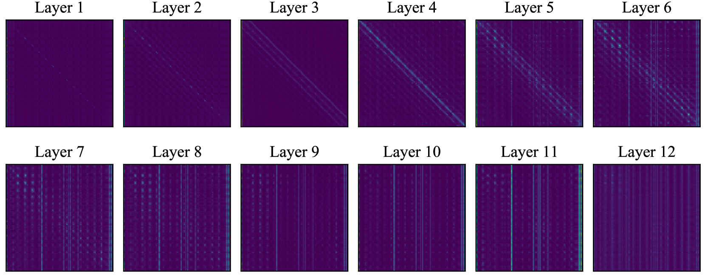
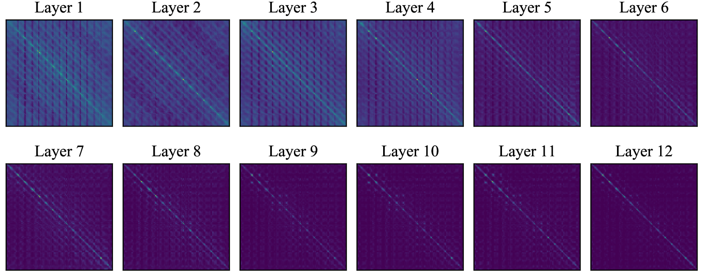

# PromptAD 研究：仅通过正常样本进行学习，实现少样本情况下的高效异常检测。

发布时间：2024年04月08日

`RAG` `异常检测`

> PromptAD: Learning Prompts with only Normal Samples for Few-Shot Anomaly Detection

# 摘要

> 视觉-语言模型极大地提升了少样本工业异常检测的效果，这一领域通常需设计大量提示。我们尝试以多类别模式的传统提示学习作为起点，自动掌握提示学习，却发现在单一类别异常检测中效果不佳。为此，本文提出了一种新颖的单类别提示学习方法PromptAD，专攻少样本异常检测。该方法通过语义连接技术，将常规提示与异常后缀结合，生成大量负样本，有效引导单类别环境下的提示学习。同时，针对异常图像缺失带来的训练难题，引入显式异常边际概念，通过超参数明确控制正常与异常提示特征间的距离。在MVTec和VisA的少样本检测任务中，PromptAD在12项挑战中11次夺魁，表现卓越。

> The vision-language model has brought great improvement to few-shot industrial anomaly detection, which usually needs to design of hundreds of prompts through prompt engineering. For automated scenarios, we first use conventional prompt learning with many-class paradigm as the baseline to automatically learn prompts but found that it can not work well in one-class anomaly detection. To address the above problem, this paper proposes a one-class prompt learning method for few-shot anomaly detection, termed PromptAD. First, we propose semantic concatenation which can transpose normal prompts into anomaly prompts by concatenating normal prompts with anomaly suffixes, thus constructing a large number of negative samples used to guide prompt learning in one-class setting. Furthermore, to mitigate the training challenge caused by the absence of anomaly images, we introduce the concept of explicit anomaly margin, which is used to explicitly control the margin between normal prompt features and anomaly prompt features through a hyper-parameter. For image-level/pixel-level anomaly detection, PromptAD achieves first place in 11/12 few-shot settings on MVTec and VisA.

[Arxiv](https://arxiv.org/abs/2404.05231)