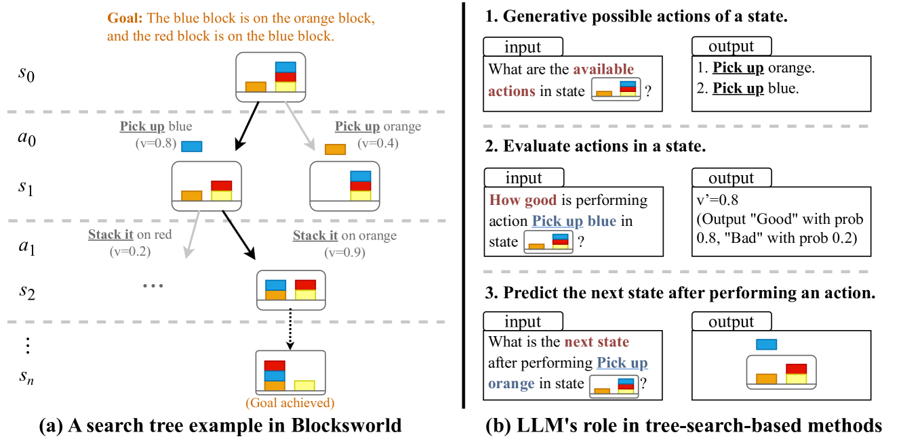
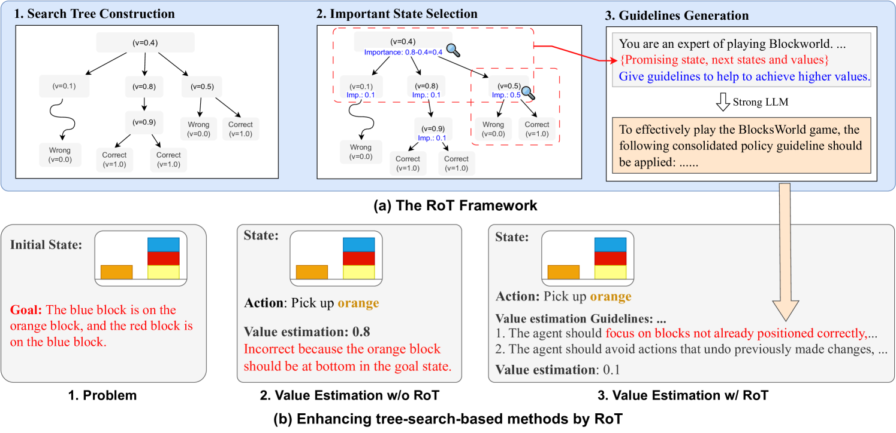
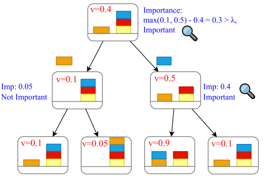
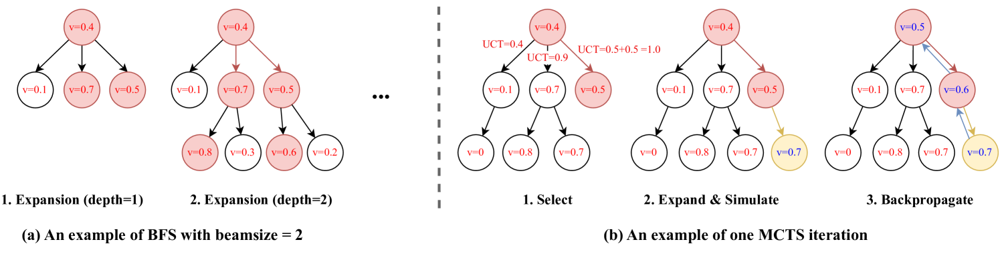
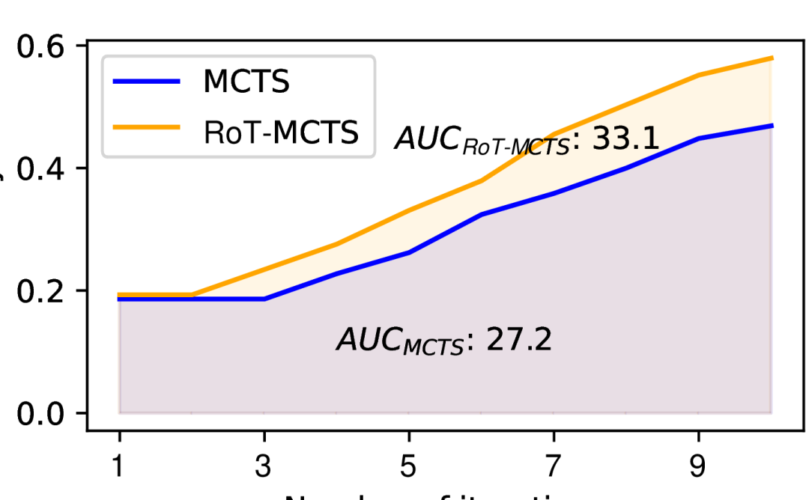
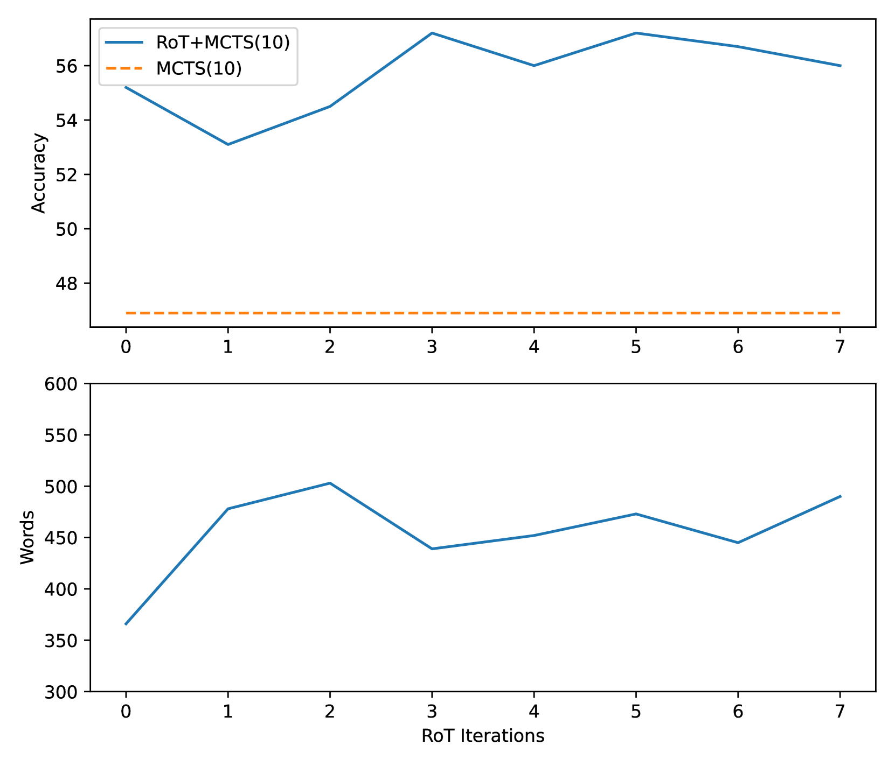
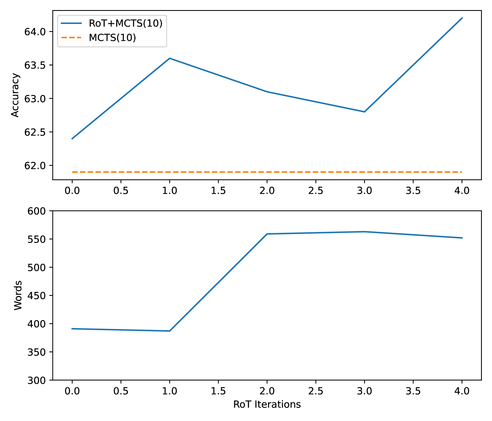

# RoT 技术：借助搜索树反思，提升大型语言模型的性能

发布时间：2024年04月08日

`LLM应用` `人工智能` `搜索算法`

> RoT: Enhancing Large Language Models with Reflection on Search Trees

# 摘要

> 大型语言模型（LLMs）结合树搜索式提示方法，在推理和规划方面展现出卓越能力。但这些方法常因忽视先前的搜索经验而重复犯错。为此，我们推出了搜索树反思（RoT）框架，它通过回顾过往搜索经验，为弱LLM提供指导，从而增强其性能。这些指导方针能有效避免在树搜索过程中的常见错误。我们还提出了一种创新的状态筛选法，从历史数据中提炼关键信息，助力RoT制定更精准的指导策略。实验证明，RoT能显著提升LLMs在多种树搜索提示方法下的表现，如广度优先搜索（BFS）和蒙特卡洛树搜索（MCTS）。即便是非树搜索的提示方法，如思维链（CoT），也能从RoT的指导中受益，因为它能提供基于搜索经验的任务相关知识。

> Large language models (LLMs) have demonstrated impressive capability in reasoning and planning when integrated with tree-search-based prompting methods. However, since these methods ignore the previous search experiences, they often make the same mistakes in the search process. To address this issue, we introduce Reflection on search Trees (RoT), an LLM reflection framework designed to improve the performance of tree-search-based prompting methods. It uses a strong LLM to summarize guidelines from previous tree search experiences to enhance the ability of a weak LLM. The guidelines are instructions about solving this task through tree search which can prevent the weak LLMs from making similar mistakes in the past search process. In addition, we proposed a novel state selection method, which identifies the critical information from historical search processes to help RoT generate more specific and meaningful guidelines. In our extensive experiments, we find that RoT significantly improves the performance of LLMs in reasoning or planning tasks with various tree-search-based prompting methods (e.g., BFS and MCTS). Non-tree-search-based prompting methods such as Chain-of-Thought (CoT) can also benefit from RoT guidelines since RoT can provide task-specific knowledge collected from the search experience.

[Arxiv](https://arxiv.org/abs/2404.05449)