# 大型语言模型与模型驱动工程相结合，为集中式车辆系统的自动化开发提供强大助力。

发布时间：2024年04月08日

`这个论文可以归类为LLM应用。` `软件开发`

> Synergy of Large Language Model and Model Driven Engineering for Automated Development of Centralized Vehicular Systems

# 摘要

> 我们展示了一款工具原型，它结合了模型驱动工程（MDE）和大型语言模型（LLM）的优势，旨在自动化汽车行业的软件开发流程。用户以自由文本形式提出需求，LLM首先将其转换为Ecore模型实例，再通过对象约束语言（OCL）进行一致性校验。校验无误后，该模型实例被送入另一个LLM，用于生成代码。随后，这段代码在CARLA模拟器搭建的紧急制动场景中，针对一个示例车辆架构进行了测试和评估。

> We present a prototype of a tool leveraging the synergy of model driven engineering (MDE) and Large Language Models (LLM) for the purpose of software development process automation in the automotive industry. In this approach, the user-provided input is free form textual requirements, which are first translated to Ecore model instance representation using an LLM, which is afterwards checked for consistency using Object Constraint Language (OCL) rules. After successful consistency check, the model instance is fed as input to another LLM for the purpose of code generation. The generated code is evaluated in a simulated environment using CARLA simulator connected to an example centralized vehicle architecture, in an emergency brake scenario.

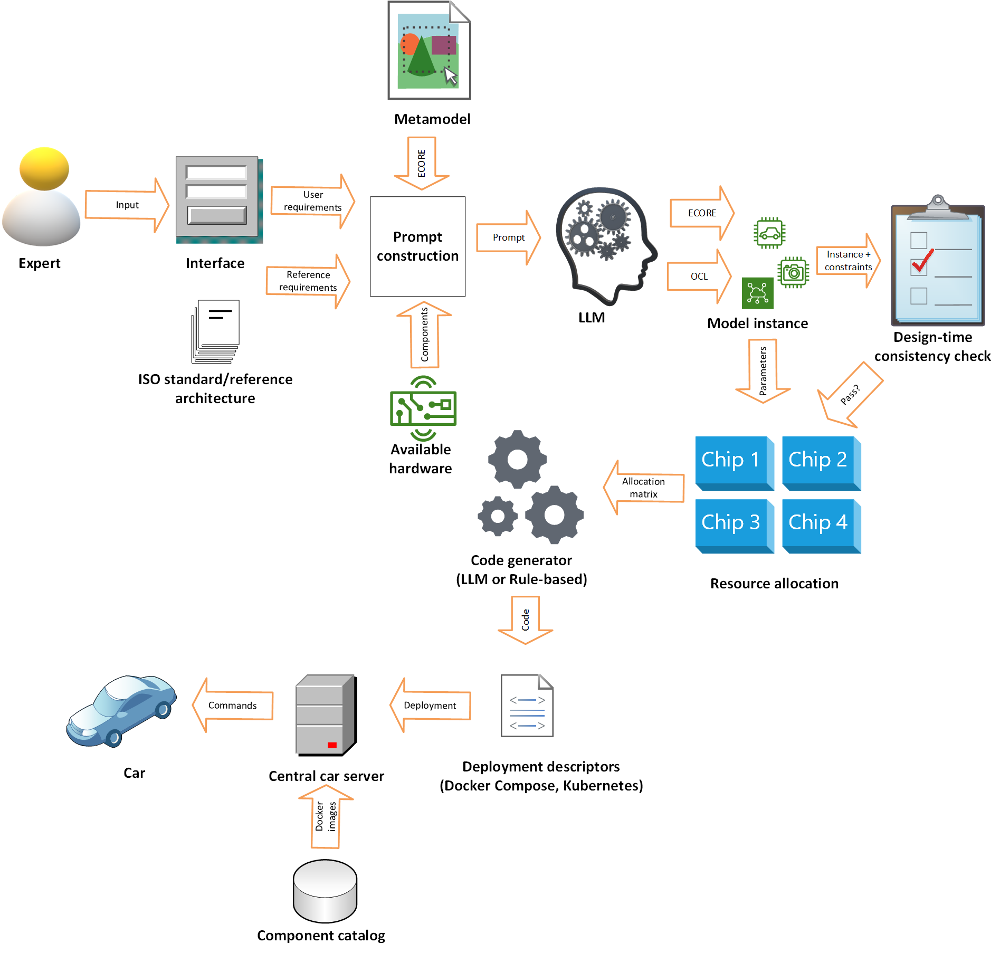

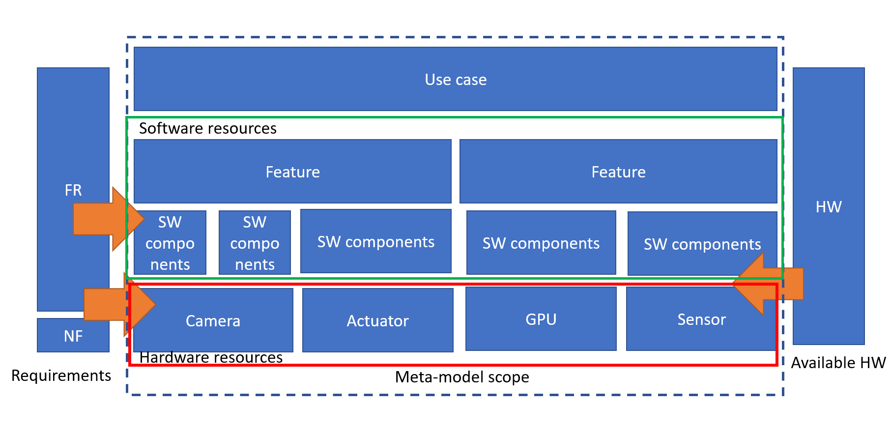

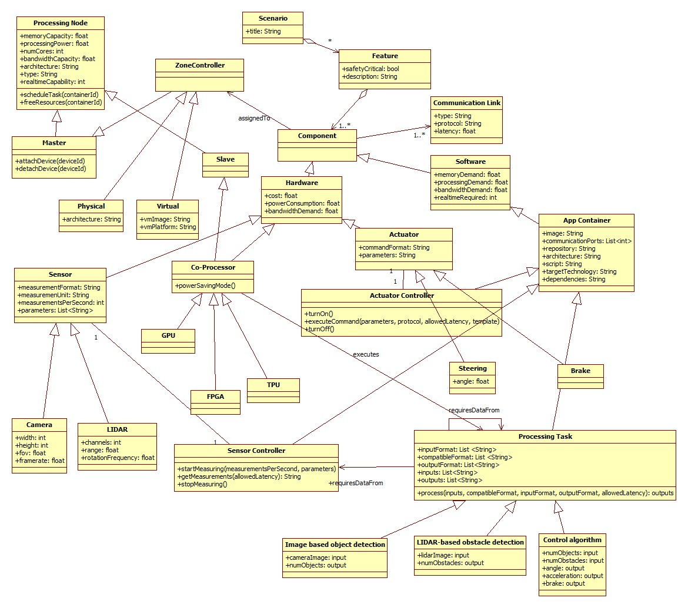

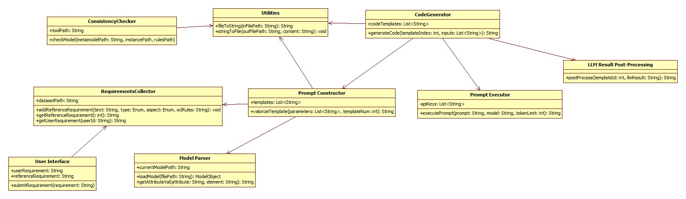

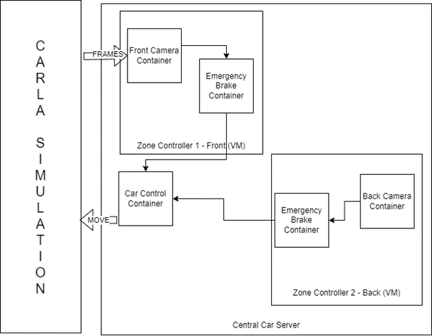

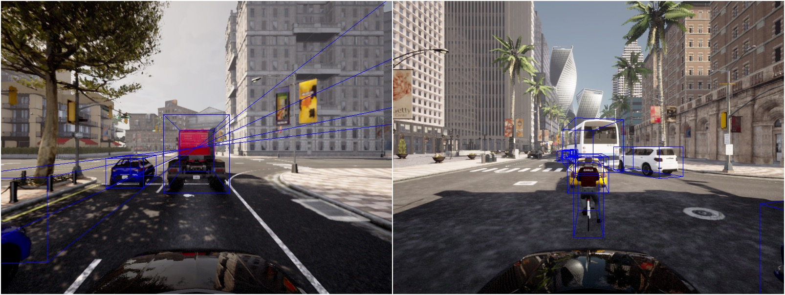

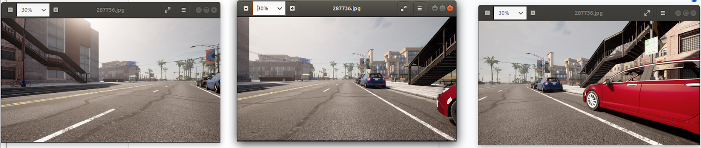

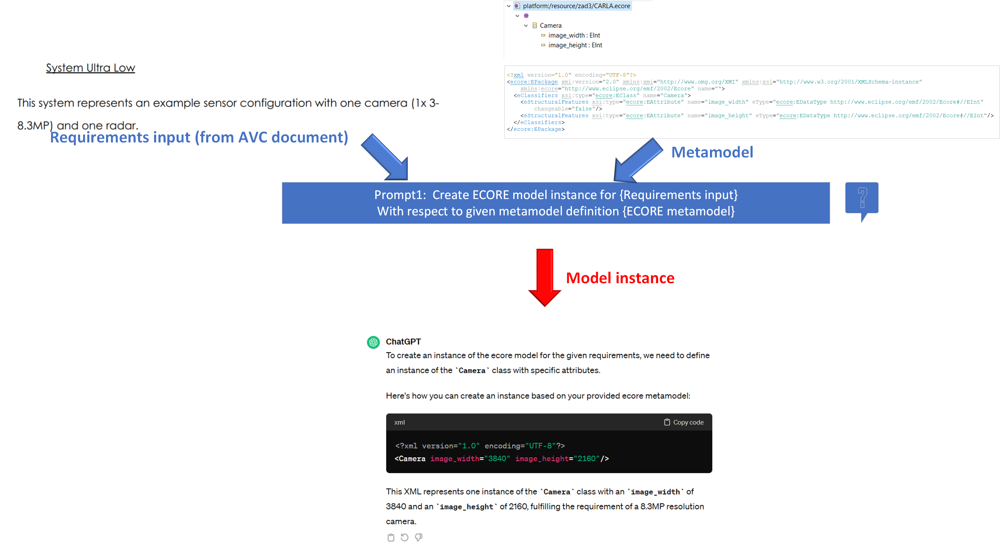

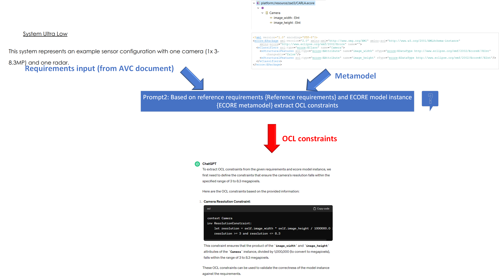

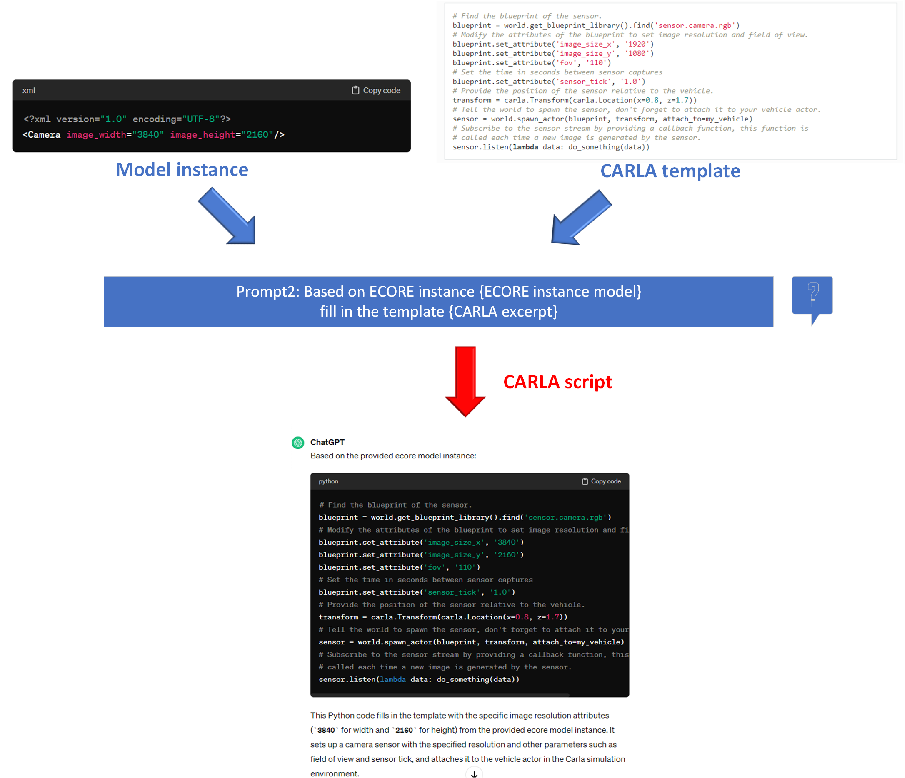

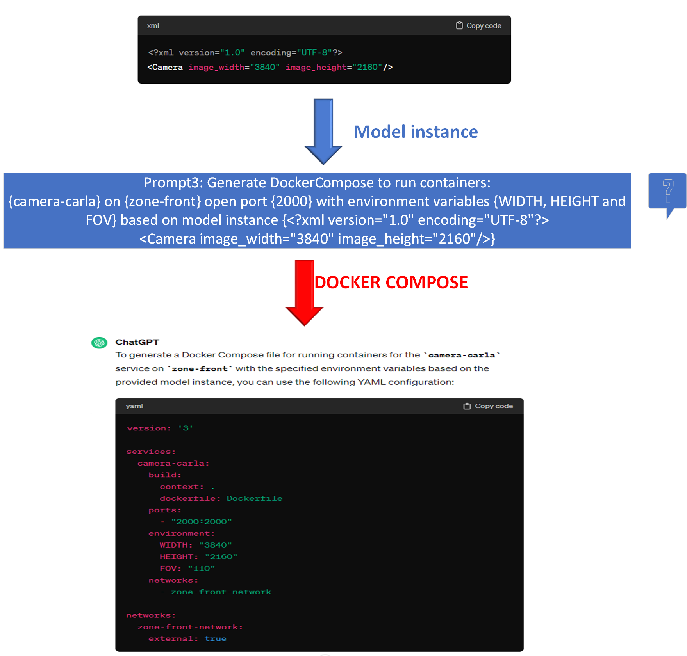

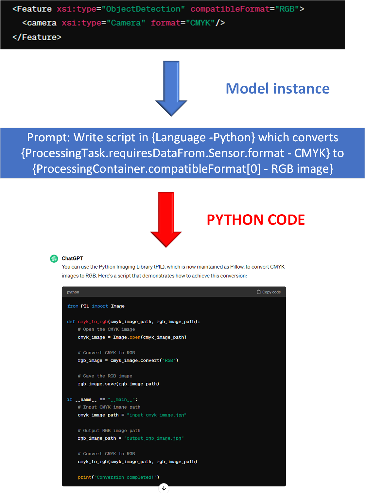

[Arxiv](https://arxiv.org/abs/2404.05508)