# 在测试阶段实现零-shot技术的时间动作定位

发布时间：2024年04月08日

`LLM应用` `视频分析` `动作识别`

> Test-Time Zero-Shot Temporal Action Localization

# 摘要

> Zero-Shot 时序动作定位（ZS-TAL）力图在未经剪辑的视频中识别并定位训练时未见的动作。传统 ZS-TAL 方法通过大量标注数据对模型进行微调。尽管这种方法行之有效，但它依赖于监督学习的标记数据，在实际应用中可能不太现实。此外，训练过程可能导致模型对特定领域产生偏见，影响其泛化能力。因此，我们尝试以一种全新的视角解决 ZS-TAL 问题，摆脱对训练数据的依赖。我们提出了一种创新的方法——测试时适应的时序动作定位（T3AL）。简而言之，T3AL 对预训练的视觉和语言模型（VLM）进行调整。T3AL 包括三个步骤：首先，通过整合视频信息计算动作类别的伪标签；其次，采用受自监督学习启发的新方法进行动作定位；最后，利用顶尖字幕模型提取的文本描述来优化动作区域建议。我们在 THUMOS14 和 ActivityNet-v1.3 数据集上进行的实验证明，T3AL 明显超越了基于最先进 VLMs 的零次基线，验证了测试时适应方法的优势。

> Zero-Shot Temporal Action Localization (ZS-TAL) seeks to identify and locate actions in untrimmed videos unseen during training. Existing ZS-TAL methods involve fine-tuning a model on a large amount of annotated training data. While effective, training-based ZS-TAL approaches assume the availability of labeled data for supervised learning, which can be impractical in some applications. Furthermore, the training process naturally induces a domain bias into the learned model, which may adversely affect the model's generalization ability to arbitrary videos. These considerations prompt us to approach the ZS-TAL problem from a radically novel perspective, relaxing the requirement for training data. To this aim, we introduce a novel method that performs Test-Time adaptation for Temporal Action Localization (T3AL). In a nutshell, T3AL adapts a pre-trained Vision and Language Model (VLM). T3AL operates in three steps. First, a video-level pseudo-label of the action category is computed by aggregating information from the entire video. Then, action localization is performed adopting a novel procedure inspired by self-supervised learning. Finally, frame-level textual descriptions extracted with a state-of-the-art captioning model are employed for refining the action region proposals. We validate the effectiveness of T3AL by conducting experiments on the THUMOS14 and the ActivityNet-v1.3 datasets. Our results demonstrate that T3AL significantly outperforms zero-shot baselines based on state-of-the-art VLMs, confirming the benefit of a test-time adaptation approach.

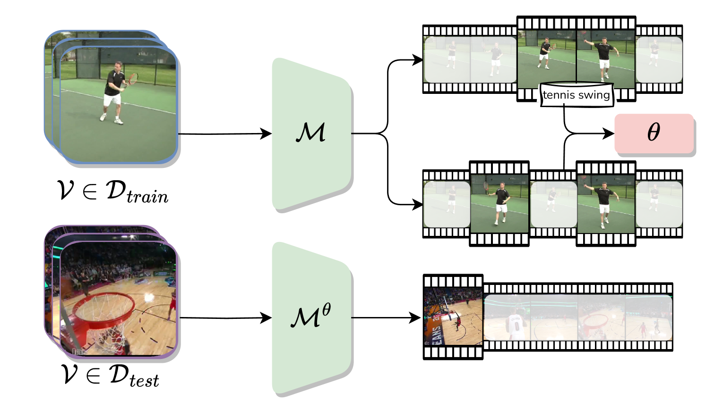

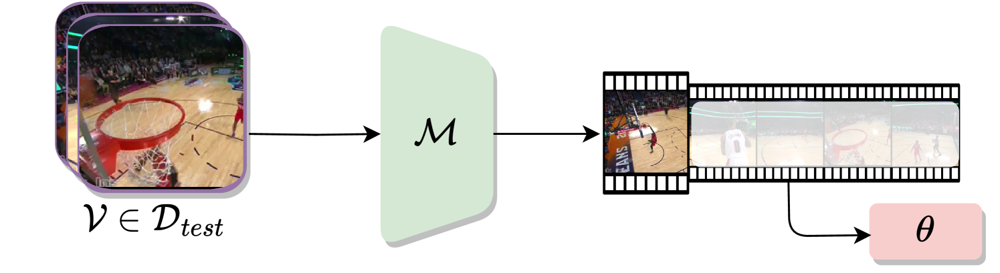

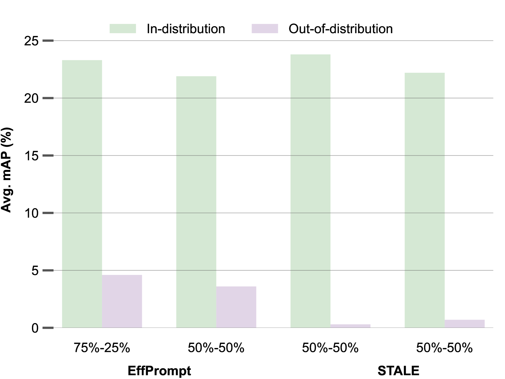

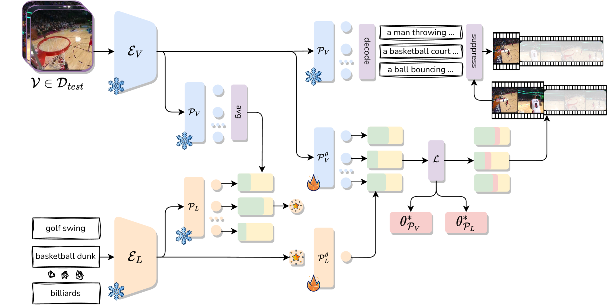

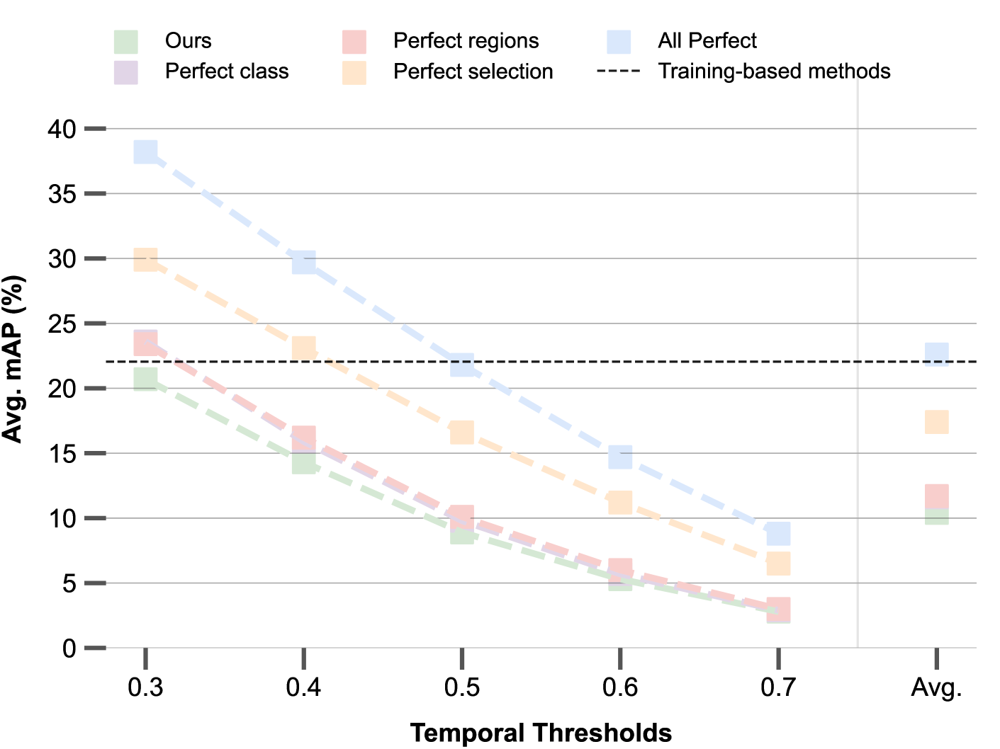

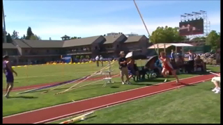

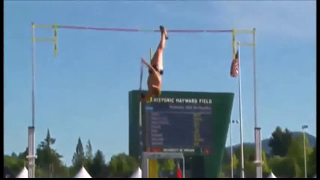

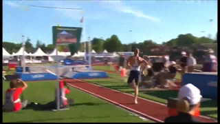

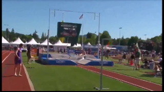

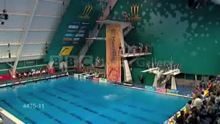

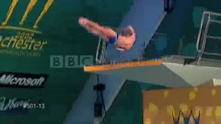

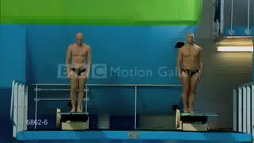

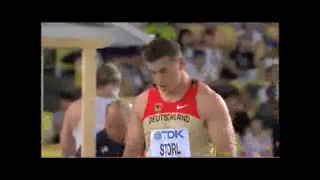

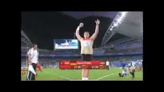

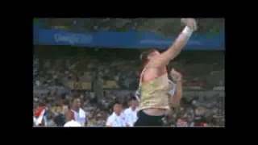

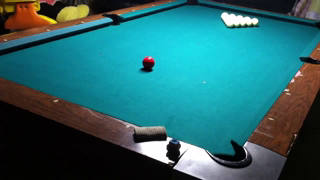

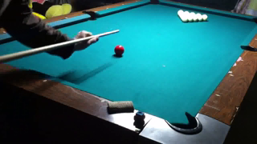

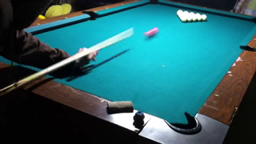

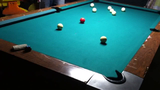

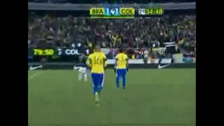

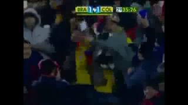

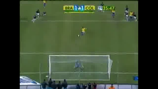

[Arxiv](https://arxiv.org/abs/2404.05426)