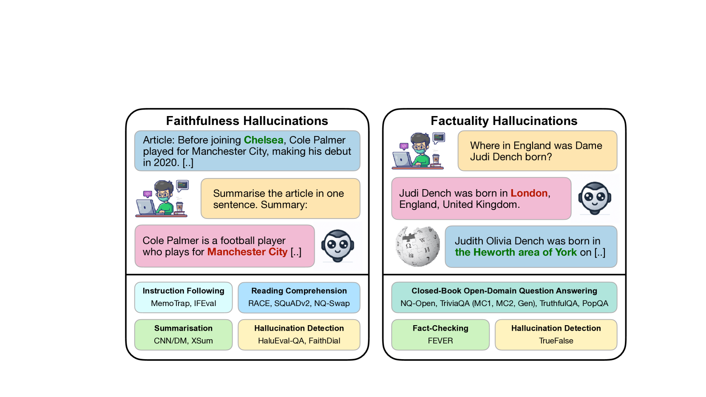
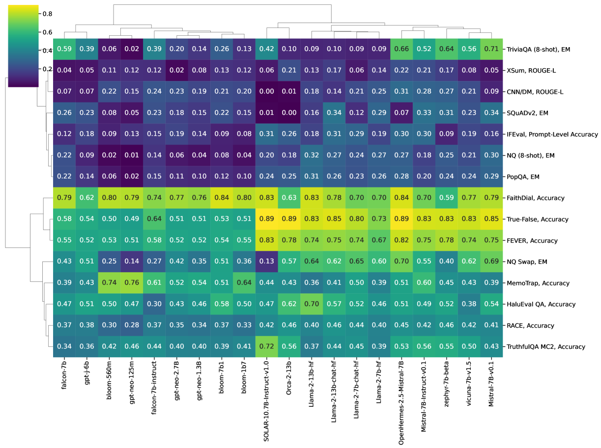

# 《幻觉排行榜》—— 一场旨在衡量大型语言模型幻觉现象的公开行动。

发布时间：2024年04月08日

`LLM理论` `模型评估`

> The Hallucinations Leaderboard -- An Open Effort to Measure Hallucinations in Large Language Models

# 摘要

> 大型语言模型（LLMs）凭借其出色的理解和生成类人文本的能力，彻底改变了自然语言处理（NLP）的领域。但这些模型有时会“幻觉”，即输出与事实或上下文不符。本文提出了幻觉排行榜，一个旨在客观评估和比较各模型产生幻觉倾向的开放性项目。该排行榜采用多维度的基准测试，针对幻觉的多个方面进行评估，比如准确性和忠实度，覆盖了问答、总结和阅读理解等多项任务。通过分析，我们得以洞察不同模型的表现，为研究者和从业者在选用最适合其应用场景的可靠模型提供指导。

> Large Language Models (LLMs) have transformed the Natural Language Processing (NLP) landscape with their remarkable ability to understand and generate human-like text. However, these models are prone to ``hallucinations'' -- outputs that do not align with factual reality or the input context. This paper introduces the Hallucinations Leaderboard, an open initiative to quantitatively measure and compare the tendency of each model to produce hallucinations. The leaderboard uses a comprehensive set of benchmarks focusing on different aspects of hallucinations, such as factuality and faithfulness, across various tasks, including question-answering, summarisation, and reading comprehension. Our analysis provides insights into the performance of different models, guiding researchers and practitioners in choosing the most reliable models for their applications.

[Arxiv](https://arxiv.org/abs/2404.05904)