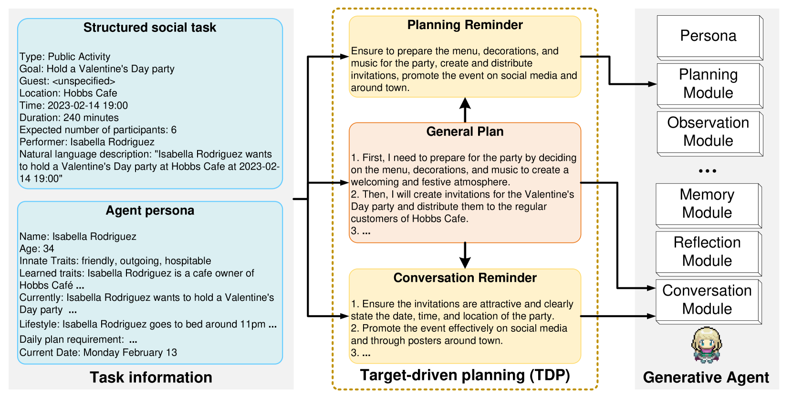
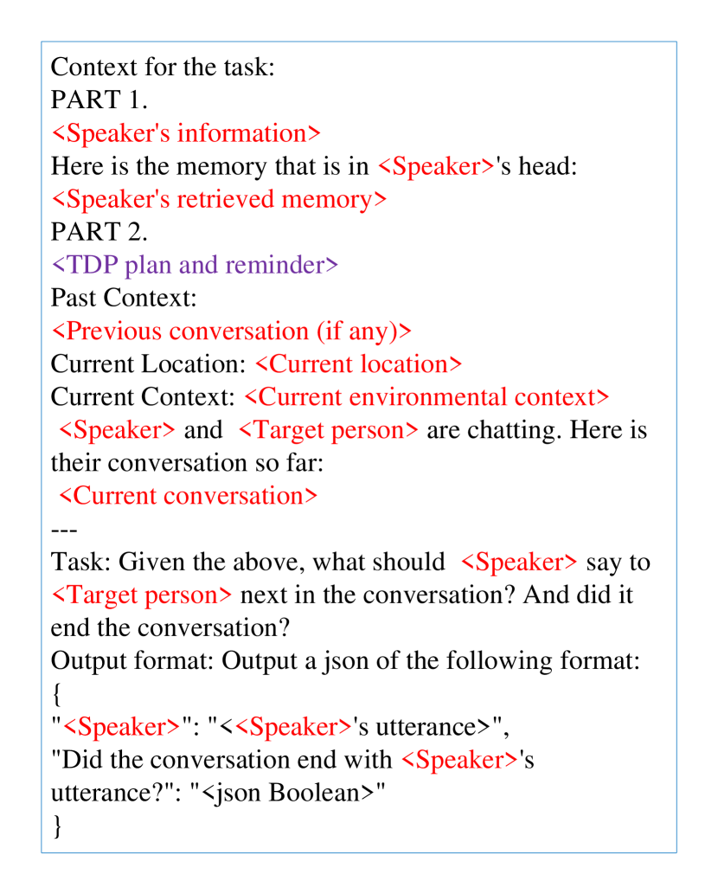

# 旨在客观地衡量语言代理在行动层面的社会智能。

发布时间：2024年04月08日

`Agent` `社交互动` `人工智能评估`

> Towards Objectively Benchmarking Social Intelligence for Language Agents at Action Level

# 摘要

> 众多大型语言模型已在多个领域达到甚至超越人类水平的表现，它们还能模拟人类互动和社会交往。尽管实际应用已证明在沙盒或实体模拟器中确立语言代理是可行的，但现有的社会智能评估标准要么仅限于语言层面，要么依赖主观评价。为了实现更贴近现实和客观的评估，我们推出了社交任务沙盒模拟（STSS）基准，通过细致分析多代理模拟环境中的目标完成情况，对语言代理进行客观的行动层面评价。我们还选取对话场景构建语言层面的基准，以经济高效的方式进行初步评估，并与传统基准相融合。为了探究代理架构的重要性，我们为现有代理增加了目标驱动规划（TDP）模块。我们的评估结果显示，STSS基准对当前最先进的语言代理来说颇具挑战性，并且能有效区分不同的语言代理，显示了其作为评估语言模型和代理架构的基准工具的价值。

> Prominent large language models have exhibited human-level performance in many domains, even enabling the derived agents to simulate human and social interactions. While practical works have substantiated the practicability of grounding language agents in sandbox simulation or embodied simulators, current social intelligence benchmarks either stay at the language level or use subjective metrics. In pursuit of a more realistic and objective evaluation, we introduce the Social Tasks in Sandbox Simulation (STSS) benchmark, which assesses language agents \textbf{objectively} at the \textbf{action level} by scrutinizing the goal achievements within the multi-agent simulation. Additionally, we sample conversation scenarios to build a language-level benchmark to provide an economically prudent preliminary evaluation and align with prevailing benchmarks. To gauge the significance of agent architecture, we implement a target-driven planning (TDP) module as an adjunct to the existing agent. Our evaluative findings highlight that the STSS benchmark is challenging for state-of-the-art language agents. Furthermore, it effectively discriminates between distinct language agents, suggesting its usefulness as a benchmark for evaluating both language models and agent architectures.

[Arxiv](https://arxiv.org/abs/2404.05337)