# VisualWebBench: 多模态LLM在网页理解和定位领域究竟取得了多大的进展？

发布时间：2024年04月08日

`LLM应用` `网络应用` `多模态大型语言模型`

> VisualWebBench: How Far Have Multimodal LLMs Evolved in Web Page Understanding and Grounding?

# 摘要

> 多模态大型语言模型（MLLMs）在网络任务中展现出了希望，但要全面评估它们的表现，却因缺少全面的评估标准而面临挑战。现行的评估标准要么过于泛化，未能充分体现网页的特有属性；要么只针对整体的网络代理任务，无法细查如光学字符识别（OCR）、理解与概念联系等微技能。本文提出了\bench{}，一个全新的多模态评估标准，专为测试MLLMs在众多网络任务上的能力而设计。\bench{}包含七项任务，涉及139个真实网站的1.5千个精选案例，覆盖了87个细分领域。我们对14种开源MLLMs进行了\bench{}测试，包括Gemini Pro、Claude-3系列和GPT-4V(ision)，结果揭示了它们面临的重大挑战和性能鸿沟。深入分析进一步暴露了这些模型的不足，特别是在文本密集环境下的定位能力不足，以及在处理低分辨率图像时的性能不佳。我们相信\bench{}将成为推动研究社区发展更强大、更通用的网络应用MLLMs的宝贵资源。

> Multimodal Large Language models (MLLMs) have shown promise in web-related tasks, but evaluating their performance in the web domain remains a challenge due to the lack of comprehensive benchmarks. Existing benchmarks are either designed for general multimodal tasks, failing to capture the unique characteristics of web pages, or focus on end-to-end web agent tasks, unable to measure fine-grained abilities such as OCR, understanding, and grounding. In this paper, we introduce \bench{}, a multimodal benchmark designed to assess the capabilities of MLLMs across a variety of web tasks. \bench{} consists of seven tasks, and comprises 1.5K human-curated instances from 139 real websites, covering 87 sub-domains. We evaluate 14 open-source MLLMs, Gemini Pro, Claude-3 series, and GPT-4V(ision) on \bench{}, revealing significant challenges and performance gaps. Further analysis highlights the limitations of current MLLMs, including inadequate grounding in text-rich environments and subpar performance with low-resolution image inputs. We believe \bench{} will serve as a valuable resource for the research community and contribute to the creation of more powerful and versatile MLLMs for web-related applications.

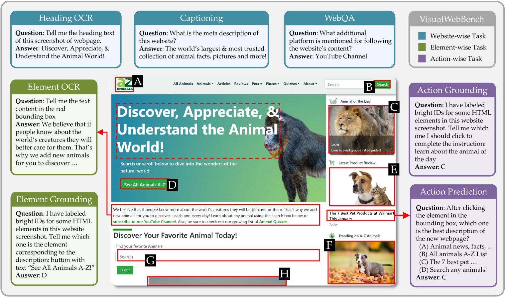

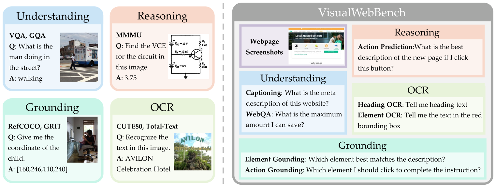

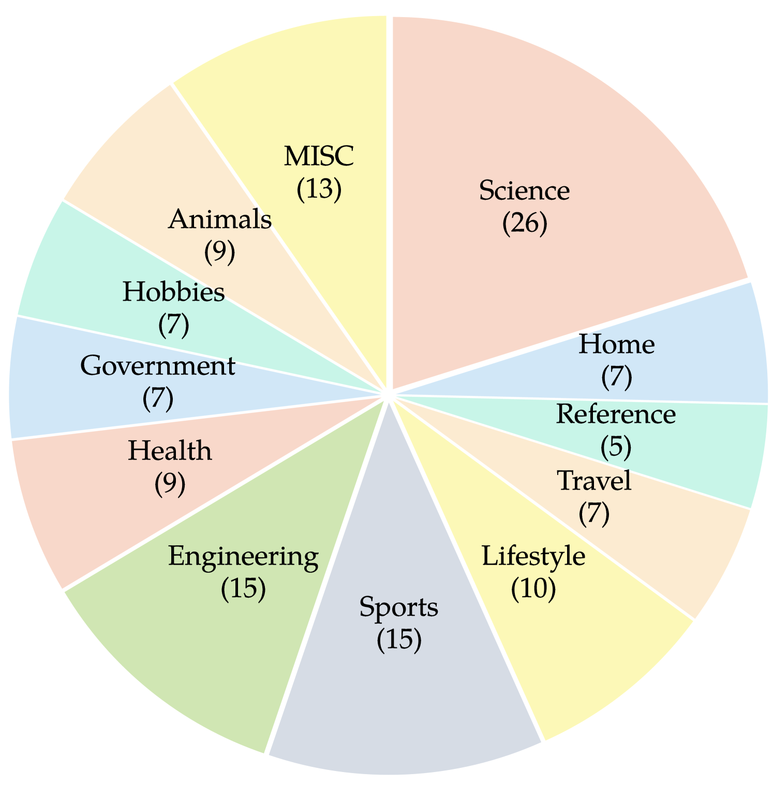

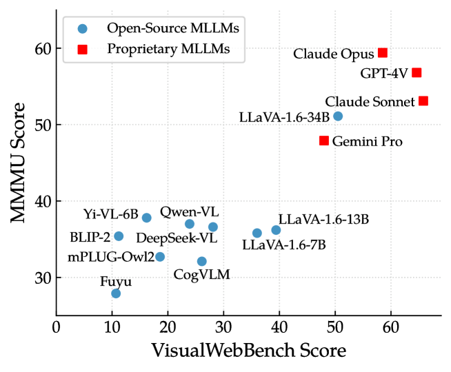

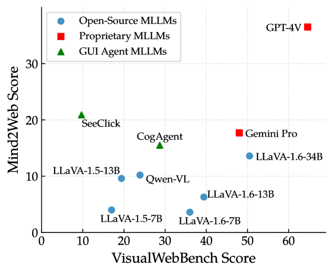

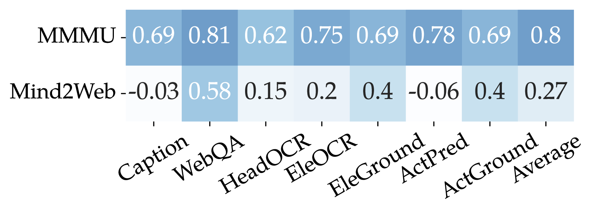

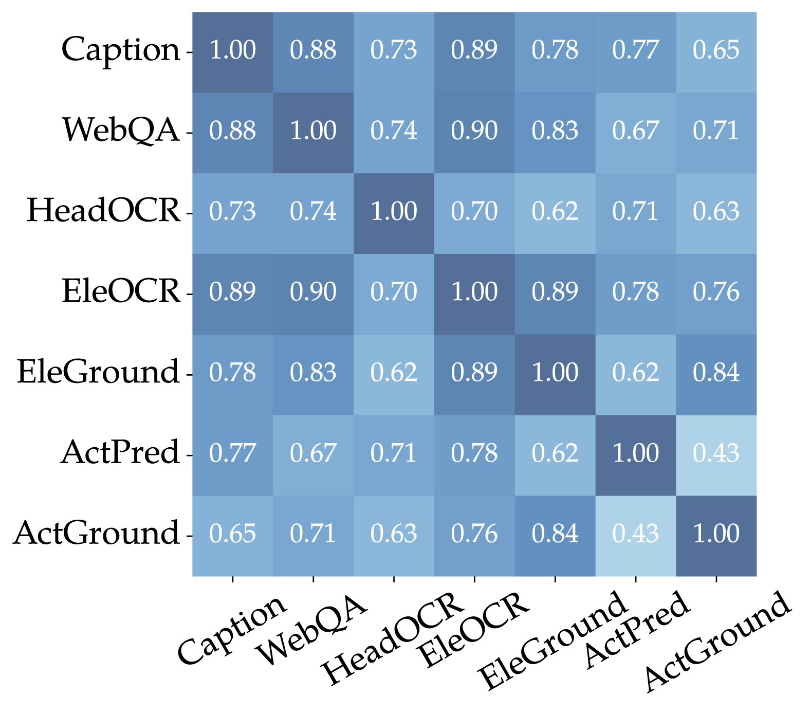

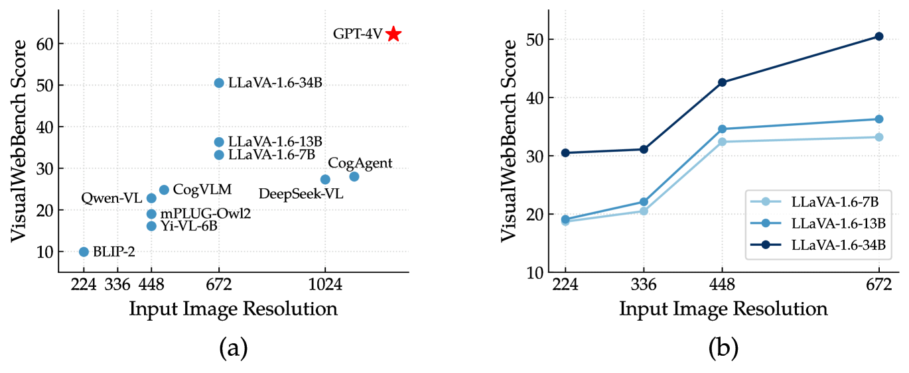

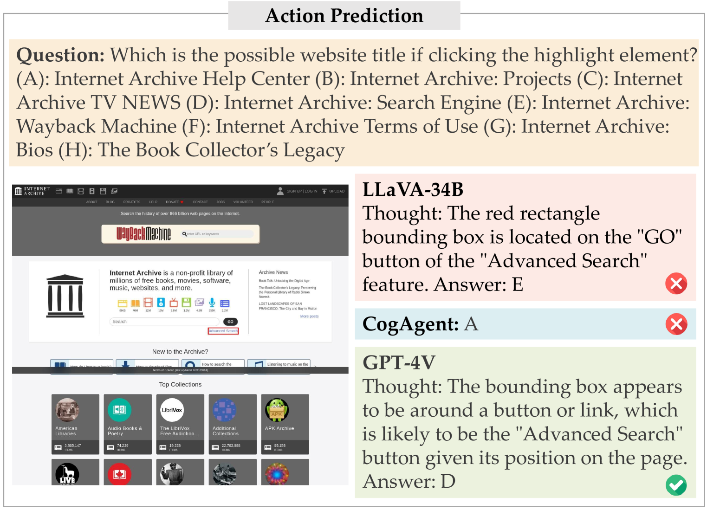

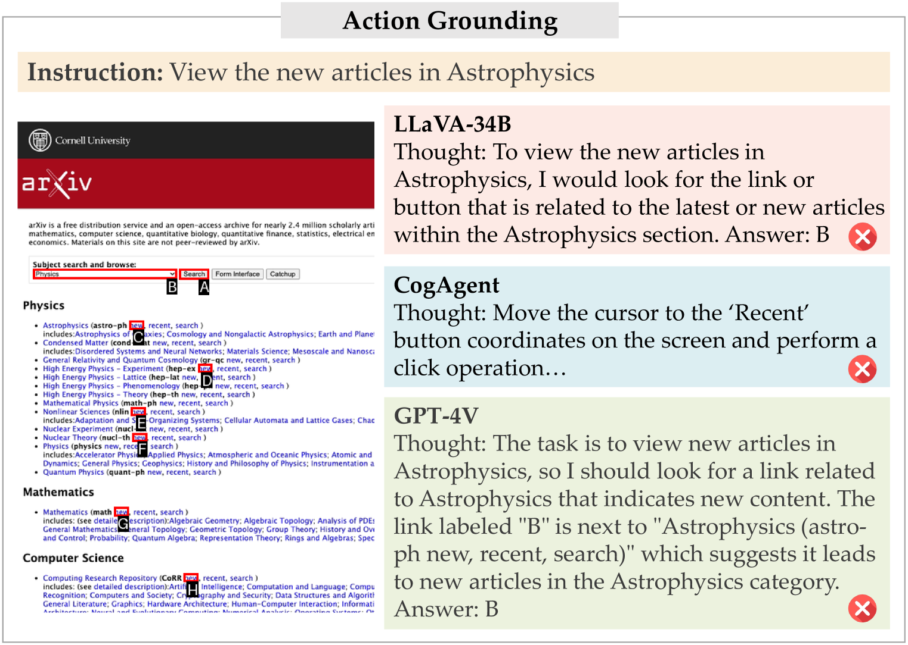

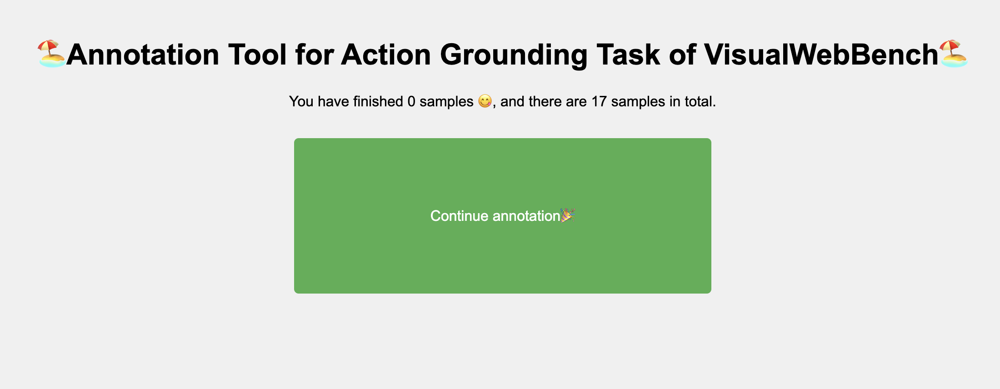

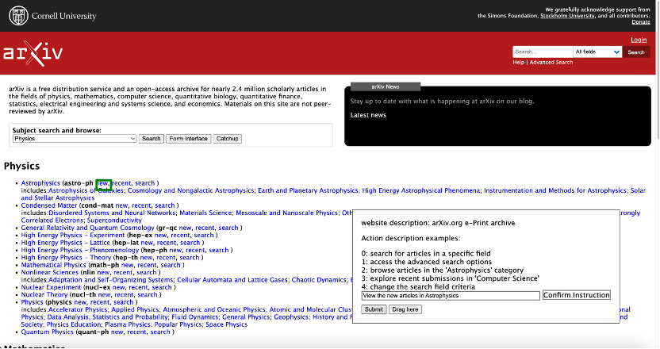

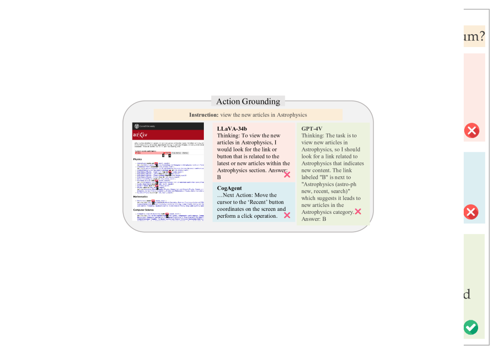

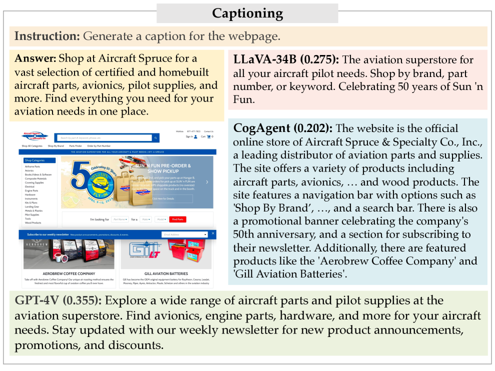

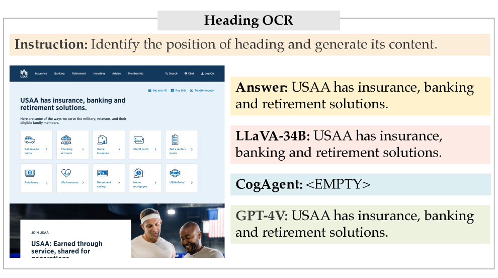

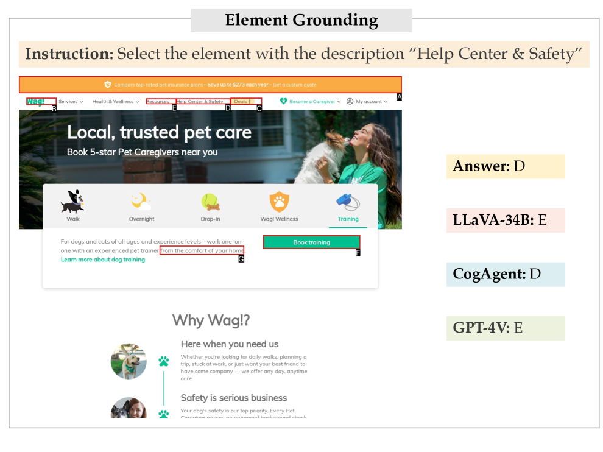

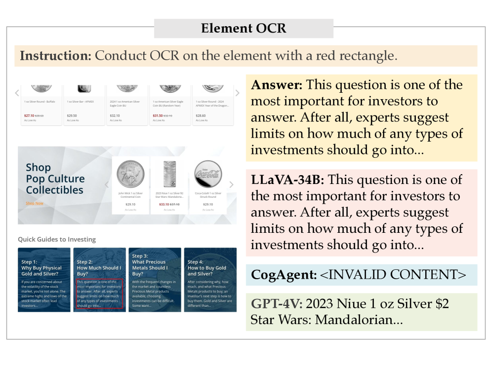

[Arxiv](https://arxiv.org/abs/2404.05955)