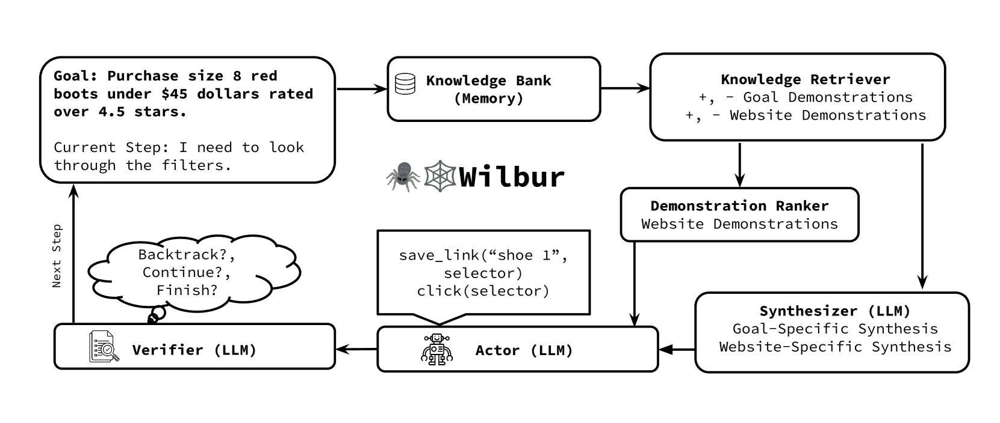
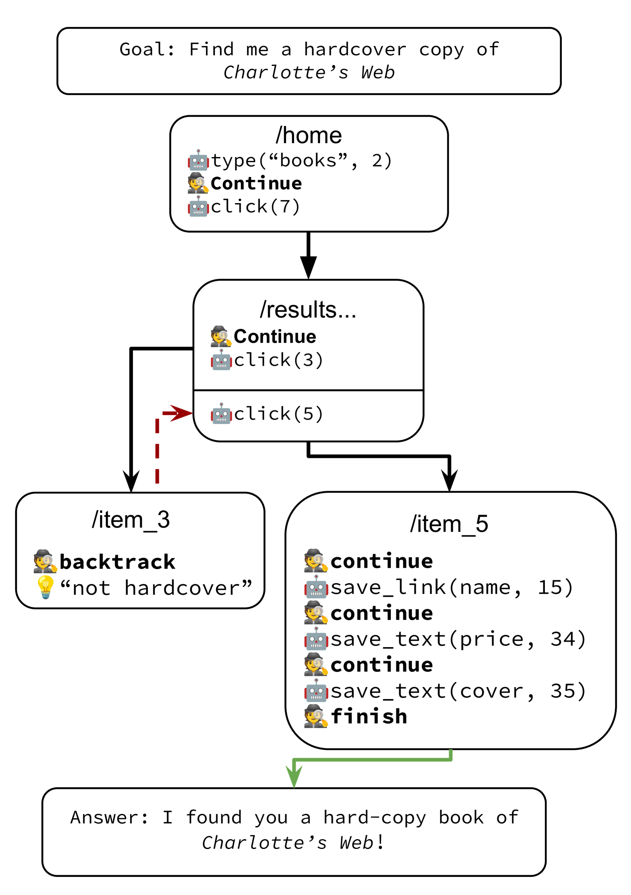

# WILBUR：为打造强大精准的网络代理，采用自适应的上下文学习技术。

发布时间：2024年04月08日

`Agent` `网络代理` `排序模型`

> WILBUR: Adaptive In-Context Learning for Robust and Accurate Web Agents

# 摘要

> 在网络代理研究的领域里，如何同时实现广泛的适用性和准确性一直是个难题。网站结构千差万别，导致许多现行方法难以奏效。此外，传统的微调和上下文学习技术在跨网站应用时也表现不佳。为此，我们推出了Wilbur，一种新颖的方法，它采用可微分排序模型和创新的指令合成技术，为大型语言模型的提示部分提供最佳的任务示例。为了提高整体的成功率，我们还设计了一个智能回溯机制，它能够识别并纠正错误。此外，我们的排序模型可以通过生成性自动课程的数据进行训练，该课程能够从大型语言模型中选取具有代表性的样本，自动运行代理并评估效果，无需人工注释。Wilbur在WebVoyager基准测试中取得了突破性成果，整体性能比纯文本模型提升了8%，在某些特定网站上甚至达到了36%的提升。即便只处理文本输入，Wilbur在该基准测试中的表现也仅比强大的多模态模型低5%，而且进一步分析发现，许多失败案例实际上是由于网络操作的工程挑战所致。

> In the realm of web agent research, achieving both generalization and accuracy remains a challenging problem. Due to high variance in website structure, existing approaches often fail. Moreover, existing fine-tuning and in-context learning techniques fail to generalize across multiple websites. We introduce Wilbur, an approach that uses a differentiable ranking model and a novel instruction synthesis technique to optimally populate a black-box large language model's prompt with task demonstrations from previous runs. To maximize end-to-end success rates, we also propose an intelligent backtracking mechanism that learns and recovers from its mistakes. Finally, we show that our ranking model can be trained on data from a generative auto-curriculum which samples representative goals from an LLM, runs the agent, and automatically evaluates it, with no manual annotation. Wilbur achieves state-of-the-art results on the WebVoyager benchmark, beating text-only models by 8% overall, and up to 36% on certain websites. On the same benchmark, Wilbur is within 5% of a strong multi-modal model despite only receiving textual inputs, and further analysis reveals a substantial number of failures are due to engineering challenges of operating the web.

[Arxiv](https://arxiv.org/abs/2404.05902)