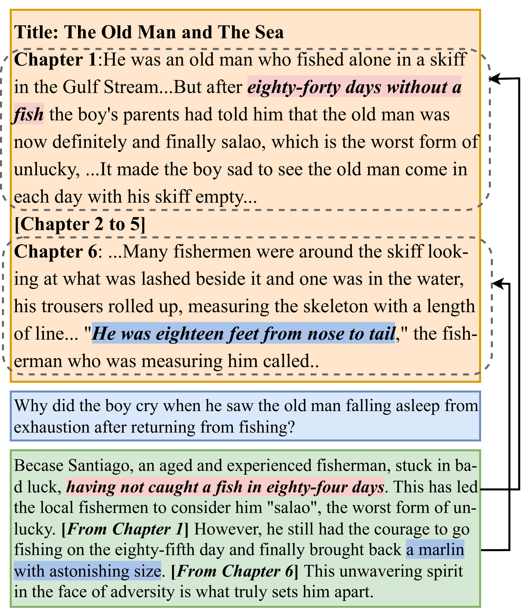
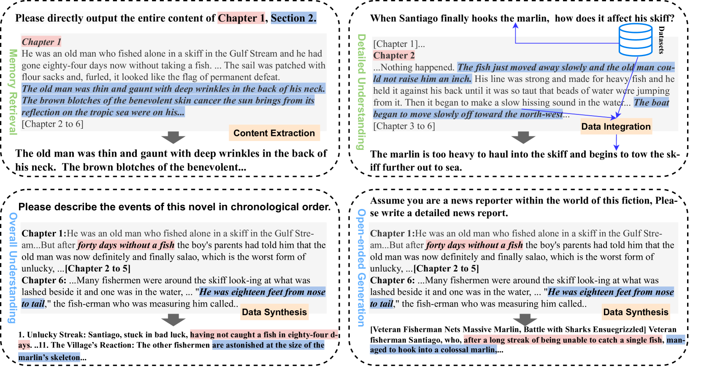
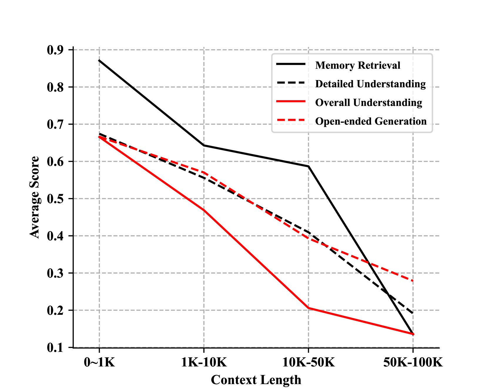

# XL$^2$Bench：针对极长上下文理解及其长距离依赖性的基准测试平台。

发布时间：2024年04月08日

`LLM理论` `长文本理解` `基准测试`

> XL$^2$Bench: A Benchmark for Extremely Long Context Understanding with Long-range Dependencies

# 摘要

> 大型语言模型（LLMs）在众多任务上展现了卓越性能，但其受限的上下文窗口大小制约了进一步发展。研究者们尝试通过扩展上下文窗口，使其能处理高达200K的输入标记，以便更好地适应长文本。同时，为了全面评估LLMs对长文本的理解能力，迫切需要构建包含更长文本和更具挑战性任务的高质量基准。然而，现有基准测试通过简单地扩展传统任务的输入来应对长文本理解，这并未充分体现长文本理解的独特性，如长距离依赖任务和与现代LLMs上下文窗口相匹配的文本长度。本文提出了XL$^2$Bench基准，专注于极长上下文的理解与长距离依赖，包含小说阅读、论文阅读和法律阅读三种场景，以及记忆检索、详细理解、整体理解和开放式生成四个递增难度的任务，共27个子任务，涵盖中英文。该基准的平均文本长度超过10万单词（英文）和20万字符（中文）。通过对六种顶尖LLMs在XL$^2$Bench上的表现进行评估，我们发现它们与人类水平相比仍有显著差距。此外，无论是在原始数据集还是在增强数据集上，性能的下降都证实了我们方法在减少数据污染方面的有效性。

> Large Language Models (LLMs) have demonstrated remarkable performance across diverse tasks but are constrained by their small context window sizes. Various efforts have been proposed to expand the context window to accommodate even up to 200K input tokens. Meanwhile, building high-quality benchmarks with much longer text lengths and more demanding tasks to provide comprehensive evaluations is of immense practical interest to facilitate long context understanding research of LLMs. However, prior benchmarks create datasets that ostensibly cater to long-text comprehension by expanding the input of traditional tasks, which falls short to exhibit the unique characteristics of long-text understanding, including long dependency tasks and longer text length compatible with modern LLMs' context window size. In this paper, we introduce a benchmark for extremely long context understanding with long-range dependencies, XL$^2$Bench, which includes three scenarios: Fiction Reading, Paper Reading, and Law Reading, and four tasks of increasing complexity: Memory Retrieval, Detailed Understanding, Overall Understanding, and Open-ended Generation, covering 27 subtasks in English and Chinese. It has an average length of 100K+ words (English) and 200K+ characters (Chinese). Evaluating six leading LLMs on XL$^2$Bench, we find that their performance significantly lags behind human levels. Moreover, the observed decline in performance across both the original and enhanced datasets underscores the efficacy of our approach to mitigating data contamination.

[Arxiv](https://arxiv.org/abs/2404.05446)