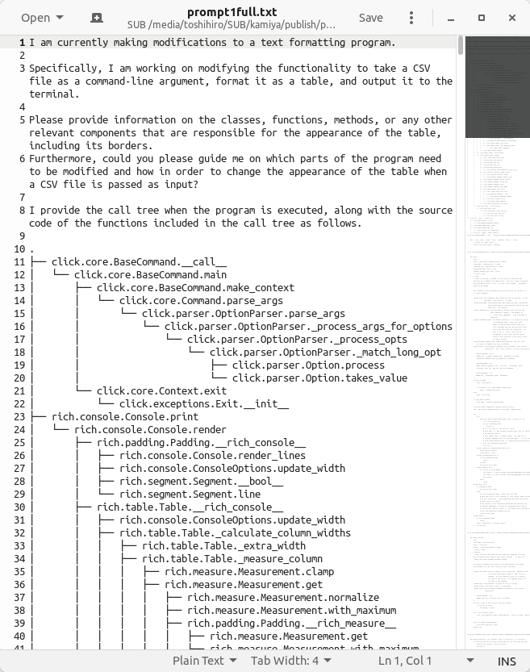
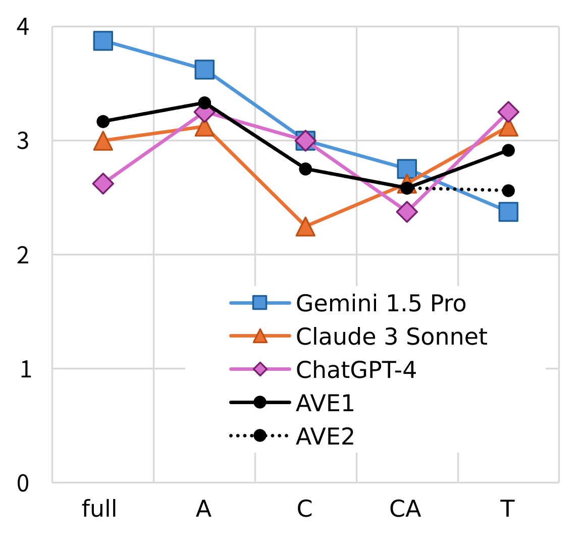

# 为长篇幅的大型语言模型（LLMs）量身定制，本文介绍了一种新的源代码查询随机访问图（RAG）方法。

发布时间：2024年04月09日

`RAG` `软件开发` `程序分析`

> A RAG Method for Source Code Inquiry Tailored to Long-Context LLMs

# 摘要

> 虽然大型语言模型的上下文长度限制有所改善，但在软件开发任务中仍存在障碍。本研究提出了一种新方法，通过将执行轨迹整合到RAG中，以优化对源代码的查询。初步实验表明，这种方法能够有效提升LLM的响应品质。

> Although the context length limitation of large language models (LLMs) has been mitigated, it still hinders their application to software development tasks. This study proposes a method incorporating execution traces into RAG for inquiries about source code. Small-scale experiments confirm a tendency for the method to contribute to improving LLM response quality.

[Arxiv](https://arxiv.org/abs/2404.06082)