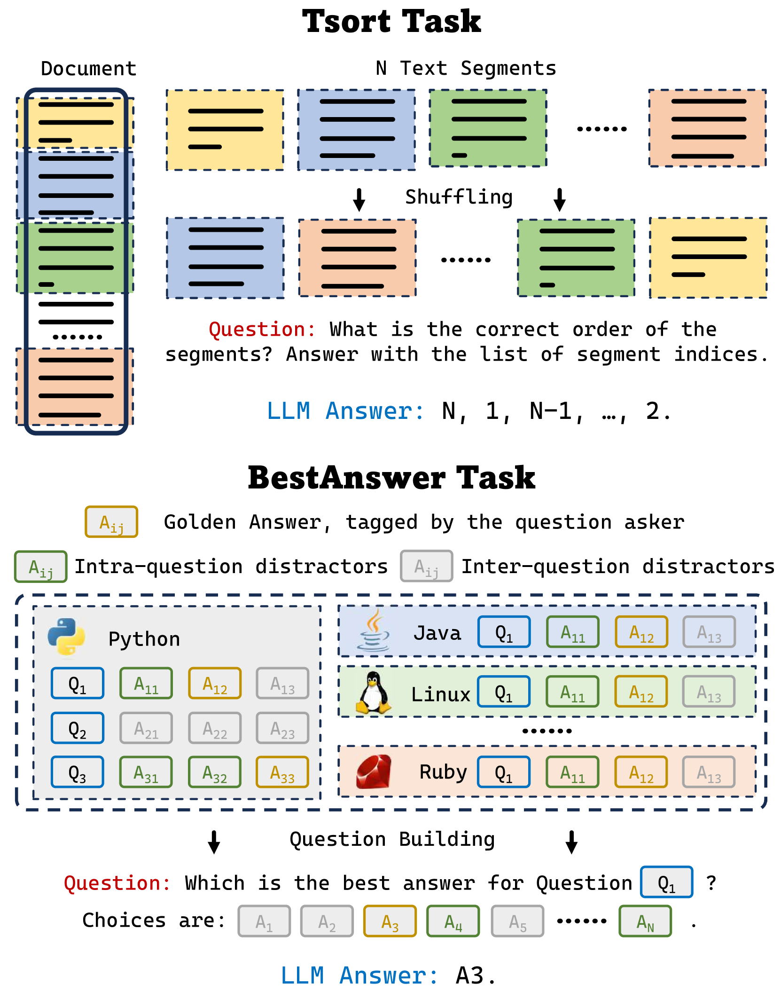
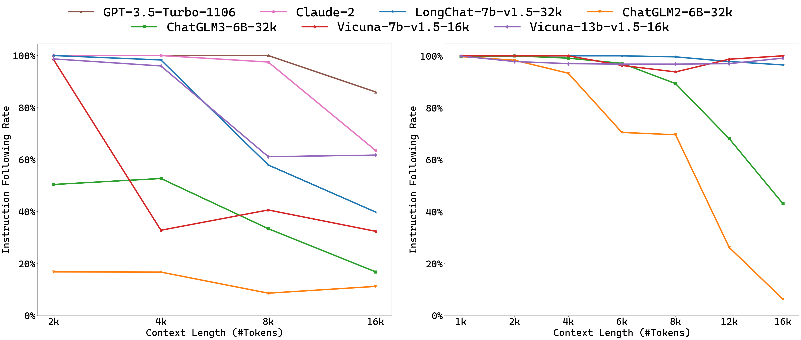

# Ada-LEval：通过可伸缩的评估标准，对长文本处理能力的大型语言模型进行评测。

发布时间：2024年04月09日

`LLM应用` `语言模型评估` `长文本处理`

> Ada-LEval: Evaluating long-context LLMs with length-adaptable benchmarks

# 摘要

> 近期，大型语言模型（LLM）研究界正积极提升模型应对超长文本的能力。随着众多长文本处理技术和模型架构的涌现，对这些模型在处理长文本方面的能力进行精确评估显得尤为重要。现有的长文本评估标准，例如L-Eval和LongBench，主要基于开源数据集，关注问答和摘要任务，但这些数据集包含的测试样本长度不一，混合在一起，难以准确评估模型对不同长度文本的处理能力。同时，这些评估标准并未覆盖到最新LLM声称能够处理的超长文本（100k+ token）。本文提出了Ada-LEval，一种能够适应不同长度的长上下文理解评估基准，包含TSort和BestAnswer两个挑战性子集，旨在更可靠地评估LLM处理长文本的能力。这些评估工具支持对测试样本长度的精细控制，能够轻松生成长达128k token的文本样本。我们利用Ada-LEval对4种业界领先的闭源API模型和6种开源模型进行了评估。评估结果显示，当前LLM在处理超长上下文方面仍存在局限。相关代码已在https://github.com/open-compass/Ada-LEval上公开。

> Recently, the large language model (LLM) community has shown increasing interest in enhancing LLMs' capability to handle extremely long documents. As various long-text techniques and model architectures emerge, the precise and detailed evaluation of models' long-text capabilities has become increasingly important. Existing long-text evaluation benchmarks, such as L-Eval and LongBench, construct long-text test sets based on open-source datasets, focusing mainly on QA and summarization tasks. These datasets include test samples of varying lengths (from 2k to 32k+) entangled together, making it challenging to assess model capabilities across different length ranges. Moreover, they do not cover the ultralong settings (100k+ tokens) that the latest LLMs claim to achieve. In this paper, we introduce Ada-LEval, a length-adaptable benchmark for evaluating the long-context understanding of LLMs. Ada-LEval includes two challenging subsets, TSort and BestAnswer, which enable a more reliable evaluation of LLMs' long context capabilities. These benchmarks support intricate manipulation of the length of test cases, and can easily produce text samples up to 128k tokens. We evaluate 4 state-of-the-art closed-source API models and 6 open-source models with Ada-LEval. The evaluation results demonstrate the limitations of current LLMs, especially in ultra-long-context settings. Our code is available at https://github.com/open-compass/Ada-LEval.

[Arxiv](https://arxiv.org/abs/2404.06480)