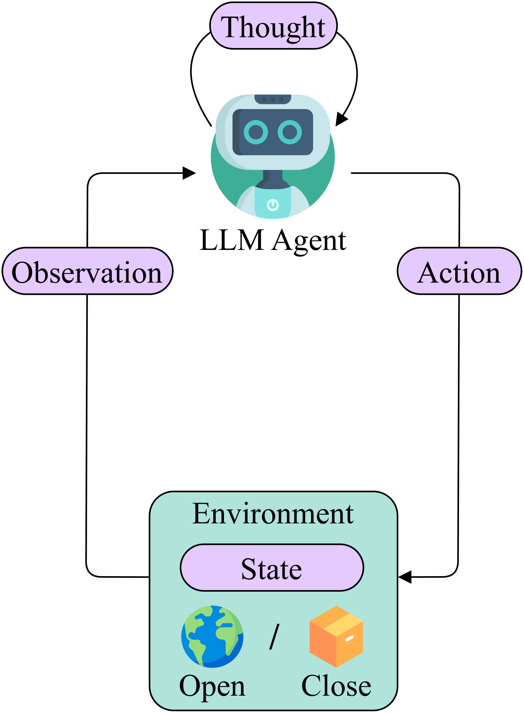
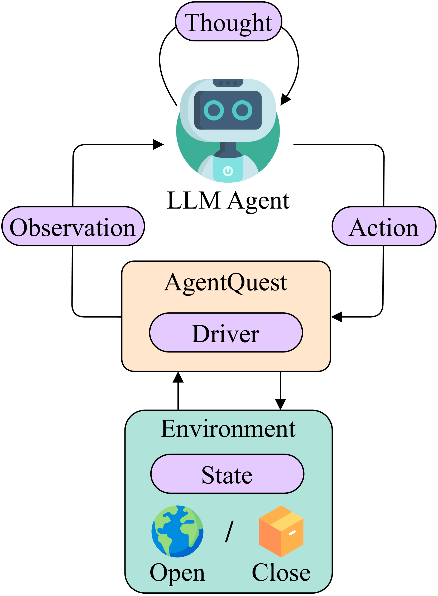
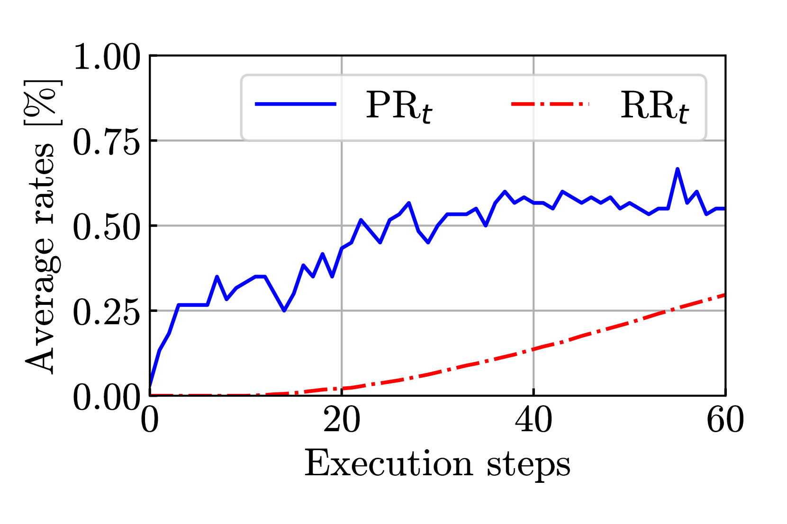
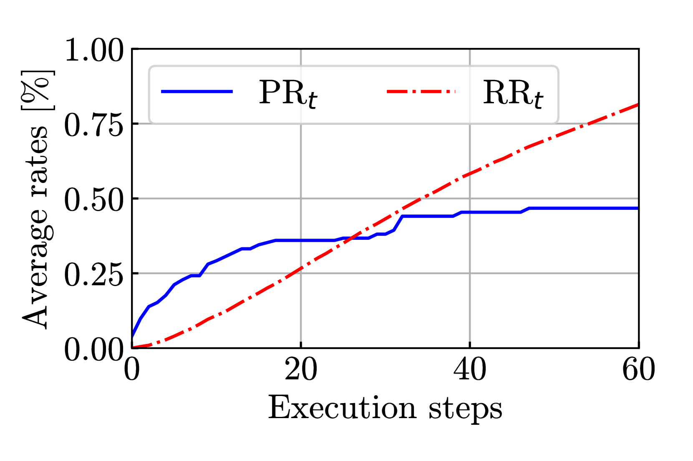
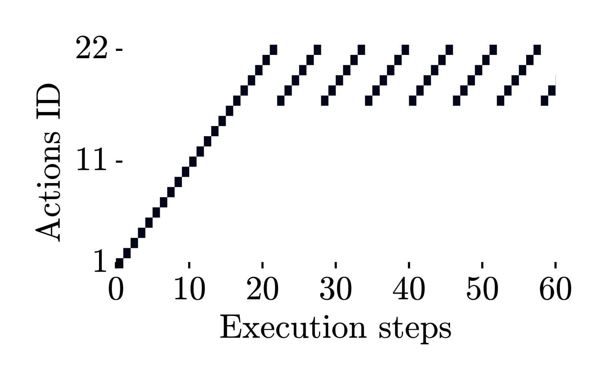
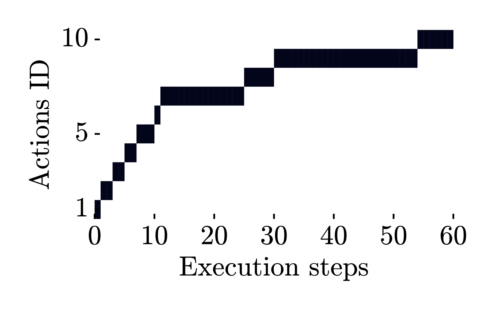
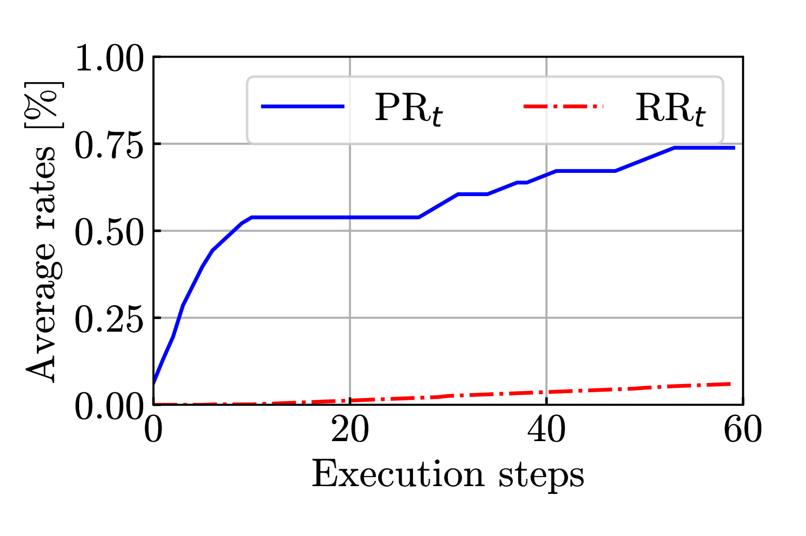
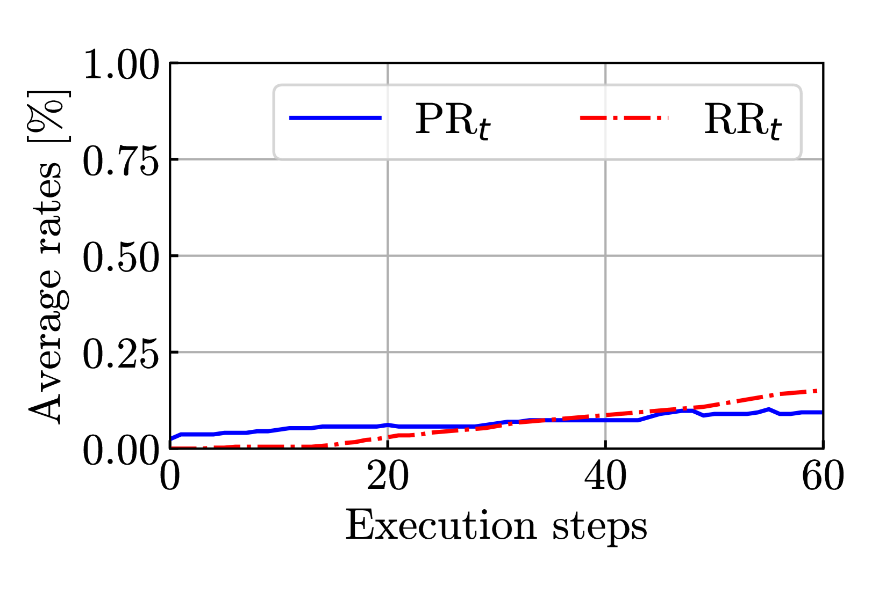

# AgentQuest：构建模块化基准，助力大型语言模型（LLM）代理的发展与优化。

发布时间：2024年04月09日

`Agent` `人工智能` `评估框架`

> AgentQuest: A Modular Benchmark Framework to Measure Progress and Improve LLM Agents

# 摘要

> 随着大型语言模型（LLMs）技术的飞速发展，研究者们开始探索能够处理复杂多步骤推理任务的LLM智能代理。正如任何科研探索一样，建立有效的基准测试和评估机制至关重要。然而，现有的基准测试往往视野狭窄，仅关注任务的整体完成情况。为了解决这一问题，我们推出了AgentQuest框架：它允许通过详细文档支持和用户友好的API轻松扩展模块化的基准测试和评估指标。我们还引入了两项新的评估指标，能够准确追踪LLM代理在任务解决过程中的进展。通过两个实际案例的分析，我们发现了一些常见的问题点，并针对性地优化了代理架构，实现了性能的显著提升。我们期待与研究界共同努力，不断完善AgentQuest，并已将其开源在https://github.com/nec-research/agentquest。

> The advances made by Large Language Models (LLMs) have led to the pursuit of LLM agents that can solve intricate, multi-step reasoning tasks. As with any research pursuit, benchmarking and evaluation are key corner stones to efficient and reliable progress. However, existing benchmarks are often narrow and simply compute overall task success. To face these issues, we propose AgentQuest -- a framework where (i) both benchmarks and metrics are modular and easily extensible through well documented and easy-to-use APIs; (ii) we offer two new evaluation metrics that can reliably track LLM agent progress while solving a task. We exemplify the utility of the metrics on two use cases wherein we identify common failure points and refine the agent architecture to obtain a significant performance increase. Together with the research community, we hope to extend AgentQuest further and therefore we make it available under https://github.com/nec-research/agentquest.

[Arxiv](https://arxiv.org/abs/2404.06411)