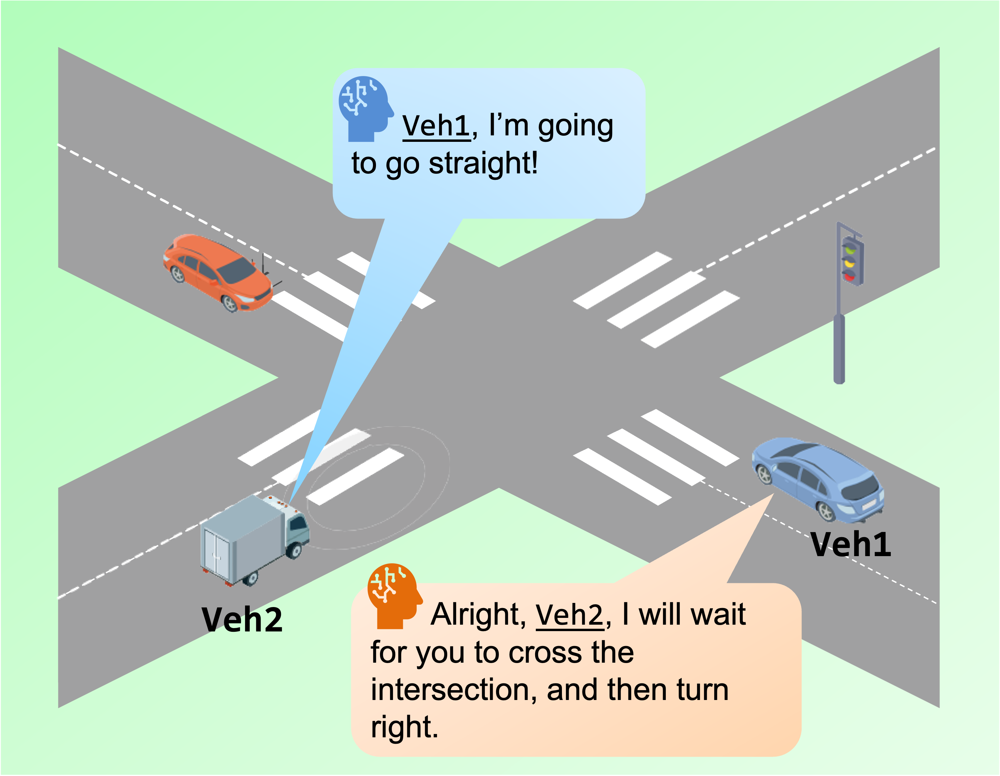
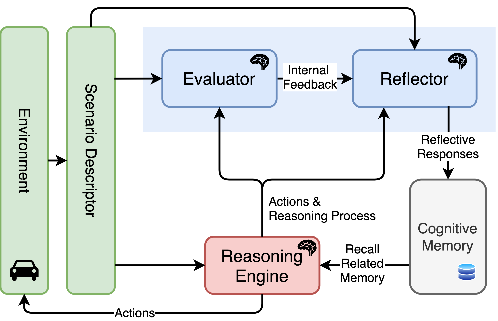
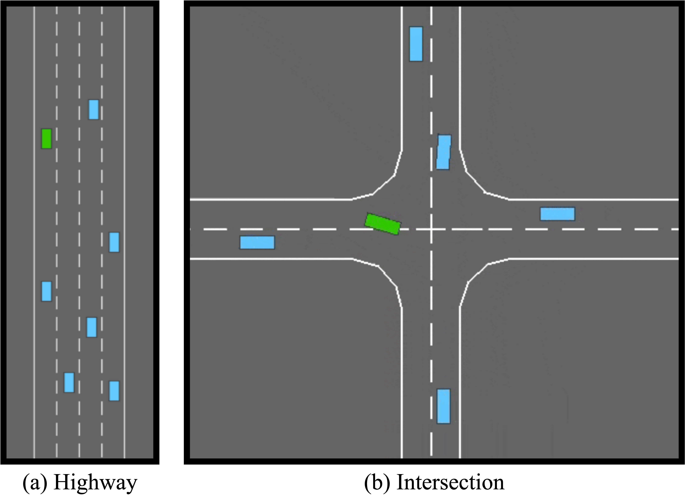
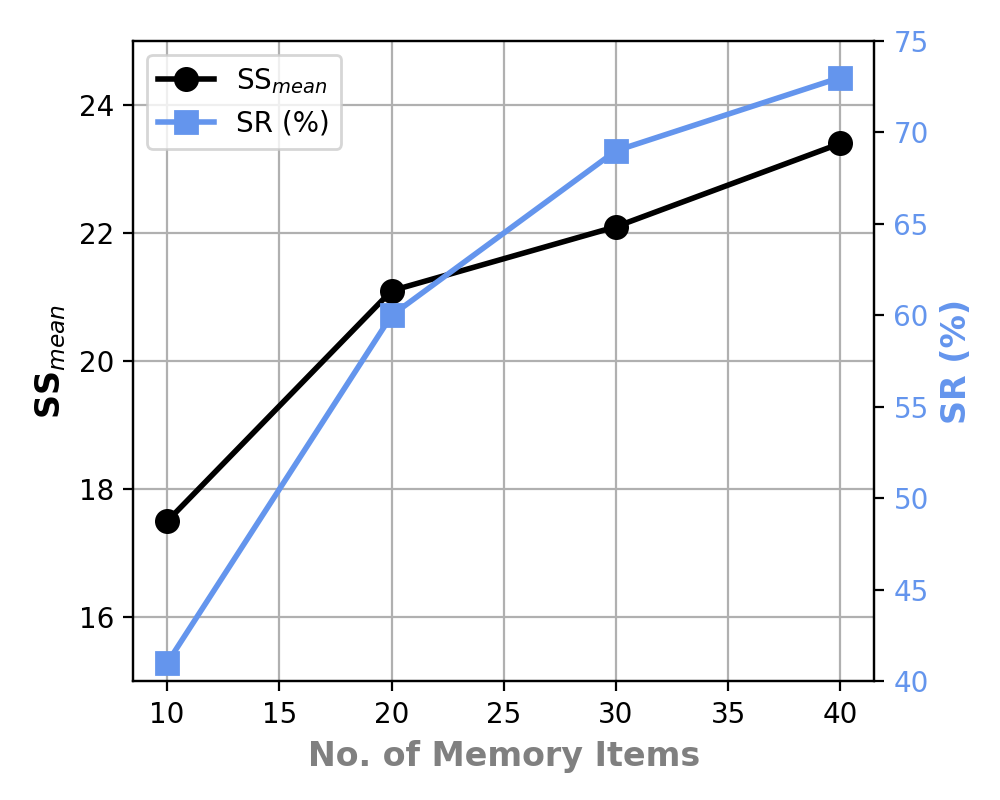
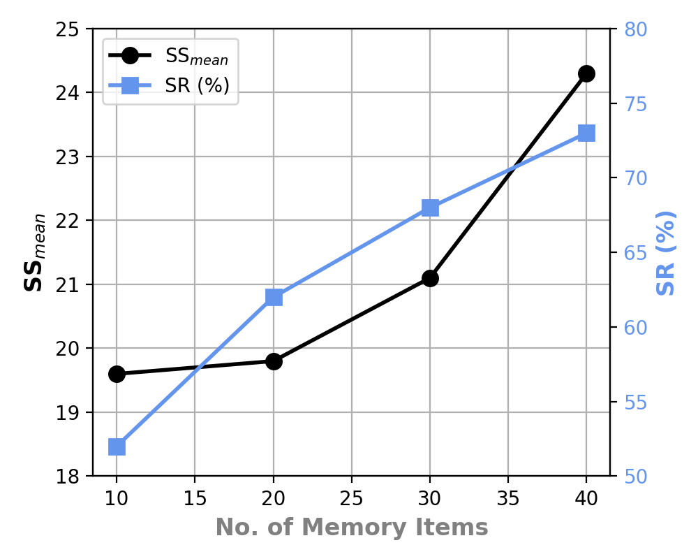
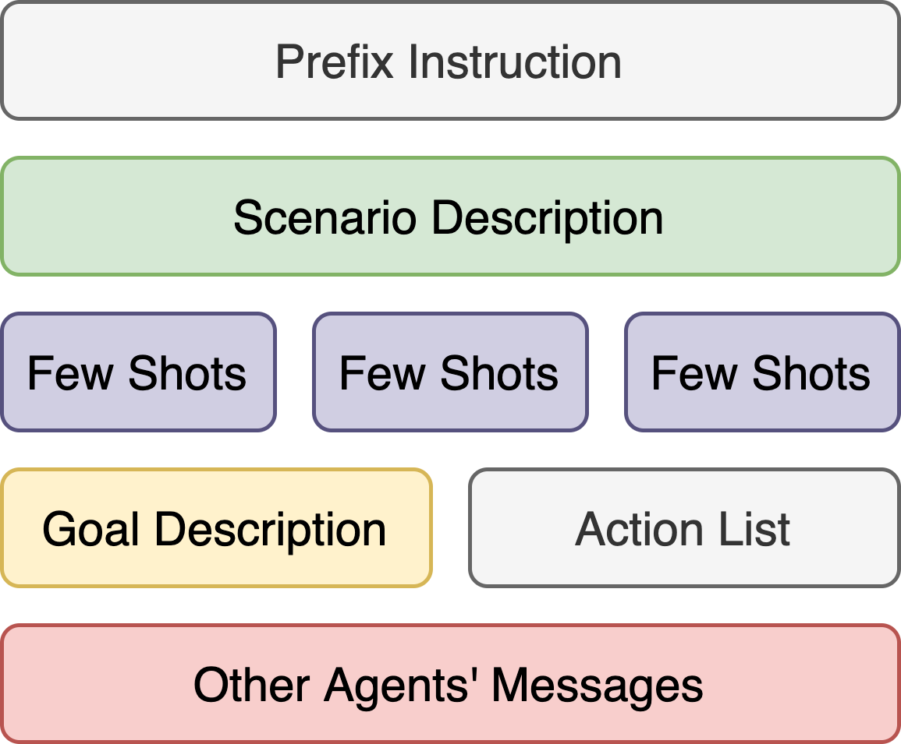
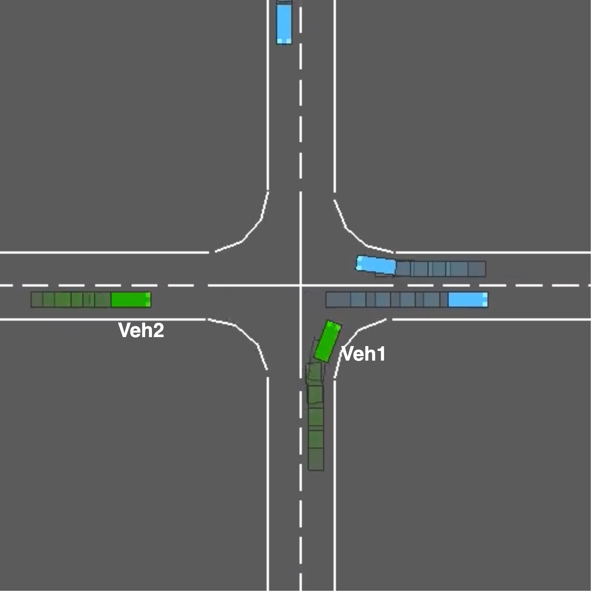

# AgentsCoDriver：借助大型语言模型实现的协作驾驶，采用终身学习机制。

发布时间：2024年04月09日

`Agent` `自动驾驶` `智能交通系统`

> AgentsCoDriver: Large Language Model Empowered Collaborative Driving with Lifelong Learning

# 摘要

> 近年来，联网与自动驾驶技术突飞猛进。但现行自动驾驶系统，主要依赖数据驱动，却在可解释性、泛化和持续学习方面略显不足。更关键的是，它们缺少与其他车辆协同合作的能力，这对自动驾驶的安全高效至关重要。为此，我们借助大型语言模型（LLMs）打造了创新框架AgentsCoDriver，实现车辆间的协同驾驶。AgentsCoDriver涵盖观察、推理、记忆、反思及通信五大模块，通过与环境的持续互动，不断积累知识与经验，实现终身学习。各代理通过通信模块信息互换，在复杂交通中协作谈判。大量实验验证了AgentsCoDriver的卓越性能。

> Connected and autonomous driving is developing rapidly in recent years. However, current autonomous driving systems, which are primarily based on data-driven approaches, exhibit deficiencies in interpretability, generalization, and continuing learning capabilities. In addition, the single-vehicle autonomous driving systems lack of the ability of collaboration and negotiation with other vehicles, which is crucial for the safety and efficiency of autonomous driving systems. In order to address these issues, we leverage large language models (LLMs) to develop a novel framework, AgentsCoDriver, to enable multiple vehicles to conduct collaborative driving. AgentsCoDriver consists of five modules: observation module, reasoning engine, cognitive memory module, reinforcement reflection module, and communication module. It can accumulate knowledge, lessons, and experiences over time by continuously interacting with the environment, thereby making itself capable of lifelong learning. In addition, by leveraging the communication module, different agents can exchange information and realize negotiation and collaboration in complex traffic environments. Extensive experiments are conducted and show the superiority of AgentsCoDriver.

[Arxiv](https://arxiv.org/abs/2404.06345)