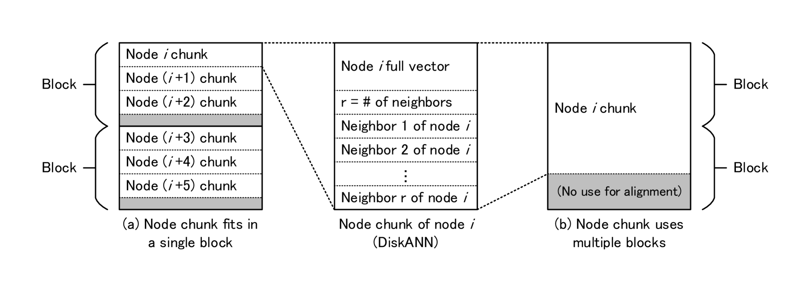
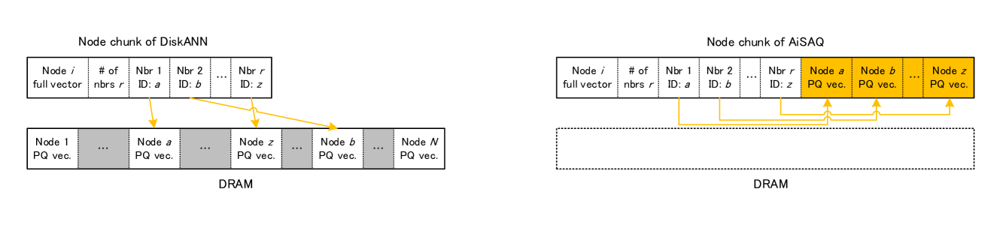
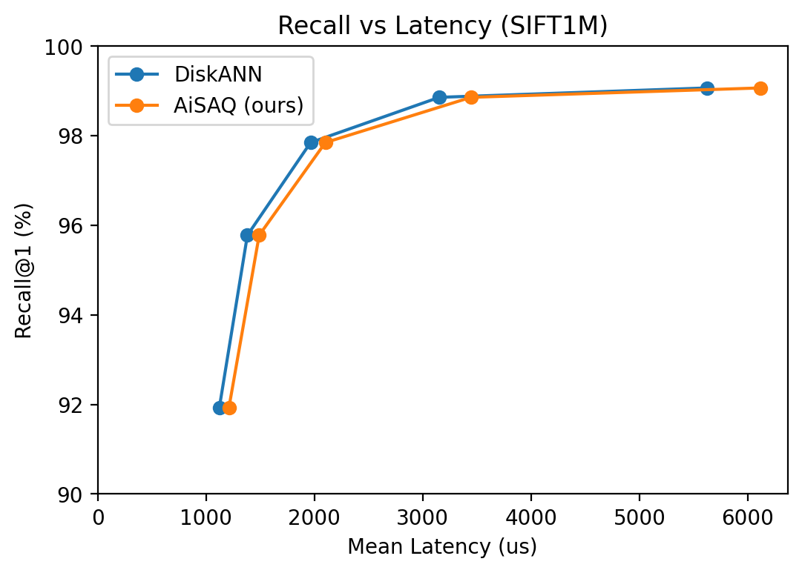
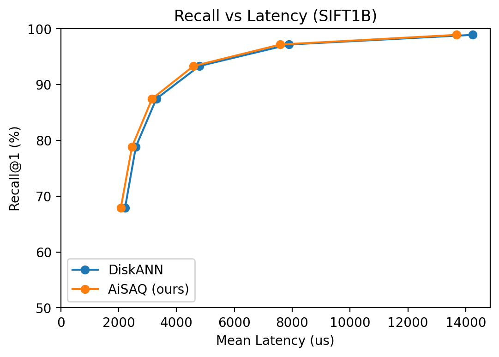
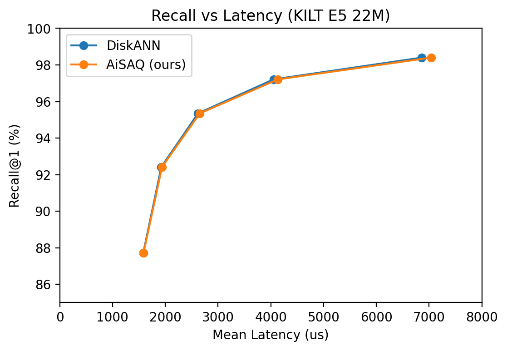
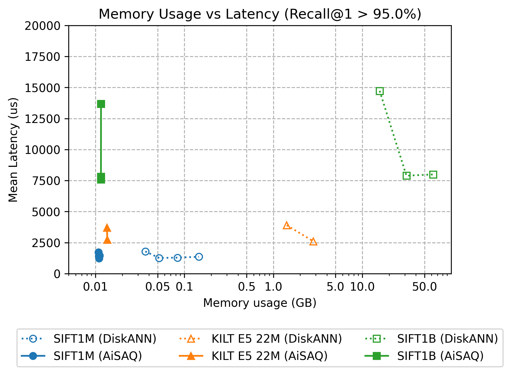

# AiSAQ: 采用产品量化技术的全存储式近似最近邻搜索（ANNS），为无需DRAM的信息检索提供解决方案。

发布时间：2024年04月09日

`RAG` `计算机科学` `数据检索`

> AiSAQ: All-in-Storage ANNS with Product Quantization for DRAM-free Information Retrieval

# 摘要

> 在基于近似邻近图的近似最近邻搜索（ANNS）技术中，DiskANN通过充分利用内存和存储空间，在处理大规模数据集时保持了较好的召回率与速度的平衡。尽管它声称通过采用产品量化（PQ）技术加载压缩向量以节省内存，但实际上内存消耗却随数据集规模的扩大而上升。本文提出了一种新颖的全存储ANNS方法——AiSAQ，该方法将压缩向量移至存储器，即便处理十亿级别的数据集，查询搜索的内存消耗也仅为大约10MB，且性能损耗微乎其微。AiSAQ还缩短了查询搜索前的索引加载时间，使得能够在众多十亿级数据集间快速切换索引，极大提升了检索增强生成（RAG）的灵活性。这一方法普适于各类基于图的ANNS算法，并有望与未来更高性能的ANNS技术相结合。

> In approximate nearest neighbor search (ANNS) methods based on approximate proximity graphs, DiskANN achieves good recall-speed balance for large-scale datasets using both of RAM and storage. Despite it claims to save memory usage by loading compressed vectors by product quantization (PQ), its memory usage increases in proportion to the scale of datasets. In this paper, we propose All-in-Storage ANNS with Product Quantization (AiSAQ), which offloads the compressed vectors to storage. Our method achieves $\sim$10 MB memory usage in query search even with billion-scale datasets with minor performance degradation. AiSAQ also reduces the index load time before query search, which enables the index switch between muitiple billion-scale datasets and significantly enhances the flexibility of retrieval-augmented generation (RAG). This method is applicable to all graph-based ANNS algorithms and can be combined with higher-spec ANNS methods in the future.

[Arxiv](https://arxiv.org/abs/2404.06004)