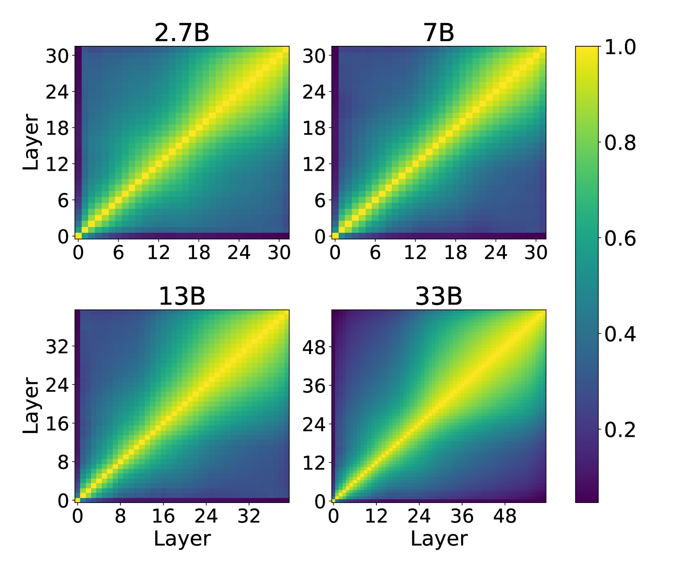
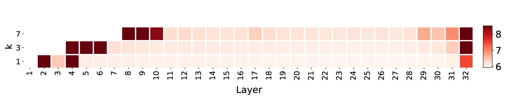
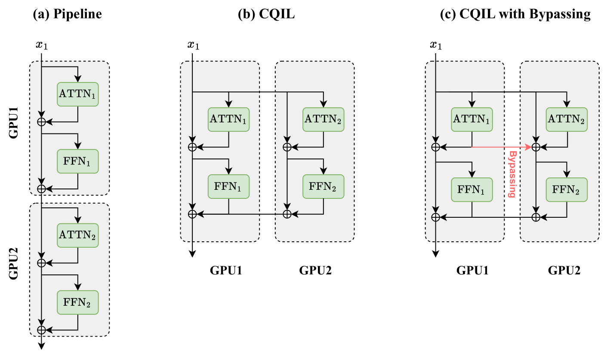
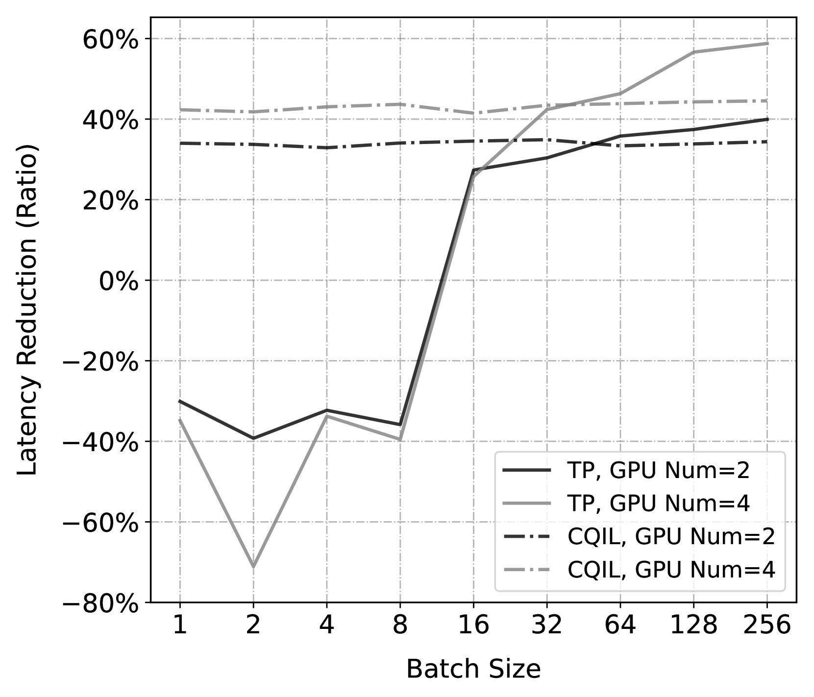
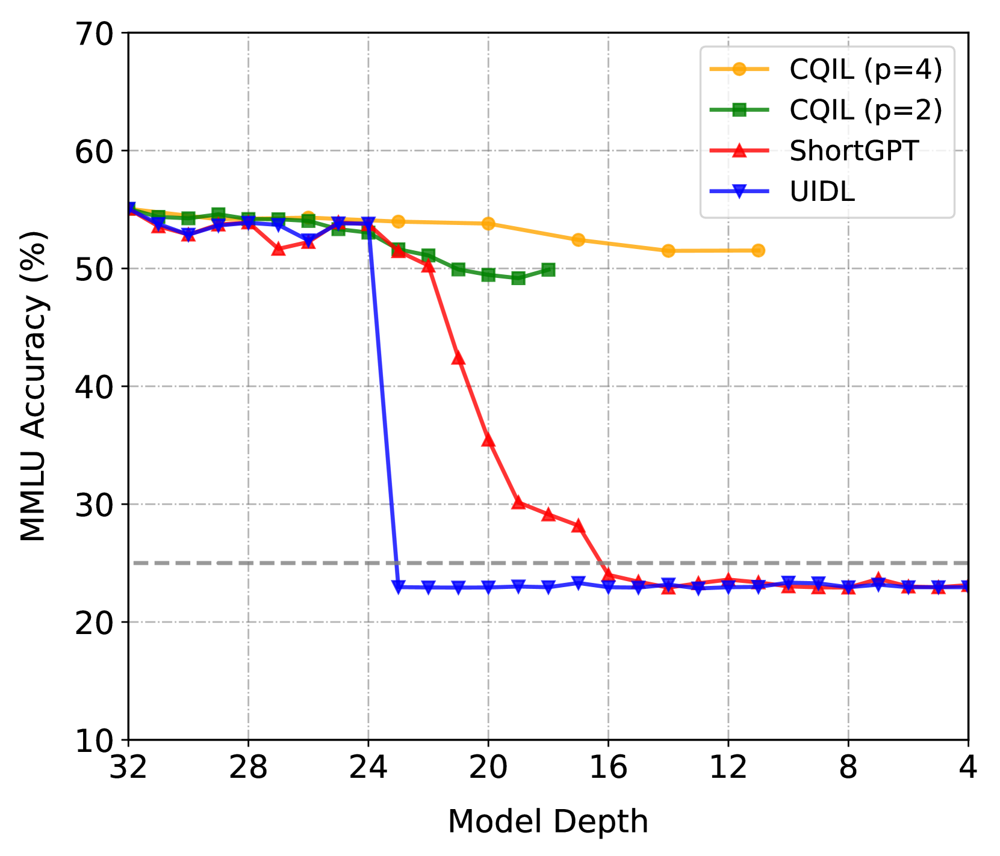
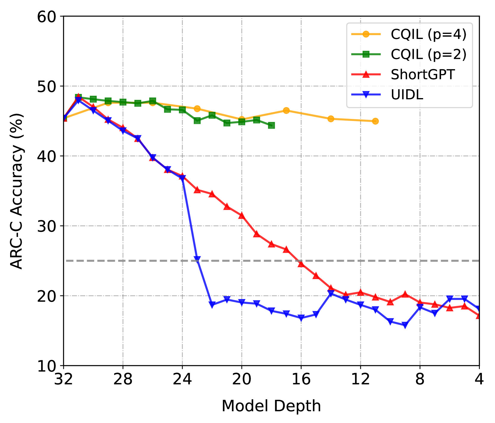
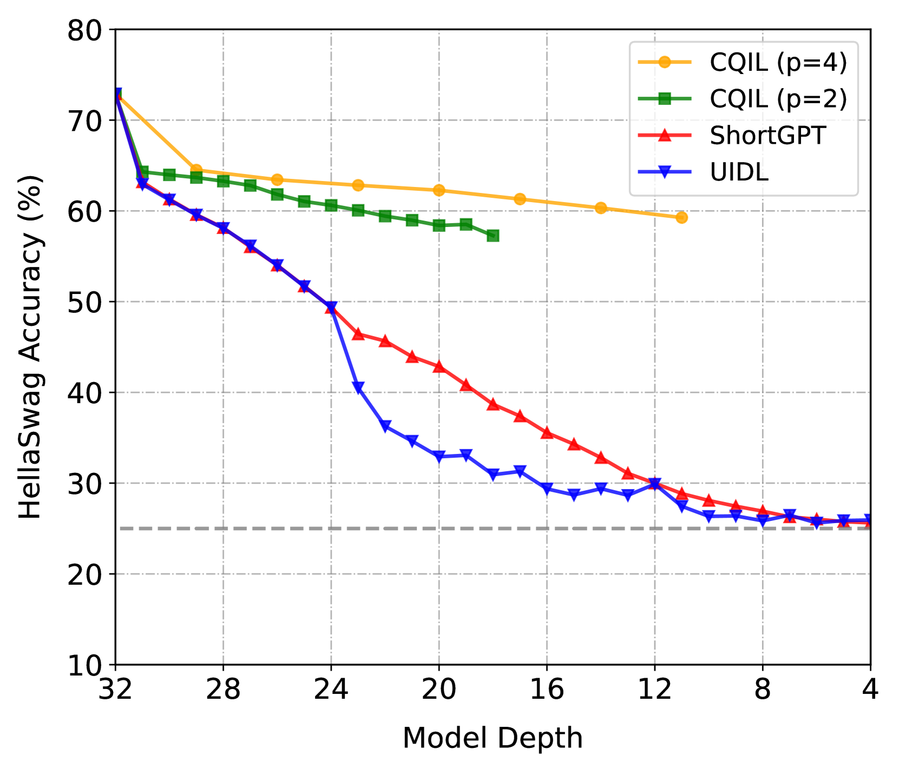

# CQIL技术：通过同时处理准独立层次以减少推理过程的延迟

发布时间：2024年04月09日

`LLM理论` `计算效率`

> CQIL: Inference Latency Optimization with Concurrent Computation of Quasi-Independent Layers

# 摘要

> 大型语言模型在自然语言处理任务上展现出空前的处理能力，但其效能却依赖于参数数量的指数级增长，引发了计算复杂性高和推理延迟长的问题，影响了用户体验。现有提升推理效率的方法，比如张量并行和量化技术，虽然减少了单层计算延迟，却未能解决层数增加导致的总体延迟问题。而通过减少层数来降低延迟的新近研究，却以牺牲性能为代价。本研究借鉴相邻层输入的相似性，提出一种识别并行计算准独立层的方法，大幅降低了推理延迟，并通过绕过技术减轻信息丢失的影响。实验证明，这一方法在LLaMA模型上最高可降低48.3%的延迟，且性能保持在一个相近的水平。

> The fast-growing large scale language models are delivering unprecedented performance on almost all natural language processing tasks. However, the effectiveness of large language models are reliant on an exponentially increasing number of parameters. The overwhelming computation complexity incurs a high inference latency that negatively affects user experience. Existing methods to improve inference efficiency, such as tensor parallelism and quantization, target to reduce per-layer computing latency, yet overlook the cumulative latency due to the number of layers. Recent works on reducing the cumulative latency through layer removing, however, lead to significant performance drop. Motivated by the similarity of inputs among adjacent layers, we propose to identify quasi-independent layers, which can be concurrently computed to significantly decrease inference latency. We also introduce a bypassing technique to mitigate the effect of information loss. Empirical experiments of the proposed approach on the LLaMA models confirm that Concurrent Computation of Quasi-Independent Layers (CQIL) can reduce latency by up to 48.3% on the LLaMA-33B model, while maintaining a close level of performance.

[Arxiv](https://arxiv.org/abs/2404.06709)