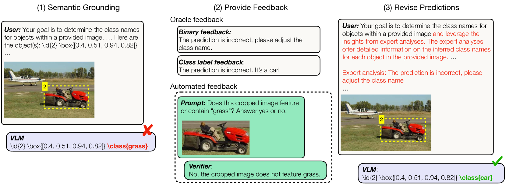
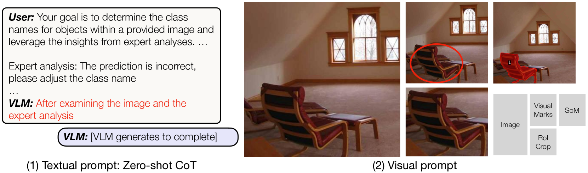
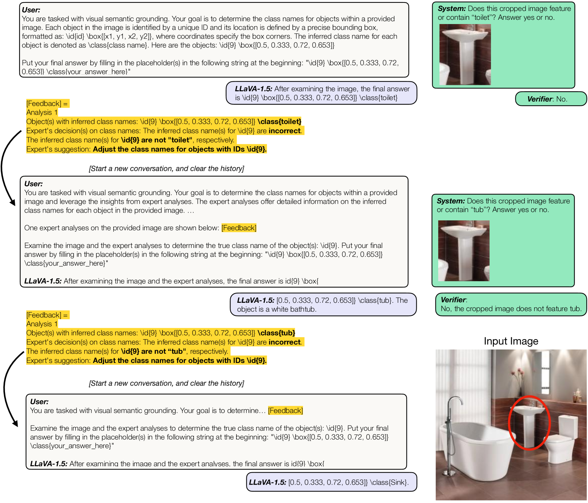
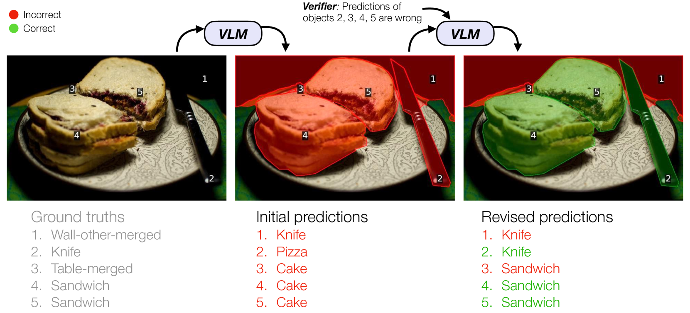

# 反馈是否能够提升大型视觉-语言模型的语义理解能力？

发布时间：2024年04月09日

`LLM应用` `视觉-语言模型` `自动反馈`

> Can Feedback Enhance Semantic Grounding in Large Vision-Language Models?

# 摘要

> 提升视觉-语言模型的语义理解力通常需要特定领域的训练数据、网络架构的精细调整或训练流程的变更。本研究另辟蹊径，探究VLMs是否能通过接受反馈来增强语义连接，无需领域数据、微调或架构改动。通过二元信号反馈机制的系统分析，我们发现只要引导得当，VLMs便能一步或逐步利用反馈，显示出反馈作为一种提升互联网级VLMs语义理解力的新方法的潜力。此外，VLMs在自我纠错方面也面临挑战，但通过二元验证机制，这一问题得到了缓解。我们还研究了将这些发现综合运用并迭代优化VLMs语义理解力的可能性与局限，结果表明，通过自动化反馈，所有模型在各种设置下的基础准确性均得到稳定提升。总体而言，我们的迭代框架在无噪声反馈条件下，将VLMs的语义理解力提升了超过15个百分点，在自动化二元验证机制下提升了最多5个百分点。项目网站可在 https://andrewliao11.github.io/vlms_feedback 访问。

> Enhancing semantic grounding abilities in Vision-Language Models (VLMs) often involves collecting domain-specific training data, refining the network architectures, or modifying the training recipes. In this work, we venture into an orthogonal direction and explore whether VLMs can improve their semantic grounding by "receiving" feedback, without requiring in-domain data, fine-tuning, or modifications to the network architectures. We systematically analyze this hypothesis using a feedback mechanism composed of a binary signal. We find that if prompted appropriately, VLMs can utilize feedback both in a single step and iteratively, showcasing the potential of feedback as an alternative technique to improve grounding in internet-scale VLMs. Furthermore, VLMs, like LLMs, struggle to self-correct errors out-of-the-box. However, we find that this issue can be mitigated via a binary verification mechanism. Finally, we explore the potential and limitations of amalgamating these findings and applying them iteratively to automatically enhance VLMs' grounding performance, showing grounding accuracy consistently improves using automated feedback across all models in all settings investigated. Overall, our iterative framework improves semantic grounding in VLMs by more than 15 accuracy points under noise-free feedback and up to 5 accuracy points under a simple automated binary verification mechanism. The project website is hosted at https://andrewliao11.github.io/vlms_feedback

[Arxiv](https://arxiv.org/abs/2404.06510)