# Cendol：面向印尼语言的开放指令优化生成式大型语言模型

发布时间：2024年04月09日

`LLM应用` `印度尼西亚语言` `低资源语言`

> Cendol: Open Instruction-tuned Generative Large Language Models for Indonesian Languages

# 摘要

> 大型语言模型（LLMs）展现出了跨领域和语言的惊人人类般能力。但在低资源语言，比如印度尼西亚的土著语言中，存在显著的质量差异，导致其在这些语言环境中表现不佳。为了缩小这一差距，我们推出了Cendol——一系列印度尼西亚语的大型语言模型，包括仅解码器和编解码器结构，覆盖了不同规模的模型。Cendol在多项任务中表现出色，提升了20%，并能适应印度尼西亚未被涉及的任务和土著语言。尽管Cendol在捕捉当地知识和文化价值方面有所不足，但其人类友好度有所提升。我们还探讨了LoRA等参数高效调整在语言适配上的局限，并建议采用词汇表调整来提升效率。此外，我们对Cendol的安全性进行了评估，发现在一个语言（如英语）中的预训练安全性可转移到低资源语言（如印度尼西亚语），即便没有使用RLHF和安全微调。

> Large language models (LLMs) show remarkable human-like capability in various domains and languages. However, a notable quality gap arises in low-resource languages, e.g., Indonesian indigenous languages, rendering them ineffective and inefficient in such linguistic contexts. To bridge this quality gap, we introduce Cendol, a collection of Indonesian LLMs encompassing both decoder-only and encoder-decoder architectures across a range of model sizes. We highlight Cendol's effectiveness across a diverse array of tasks, attaining 20% improvement, and demonstrate its capability to generalize to unseen tasks and indigenous languages of Indonesia. Furthermore, Cendol models showcase improved human favorability despite their limitations in capturing indigenous knowledge and cultural values in Indonesia. In addition, we discuss the shortcomings of parameter-efficient tunings, such as LoRA, for language adaptation. Alternatively, we propose the usage of vocabulary adaptation to enhance efficiency. Lastly, we evaluate the safety of Cendol and showcase that safety in pre-training in one language such as English is transferable to low-resource languages, such as Indonesian, even without RLHF and safety fine-tuning.

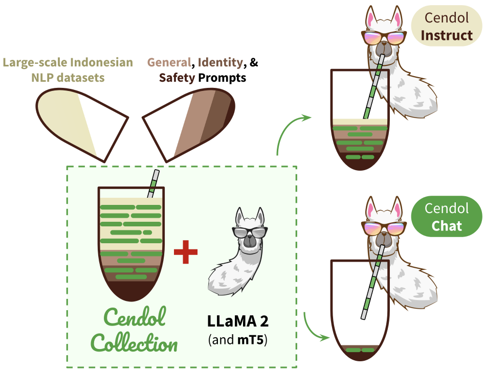

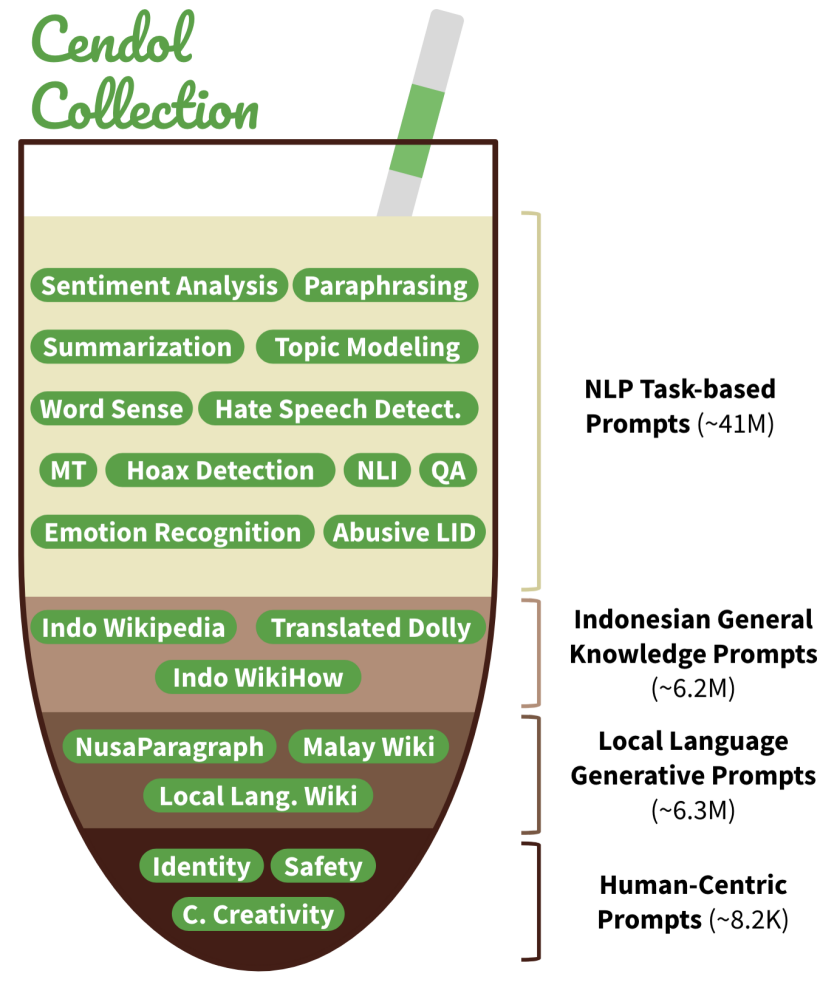

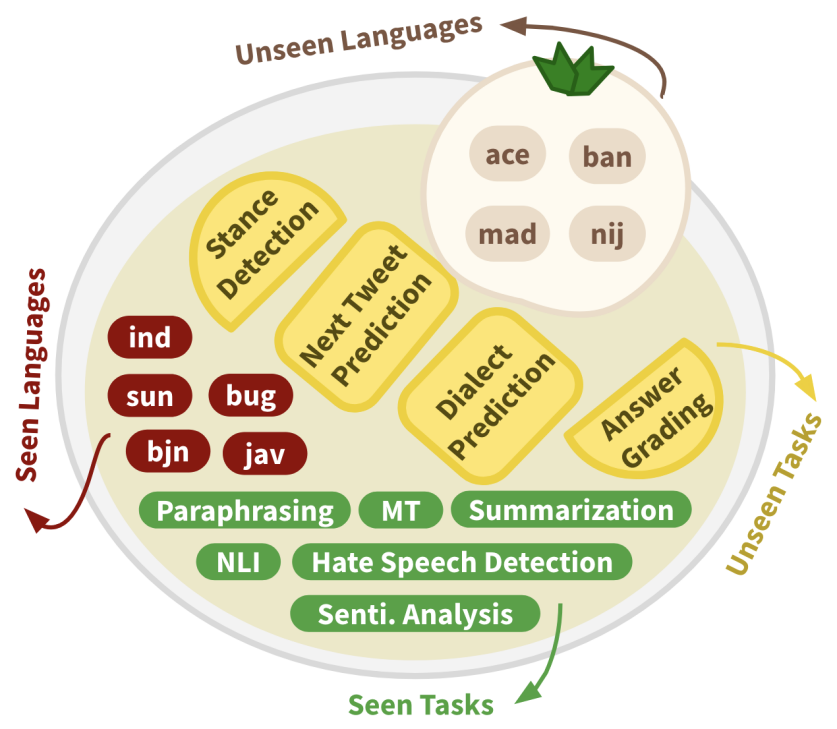

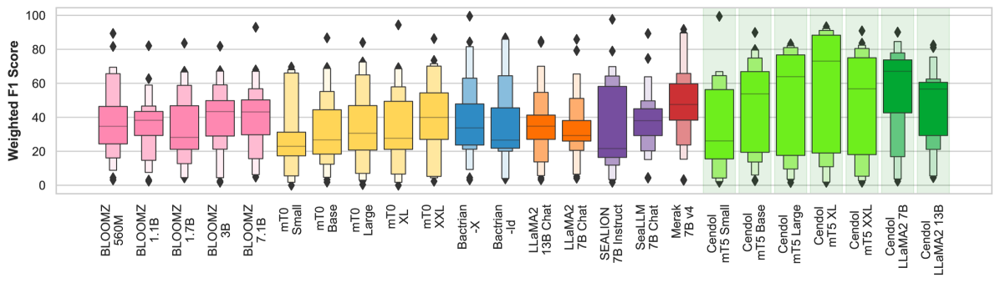

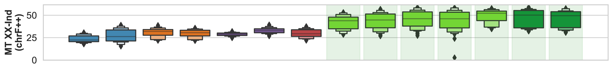

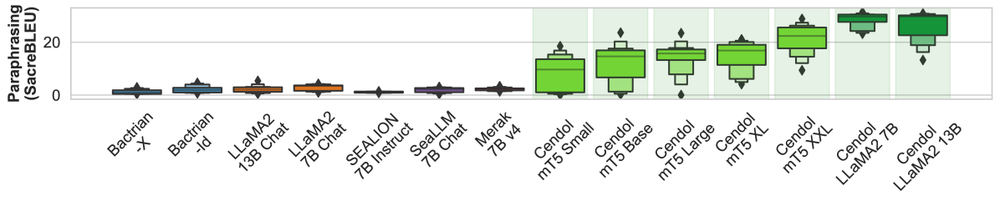

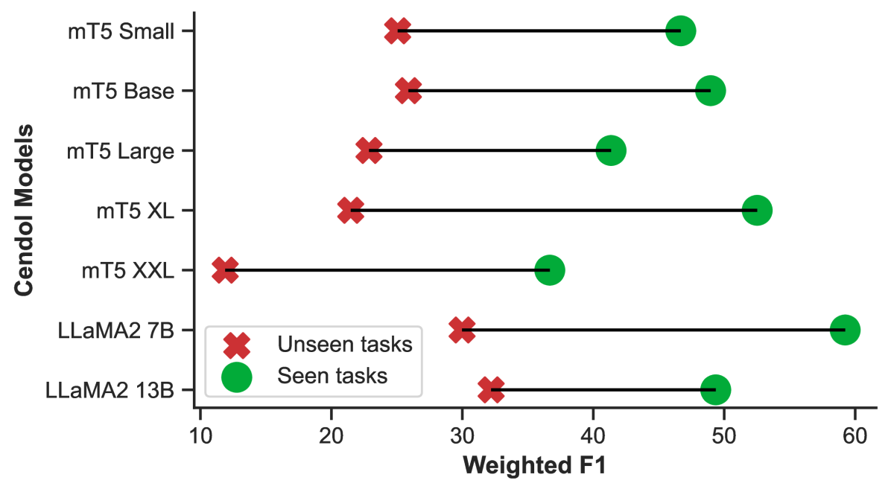

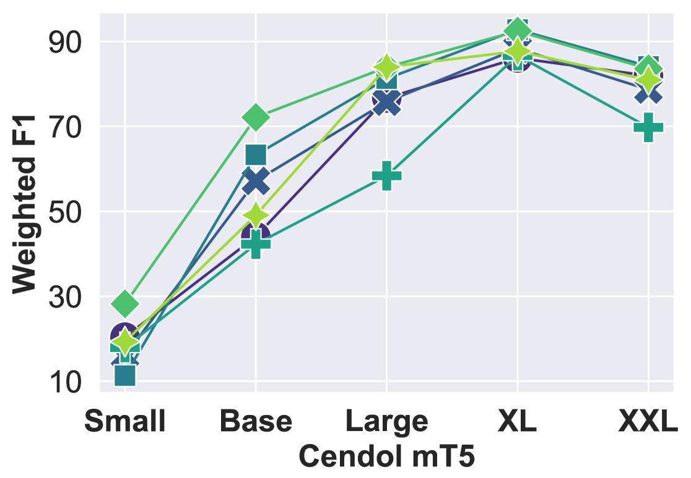

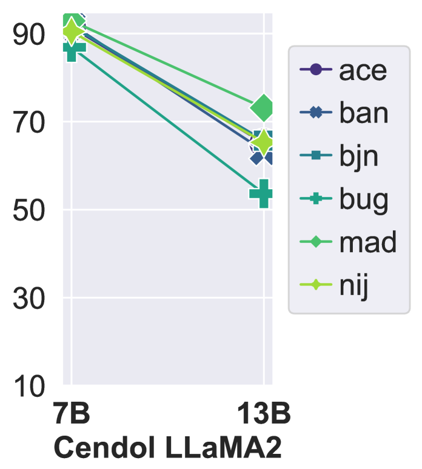

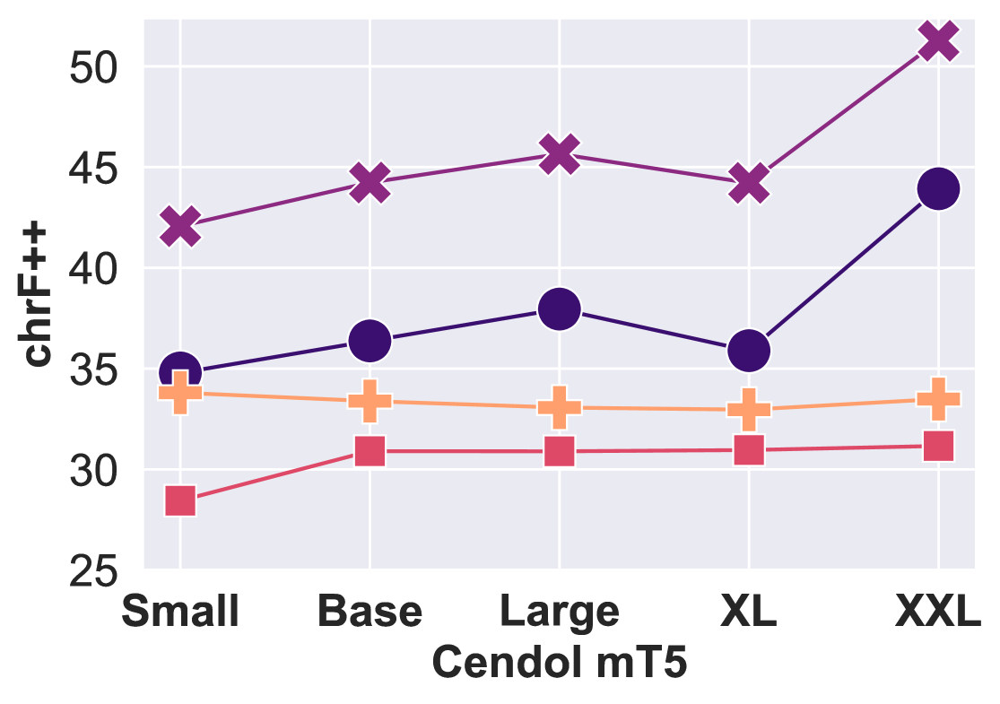

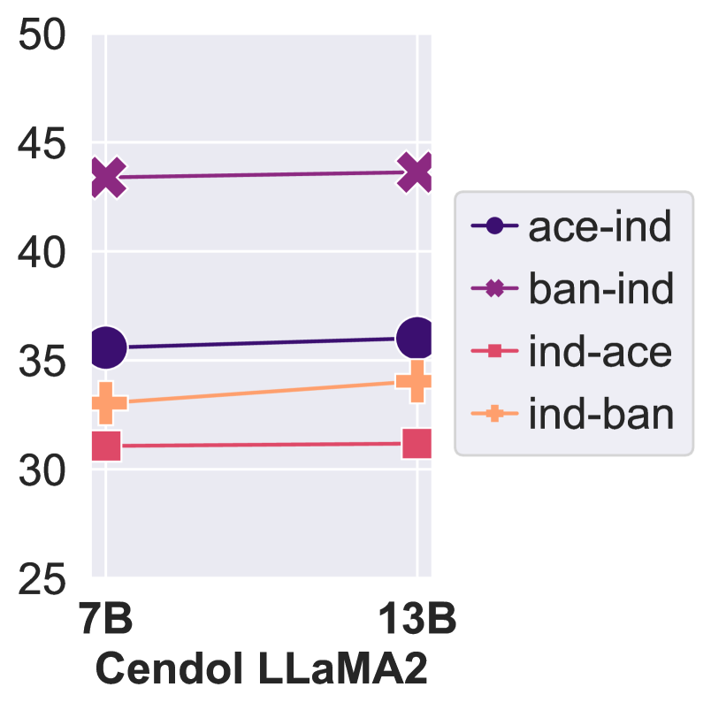

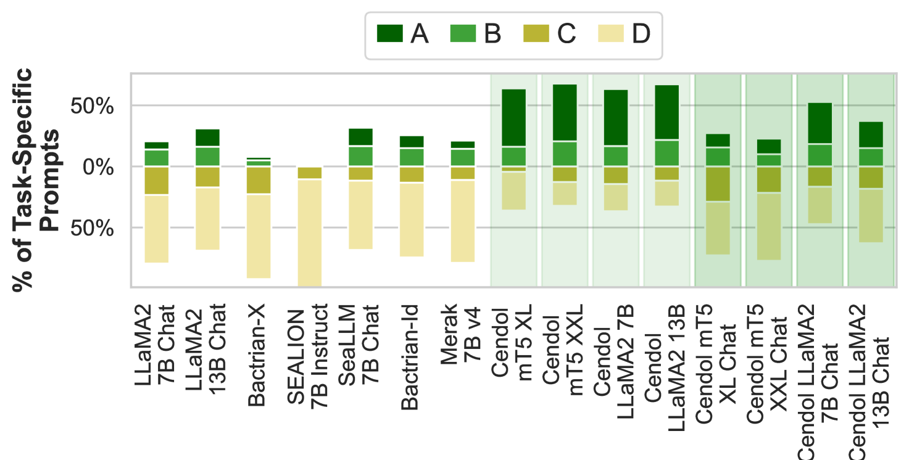

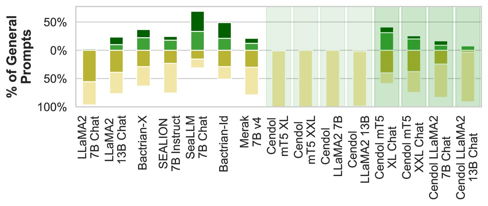

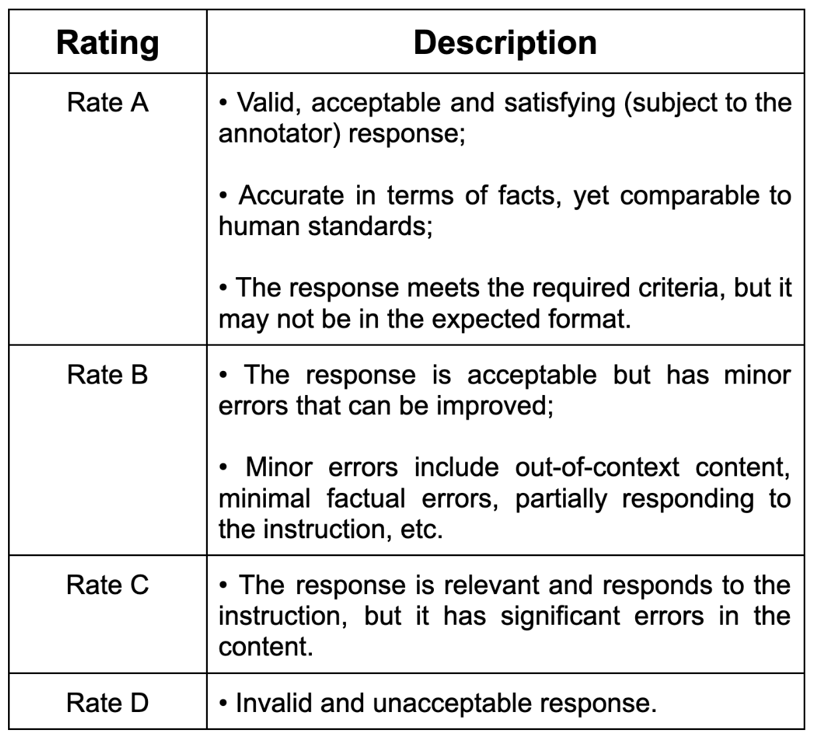

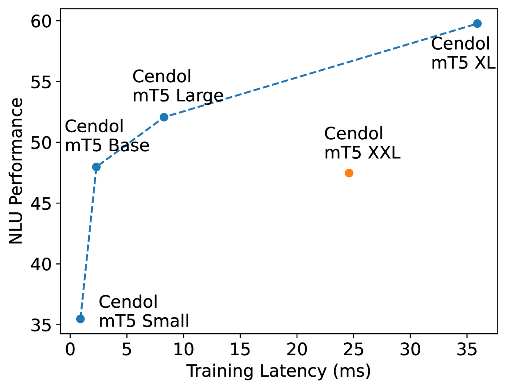

[Arxiv](https://arxiv.org/abs/2404.06138)