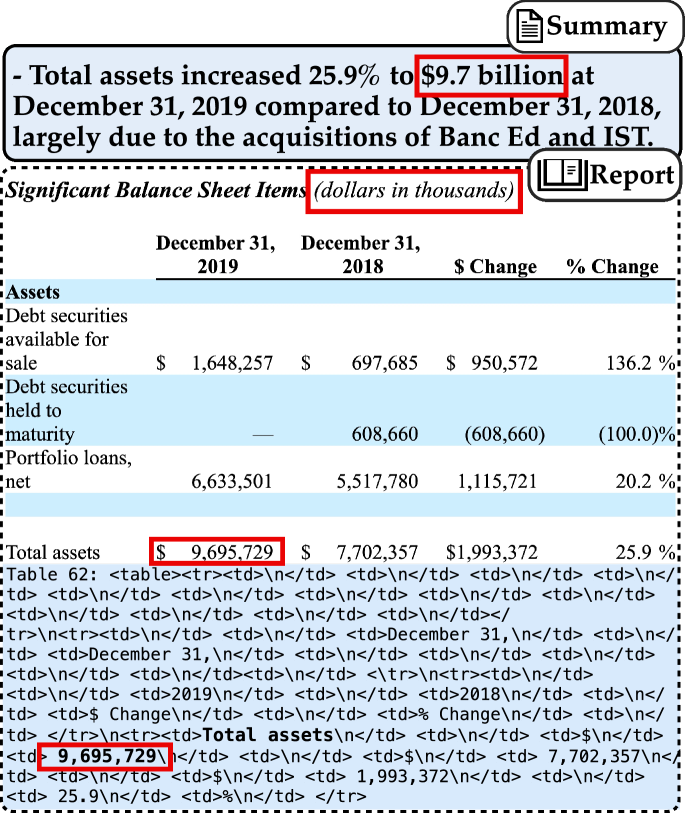
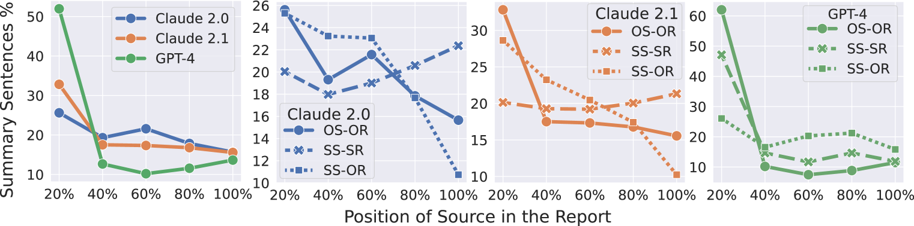

# 探究多模态长文本摘要：以金融报告分析为例

发布时间：2024年04月09日

`LLM应用` `摘要生成`

> Characterizing Multimodal Long-form Summarization: A Case Study on Financial Reports

# 摘要

> 随着大型语言模型（LLMs）增强了自然语言处理处理长篇文本的能力，我们需要通过严谨和系统的研究来深入理解它们的功能和表现。以摘要生成为例，它因其普遍性和争议性（如一些研究者宣称摘要生成已走到尽头）而备受关注。本文以财务报告摘要为例，探讨了这一任务的挑战，因为财务报告通常篇幅庞大且包含大量数字和表格。我们构建了一个计算框架，用以刻画多模态长文本摘要的特性，并针对Claude 2.0/2.1、GPT-4/3.5和Command三款模型进行了行为分析。研究发现，GPT-3.5和Command在这项摘要任务上表现欠佳。而对于Claude 2和GPT-4，我们深入分析了它们生成摘要的抽取特性，并发现了LLMs中存在的位置偏好。有趣的是，当输入内容被打乱后，Claude的位置偏好消失了，这表明它能够辨识出关键信息。此外，我们还全面考察了LLM生成摘要时对数字数据的处理，并提出了数字误读的分类。尽管我们尝试通过提示工程来优化GPT-4处理数字的能力，但成效有限。总的来说，我们的研究显示，Claude 2在处理长篇幅多模态输入方面的能力远超GPT-4。

> As large language models (LLMs) expand the power of natural language processing to handle long inputs, rigorous and systematic analyses are necessary to understand their abilities and behavior. A salient application is summarization, due to its ubiquity and controversy (e.g., researchers have declared the death of summarization). In this paper, we use financial report summarization as a case study because financial reports not only are long but also use numbers and tables extensively. We propose a computational framework for characterizing multimodal long-form summarization and investigate the behavior of Claude 2.0/2.1, GPT-4/3.5, and Command. We find that GPT-3.5 and Command fail to perform this summarization task meaningfully. For Claude 2 and GPT-4, we analyze the extractiveness of the summary and identify a position bias in LLMs. This position bias disappears after shuffling the input for Claude, which suggests that Claude has the ability to recognize important information. We also conduct a comprehensive investigation on the use of numeric data in LLM-generated summaries and offer a taxonomy of numeric hallucination. We employ prompt engineering to improve GPT-4's use of numbers with limited success. Overall, our analyses highlight the strong capability of Claude 2 in handling long multimodal inputs compared to GPT-4.

[Arxiv](https://arxiv.org/abs/2404.06162)