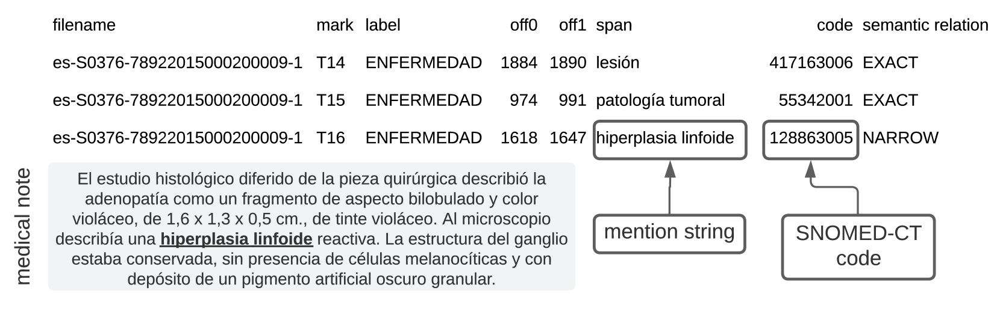
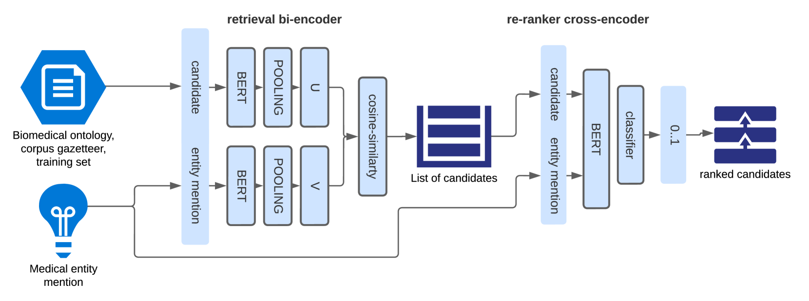
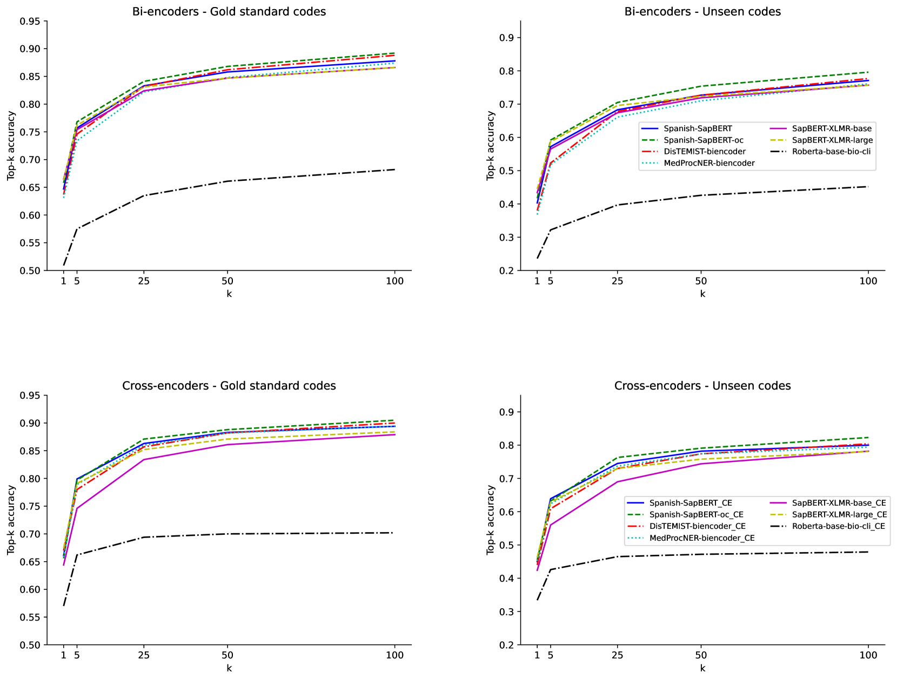
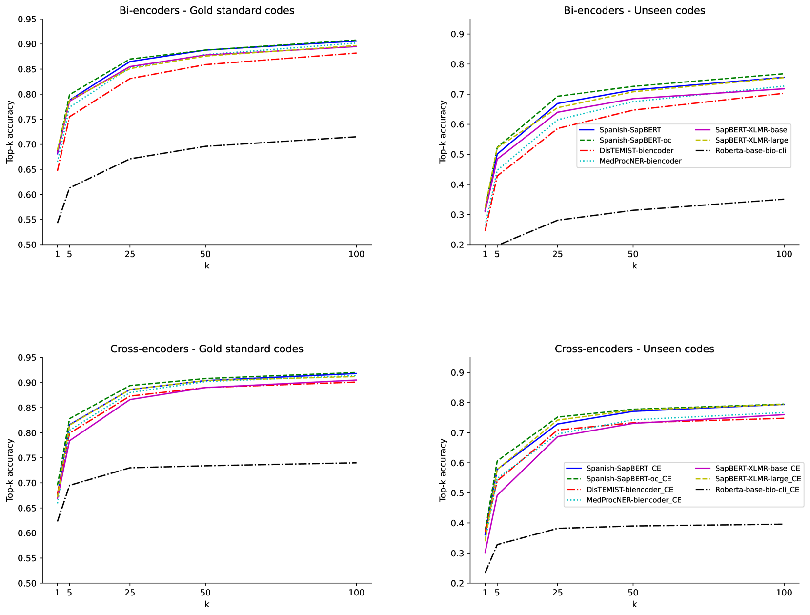

# ClinLinker：将西班牙语临床术语中的医疗实体进行链接

发布时间：2024年04月09日

`LLM应用`

> ClinLinker: Medical Entity Linking of Clinical Concept Mentions in Spanish

# 摘要

> 自然语言处理技术的突破，例如对命名实体的识别和标准化术语的归一化，结合电子健康记录的数字化，极大地推动了临床文本分析的进步。本研究介绍了ClinLinker，这是一种创新的方法，通过两阶段流水线实现医学实体链接，充分发挥了生物医学文本挖掘中领域适应语言模型的潜力：首先使用基于SapBERT的双向编码器进行候选实体的初步检索，然后通过交叉编码器进行重新排序，该编码器通过对比学习策略训练，以适应西班牙语医学概念。这一方法最初针对西班牙语文本，其性能显著超越了为相同目标设计的多语言模型，即便在处理复杂多变的医学术语和基于数据子集的训练情况下亦然。我们的成果通过25和其他top-k指标的准确度评估，显示了在DisTEMIST（疾病）和MedProcNER（临床程序）两个不同的临床实体链接标准语料库上的性能，分别比以往的基准提高了40分和43分，均已转换为SNOMED-CT代码。这些成果凸显了我们方法在处理语言细节上的优势，并在实体链接领域树立了新的标杆，为提升数字医疗记录的效用提供了有力的工具。这一系统在实际应用中具有重要价值，不仅能够大规模自动生成源自临床记录的结构化数据，还能全面提取和整合关键的临床变量。

> Advances in natural language processing techniques, such as named entity recognition and normalization to widely used standardized terminologies like UMLS or SNOMED-CT, along with the digitalization of electronic health records, have significantly advanced clinical text analysis. This study presents ClinLinker, a novel approach employing a two-phase pipeline for medical entity linking that leverages the potential of in-domain adapted language models for biomedical text mining: initial candidate retrieval using a SapBERT-based bi-encoder and subsequent re-ranking with a cross-encoder, trained by following a contrastive-learning strategy to be tailored to medical concepts in Spanish. This methodology, focused initially on content in Spanish, substantially outperforming multilingual language models designed for the same purpose. This is true even for complex scenarios involving heterogeneous medical terminologies and being trained on a subset of the original data. Our results, evaluated using top-k accuracy at 25 and other top-k metrics, demonstrate our approach's performance on two distinct clinical entity linking Gold Standard corpora, DisTEMIST (diseases) and MedProcNER (clinical procedures), outperforming previous benchmarks by 40 points in DisTEMIST and 43 points in MedProcNER, both normalized to SNOMED-CT codes. These findings highlight our approach's ability to address language-specific nuances and set a new benchmark in entity linking, offering a potent tool for enhancing the utility of digital medical records. The resulting system is of practical value, both for large scale automatic generation of structured data derived from clinical records, as well as for exhaustive extraction and harmonization of predefined clinical variables of interest.

[Arxiv](https://arxiv.org/abs/2404.06367)