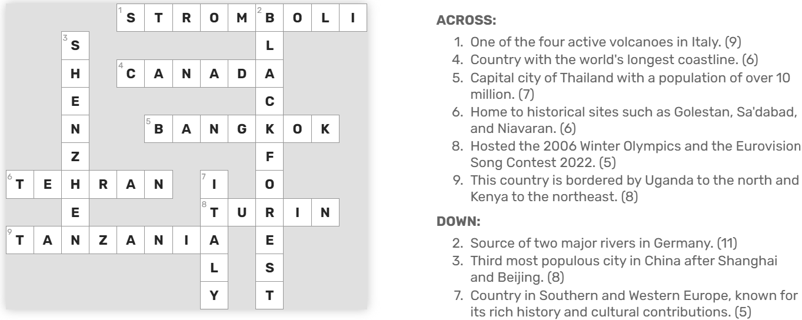
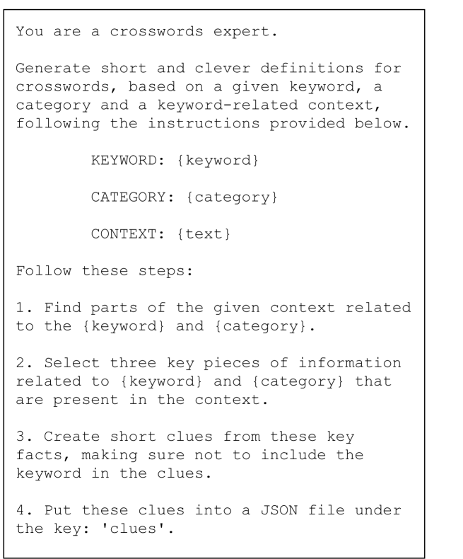
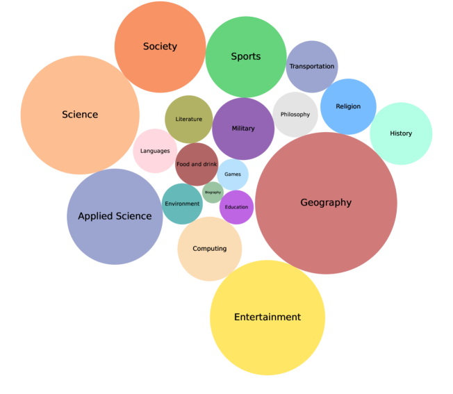
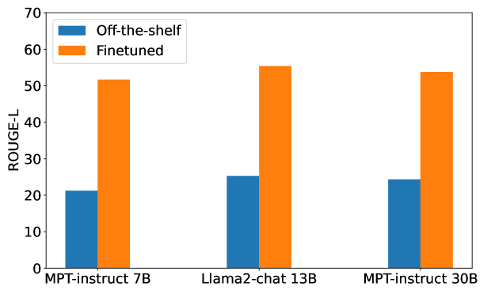
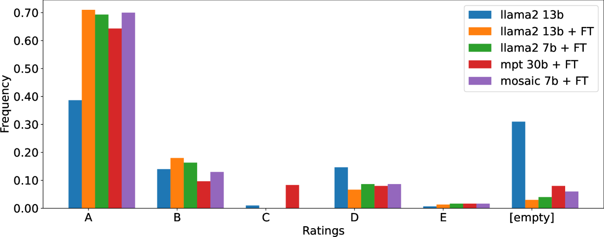
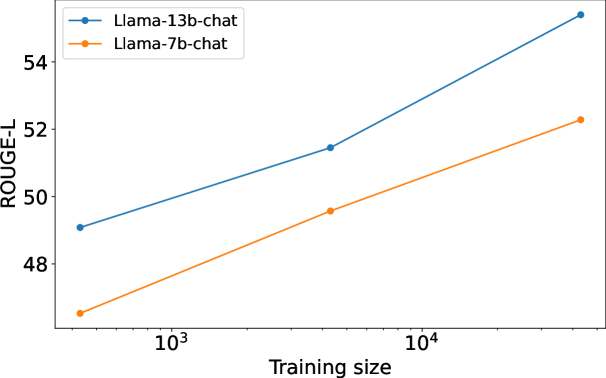

# Clue-Instruct：为教育性填字游戏设计的文本线索生成方法

发布时间：2024年04月09日

`LLM应用` `数据集构建`

> Clue-Instruct: Text-Based Clue Generation for Educational Crossword Puzzles

# 摘要

> 填字游戏广受喜爱，是激发学生学习兴趣的有效工具。与传统填字游戏相比，教育性填字游戏以其直接明了的线索脱颖而出。虽然传统填字游戏的线索-答案对数据库众多，但针对教育目的的数据集尚属空白。本文提出了一种新颖方法，用于构建教育性线索生成的数据集，旨在训练大型语言模型（LLMs）。我们从维基百科中提取与关键词紧密相关的信息，借助大型语言模型，自动生成与输入关键词及其背景相匹配的教学线索。利用这一方法，我们成功打造了clue-instruct数据集，收录了44,075组独特的文本与关键词组合，每组均对应三个不同的填字线索。通过clue-instruct，我们引导不同的LLMs基于特定输入内容和关键词创作教育性线索。经过人工与自动化评估的双重验证，生成的线索品质得到了肯定，证明了我们方法的高效性。

> Crossword puzzles are popular linguistic games often used as tools to engage students in learning. Educational crosswords are characterized by less cryptic and more factual clues that distinguish them from traditional crossword puzzles. Despite there exist several publicly available clue-answer pair databases for traditional crosswords, educational clue-answer pairs datasets are missing. In this article, we propose a methodology to build educational clue generation datasets that can be used to instruct Large Language Models (LLMs). By gathering from Wikipedia pages informative content associated with relevant keywords, we use Large Language Models to automatically generate pedagogical clues related to the given input keyword and its context. With such an approach, we created clue-instruct, a dataset containing 44,075 unique examples with text-keyword pairs associated with three distinct crossword clues. We used clue-instruct to instruct different LLMs to generate educational clues from a given input content and keyword. Both human and automatic evaluations confirmed the quality of the generated clues, thus validating the effectiveness of our approach.

[Arxiv](https://arxiv.org/abs/2404.06186)