# 大规模分布式深度学习中的通信效率：一篇全面综述

发布时间：2024年04月09日

`LLM理论` `分布式计算`

> Communication-Efficient Large-Scale Distributed Deep Learning: A Comprehensive Survey

# 摘要

> 随着深度学习领域数据量、模型和设备的激增，大规模分布式深度学习正受到越来越多的关注。与传统分布式深度学习不同，大规模场景带来了新的挑战，如容错性、算法与基础设施的扩展性，以及数据集、模型和资源的多样性。在分布式训练和推理过程中，模型间的频繁同步和跨GPU及计算节点的数据共享导致通信效率成为提升大规模性能的瓶颈。本文回顾了2018至2023年间的研究成果，探讨了旨在提升大规模分布式深度学习通信效率的算法和技术，涵盖算法、框架和基础设施等多个层面。我们首先介绍了针对大规模分布式训练的模型同步和通信数据压缩的高效算法。接着，探讨了分布式训练和推理中资源配置和任务调度的高效策略。然后，展示了现代通信基础设施在分布式深度学习中的应用，并重点分析了大规模异构环境下通信开销的影响。最后，通过大型语言模型的分布式训练案例，展示了如何将这些技术应用于实际场景。本文意在为研究者提供对大规模分布式深度学习现状的深入理解，并指出未来研究的方向，特别是在通信效率方面的解决方案。

> With the rapid growth in the volume of data sets, models, and devices in the domain of deep learning, there is increasing attention on large-scale distributed deep learning. In contrast to traditional distributed deep learning, the large-scale scenario poses new challenges that include fault tolerance, scalability of algorithms and infrastructures, and heterogeneity in data sets, models, and resources. Due to intensive synchronization of models and sharing of data across GPUs and computing nodes during distributed training and inference processes, communication efficiency becomes the bottleneck for achieving high performance at a large scale. This article surveys the literature over the period of 2018-2023 on algorithms and technologies aimed at achieving efficient communication in large-scale distributed deep learning at various levels, including algorithms, frameworks, and infrastructures. Specifically, we first introduce efficient algorithms for model synchronization and communication data compression in the context of large-scale distributed training. Next, we introduce efficient strategies related to resource allocation and task scheduling for use in distributed training and inference. After that, we present the latest technologies pertaining to modern communication infrastructures used in distributed deep learning with a focus on examining the impact of the communication overhead in a large-scale and heterogeneous setting. Finally, we conduct a case study on the distributed training of large language models at a large scale to illustrate how to apply these technologies in real cases. This article aims to offer researchers a comprehensive understanding of the current landscape of large-scale distributed deep learning and to reveal promising future research directions toward communication-efficient solutions in this scope.

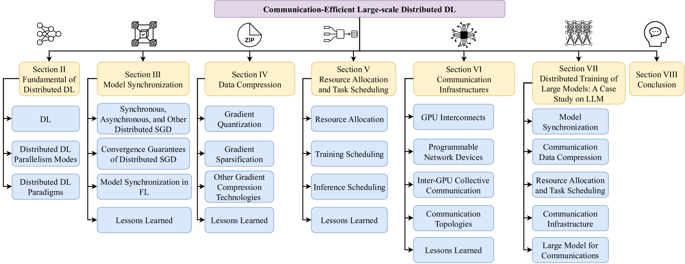

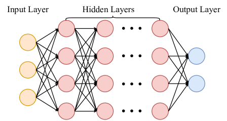

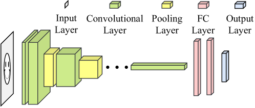

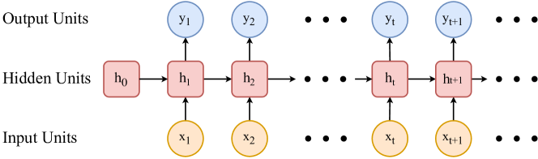

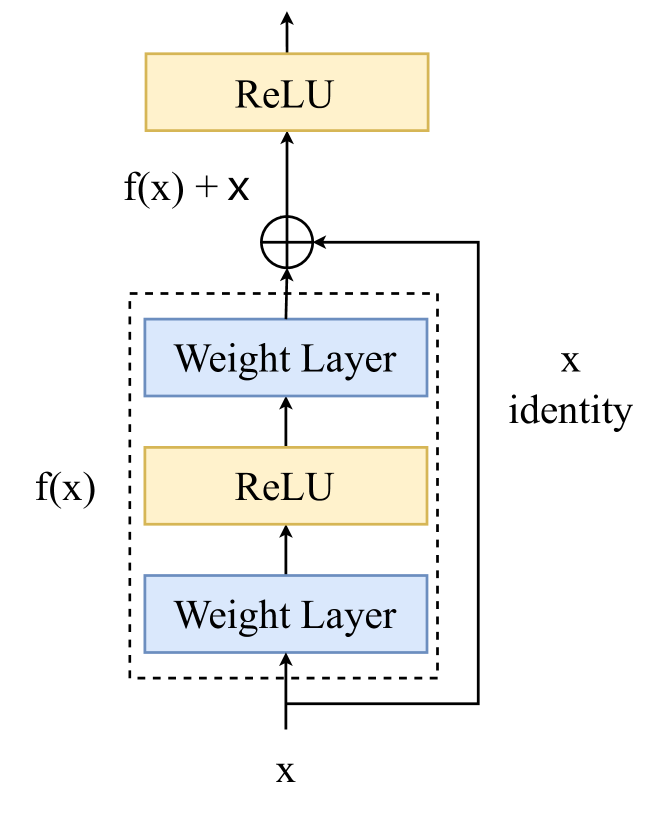

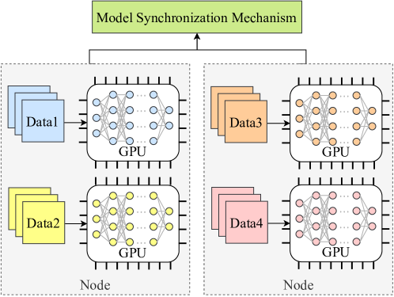

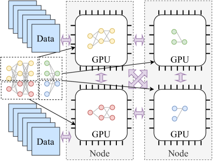

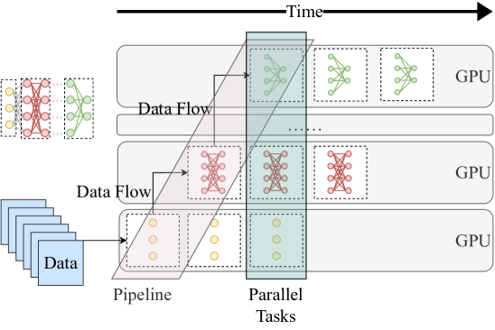

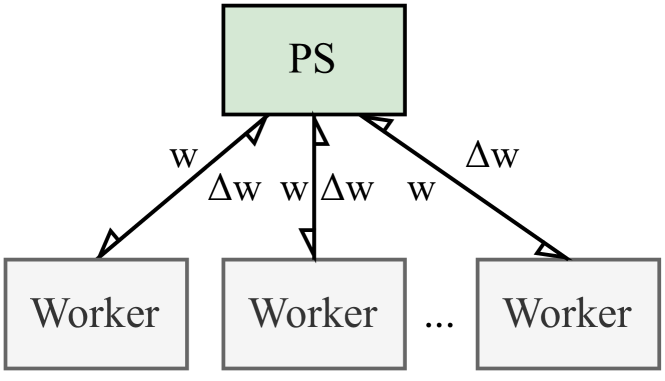

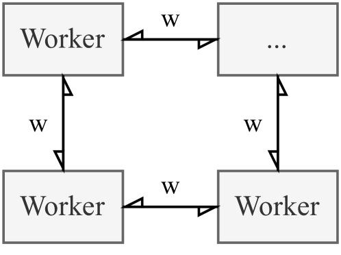

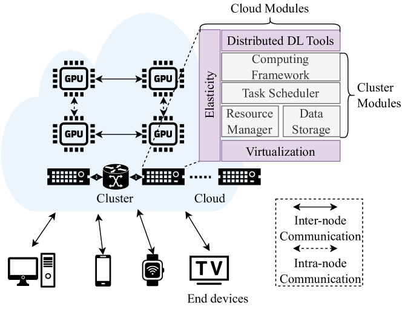

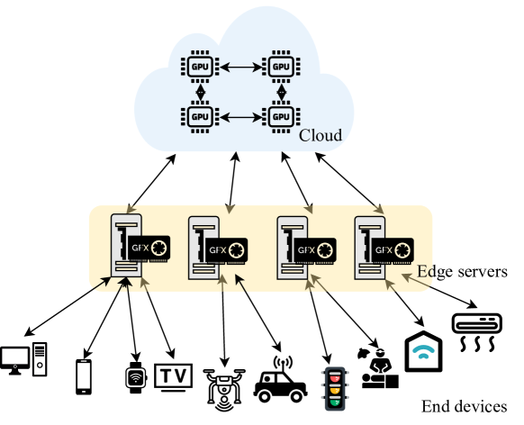

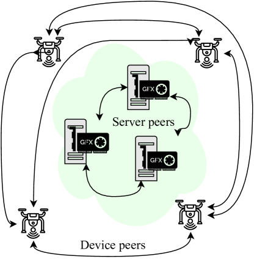

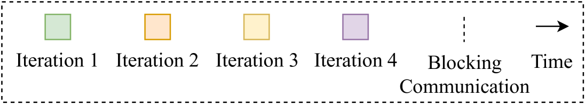

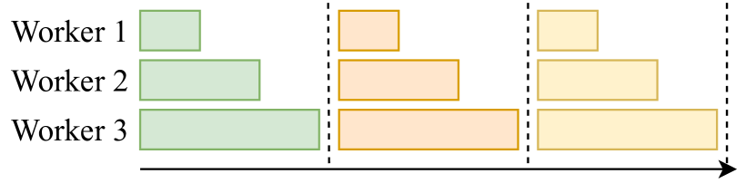

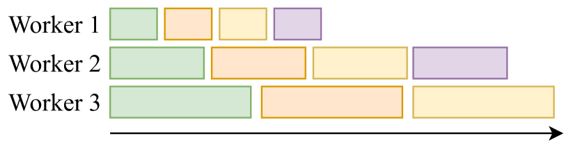

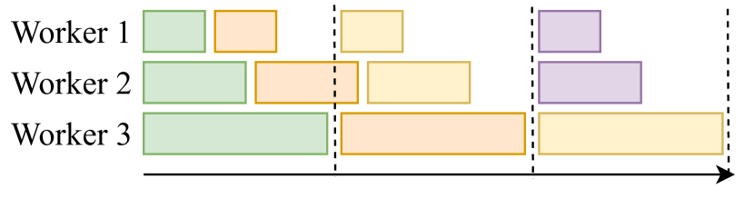

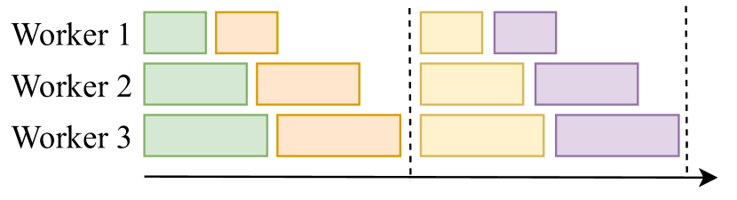

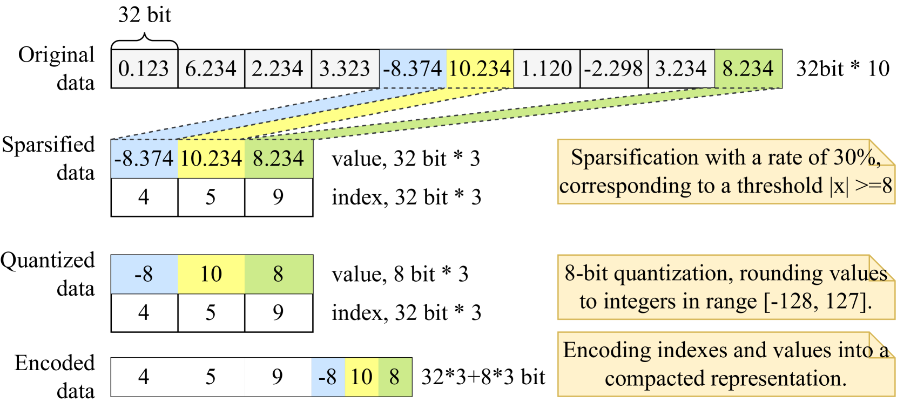

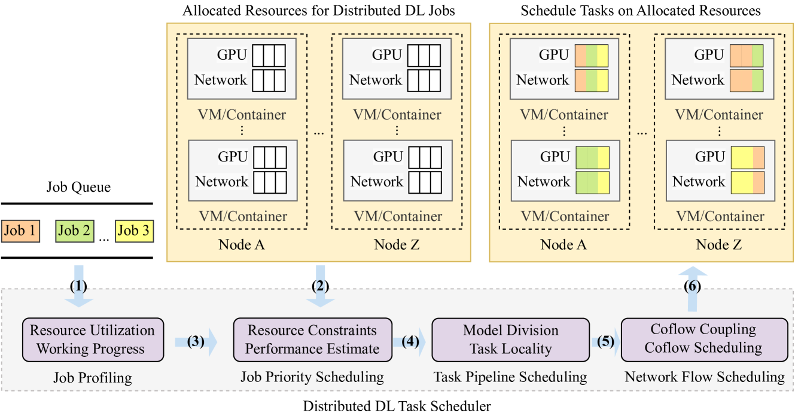

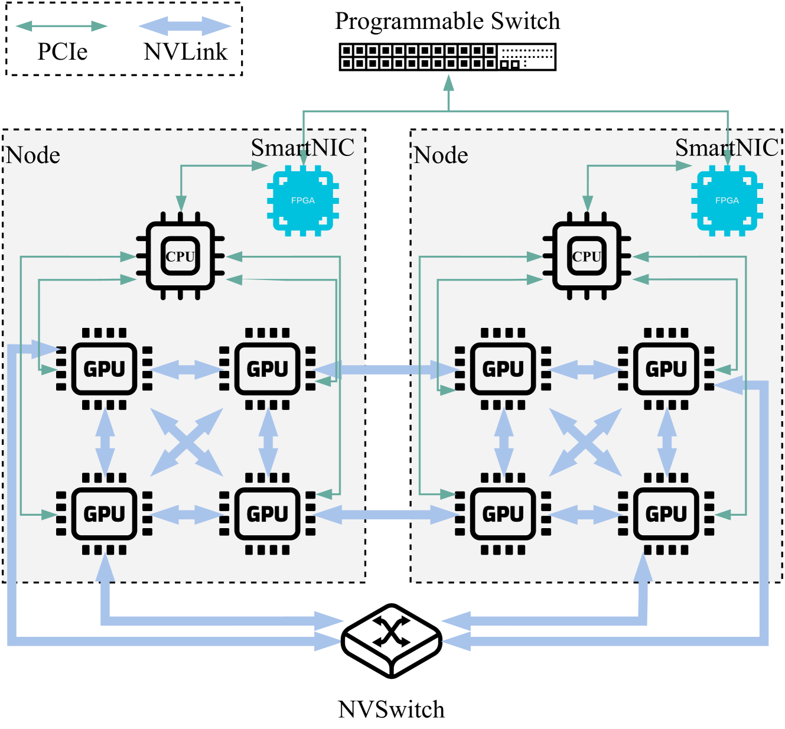

[Arxiv](https://arxiv.org/abs/2404.06114)