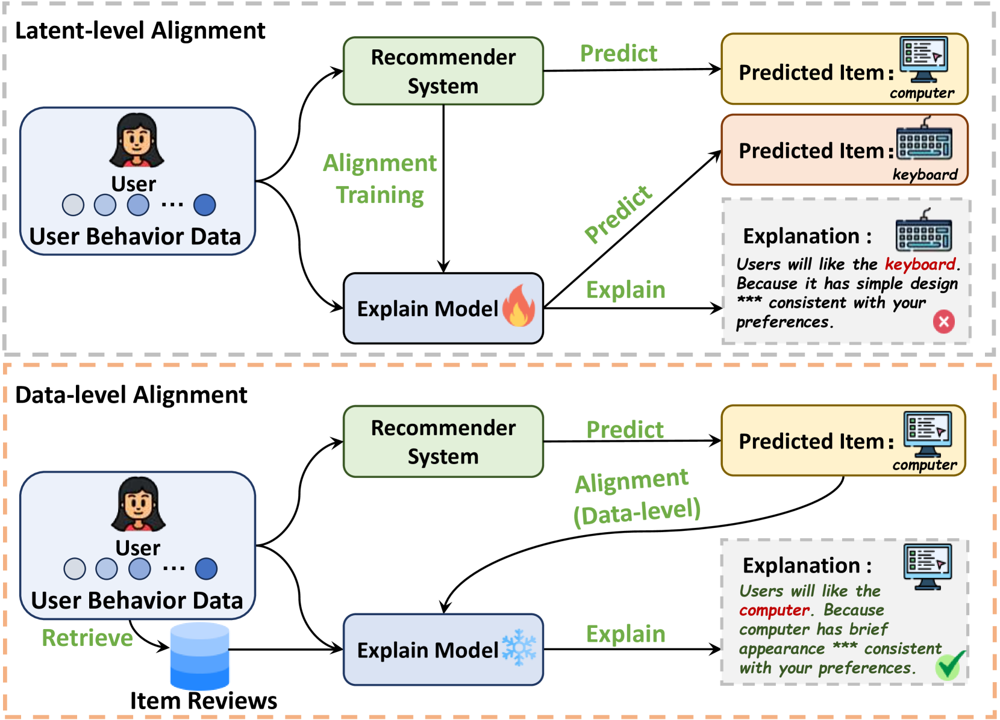
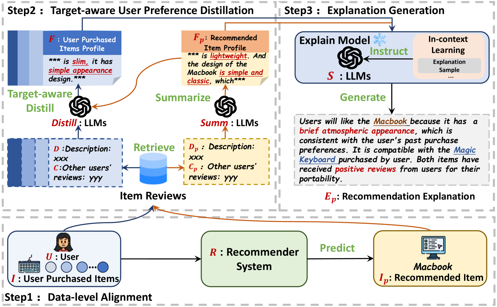
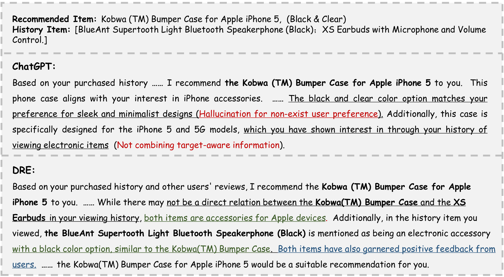

# DRE：通过数据层面的大型语言模型对齐，打造推荐解释的生成机制

发布时间：2024年04月09日

`LLM应用` `推荐系统` `用户行为分析`

> DRE: Generating Recommendation Explanations by Aligning Large Language Models at Data-level

# 摘要

> 推荐系统根据用户行为推荐商品，至关重要却也因缺乏透明度而让用户困惑。本文提出了数据级推荐解释（DRE），一种新颖的非侵入式解释框架，专为黑盒推荐模型设计。DRE避免了使用推荐模型的中间层表示和潜在对齐训练，从而减少了性能风险。我们创新性地采用数据级对齐策略，运用大型语言模型分析用户数据与推荐商品的关联。为使解释内容更丰富，我们还引入了目标导向的用户偏好提炼方法，借助商品评论来实现。实验表明，DRE能够提供精准、用户友好的解释，有效提升用户对推荐商品的参与度。

> Recommendation systems play a crucial role in various domains, suggesting items based on user behavior.However, the lack of transparency in presenting recommendations can lead to user confusion. In this paper, we introduce Data-level Recommendation Explanation (DRE), a non-intrusive explanation framework for black-box recommendation models.Different from existing methods, DRE does not require any intermediary representations of the recommendation model or latent alignment training, mitigating potential performance issues.We propose a data-level alignment method, leveraging large language models to reason relationships between user data and recommended items.Additionally, we address the challenge of enriching the details of the explanation by introducing target-aware user preference distillation, utilizing item reviews. Experimental results on benchmark datasets demonstrate the effectiveness of the DRE in providing accurate and user-centric explanations, enhancing user engagement with recommended item.

[Arxiv](https://arxiv.org/abs/2404.06311)