# 深度生成式数据融合技术在多模态环境下的应用

发布时间：2024年04月09日

`RAG` `地球科学` `数据同化`

> Deep Generative Data Assimilation in Multimodal Setting

# 摘要

> 将物理知识与数据有效融合对提升计算模拟至关重要，例如在地球系统模型中。数据同化技术因其能够系统性地将模型输出与实际观测（如遥感图像和地面监测数据）进行校准并量化不确定性，而成为实现这一目标的关键。传统同化技术，如卡尔曼滤波和变分方法，通常基于线性和高斯假设，计算成本较高。但随着数据驱动方法在计算科学领域的广泛应用，深度学习和生成模型在模拟数据同化方面展现出巨大潜力。扩散概率框架与数据同化原则高度契合，都支持在贝叶斯逆过程中进行条件样本生成。这些模型在文本驱动图像生成和图像控制视频合成方面已取得卓越成就。同样，我们可以将数据同化视为一种基于观测的状态校准过程。本研究提出了SLAMS——一种基于分数的多模态潜同化方法。我们通过同化实地气象站数据和卫星图像，对全球范围内的垂直温度剖面进行校准。经过一系列严格的消融实验，我们证实了SLAMS即便在数据低分辨率、噪声多且稀疏的情况下也表现出色。这是首次将深度生成模型框架应用于真实数据集的多模态数据同化，为构建下一代地球系统模型等强大的计算模拟器迈出了重要一步。相关代码已在GitHub上公开：https://github.com/yongquan-qu/SLAMS。

> Robust integration of physical knowledge and data is key to improve computational simulations, such as Earth system models. Data assimilation is crucial for achieving this goal because it provides a systematic framework to calibrate model outputs with observations, which can include remote sensing imagery and ground station measurements, with uncertainty quantification. Conventional methods, including Kalman filters and variational approaches, inherently rely on simplifying linear and Gaussian assumptions, and can be computationally expensive. Nevertheless, with the rapid adoption of data-driven methods in many areas of computational sciences, we see the potential of emulating traditional data assimilation with deep learning, especially generative models. In particular, the diffusion-based probabilistic framework has large overlaps with data assimilation principles: both allows for conditional generation of samples with a Bayesian inverse framework. These models have shown remarkable success in text-conditioned image generation or image-controlled video synthesis. Likewise, one can frame data assimilation as observation-conditioned state calibration. In this work, we propose SLAMS: Score-based Latent Assimilation in Multimodal Setting. Specifically, we assimilate in-situ weather station data and ex-situ satellite imagery to calibrate the vertical temperature profiles, globally. Through extensive ablation, we demonstrate that SLAMS is robust even in low-resolution, noisy, and sparse data settings. To our knowledge, our work is the first to apply deep generative framework for multimodal data assimilation using real-world datasets; an important step for building robust computational simulators, including the next-generation Earth system models. Our code is available at: https://github.com/yongquan-qu/SLAMS

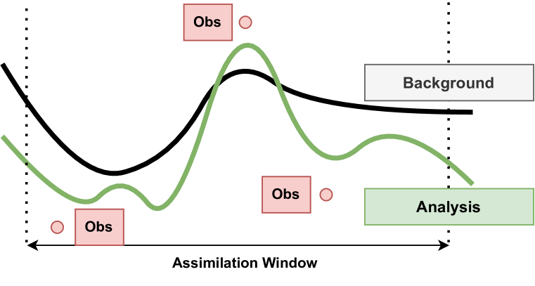

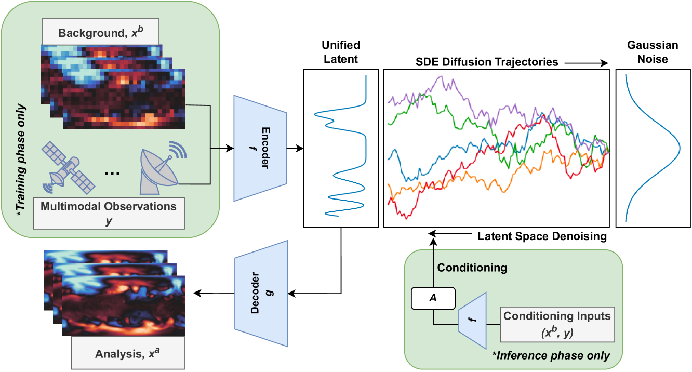

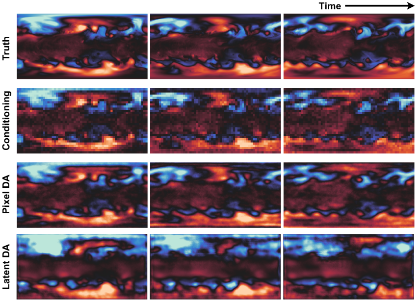

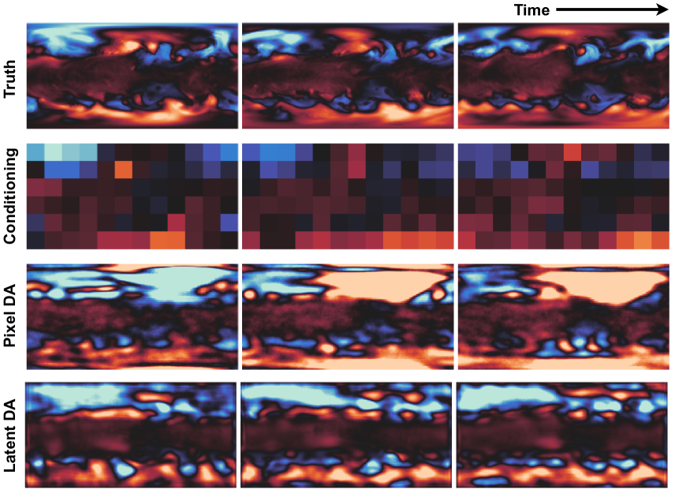

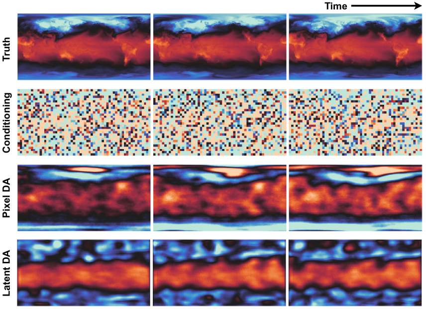

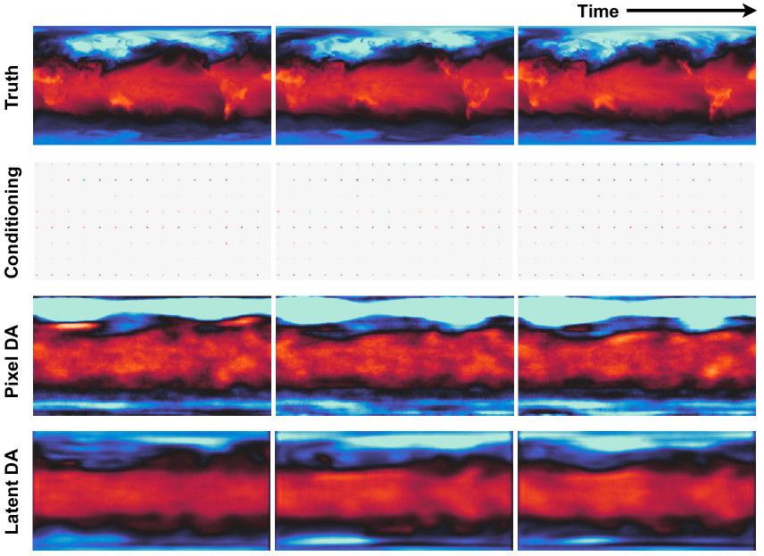

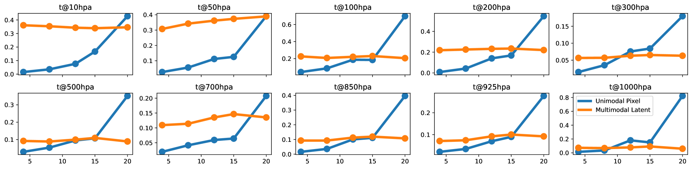

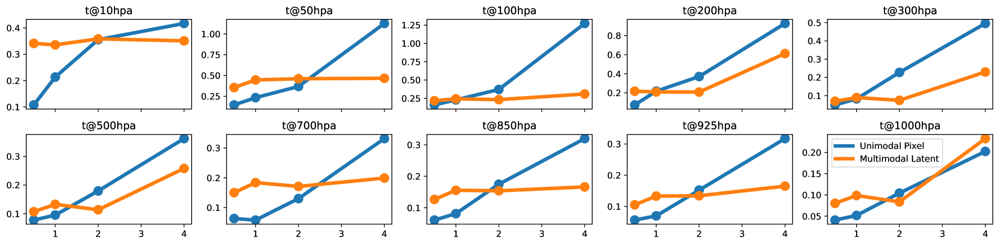

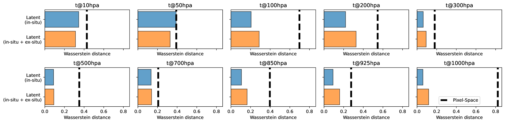

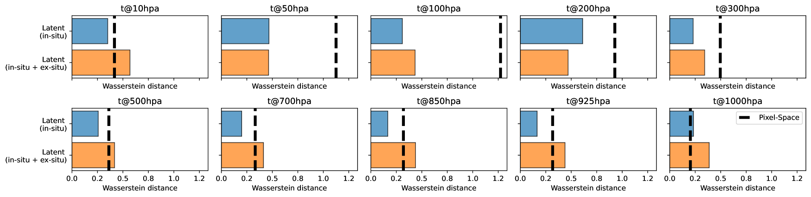

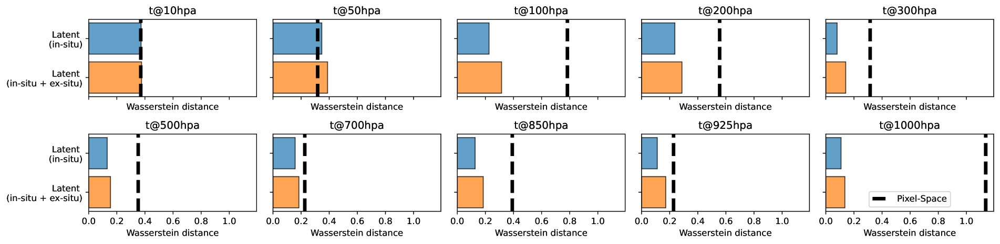

[Arxiv](https://arxiv.org/abs/2404.06665)