# 大象记忆力惊人，这篇文章探讨了大型语言模型如何记忆和学习表格数据。

发布时间：2024年04月09日

`LLM应用` `数据分析` `机器学习`

> Elephants Never Forget: Memorization and Learning of Tabular Data in Large Language Models

# 摘要

> 虽然大型语言模型（LLMs）的多任务应用潜力被广泛认可，但数据污染和记忆化的问题却鲜少受到关注。本研究针对表格数据的这一隐患进行了深入探讨。我们采用了多种创新方法，以判断LLMs在训练过程中是否接触过特定的表格数据集。研究结果令人瞩目，LLMs竟能逐字复现众多知名表格数据集。进一步的对比实验显示，LLMs对训练中接触过的数据集有更好的学习表现，这暗示了记忆化可能引起过拟合现象。然而，它们在未见过的新型数据集上同样能展现不俗的性能，并且对数据变化具备出人意料的适应力。此外，我们还探索了LLMs在无需微调情况下的上下文统计学习能力，发现其实力有所局限，这意味着在新数据集上的学习表现很大程度上得益于其积累的世界知识。我们的发现强调了在预训练阶段检验LLM是否已接触过评估数据集的必要性。相关测试工具现已集成至tabmemcheck Python包，开源于https://github.com/interpretml/LLM-Tabular-Memorization-Checker，供大家使用。

> While many have shown how Large Language Models (LLMs) can be applied to a diverse set of tasks, the critical issues of data contamination and memorization are often glossed over. In this work, we address this concern for tabular data. Specifically, we introduce a variety of different techniques to assess whether a language model has seen a tabular dataset during training. This investigation reveals that LLMs have memorized many popular tabular datasets verbatim. We then compare the few-shot learning performance of LLMs on datasets that were seen during training to the performance on datasets released after training. We find that LLMs perform better on datasets seen during training, indicating that memorization leads to overfitting. At the same time, LLMs show non-trivial performance on novel datasets and are surprisingly robust to data transformations. We then investigate the in-context statistical learning abilities of LLMs. Without fine-tuning, we find them to be limited. This suggests that much of the few-shot performance on novel datasets is due to the LLM's world knowledge. Overall, our results highlight the importance of testing whether an LLM has seen an evaluation dataset during pre-training. We make the exposure tests we developed available as the tabmemcheck Python package at https://github.com/interpretml/LLM-Tabular-Memorization-Checker

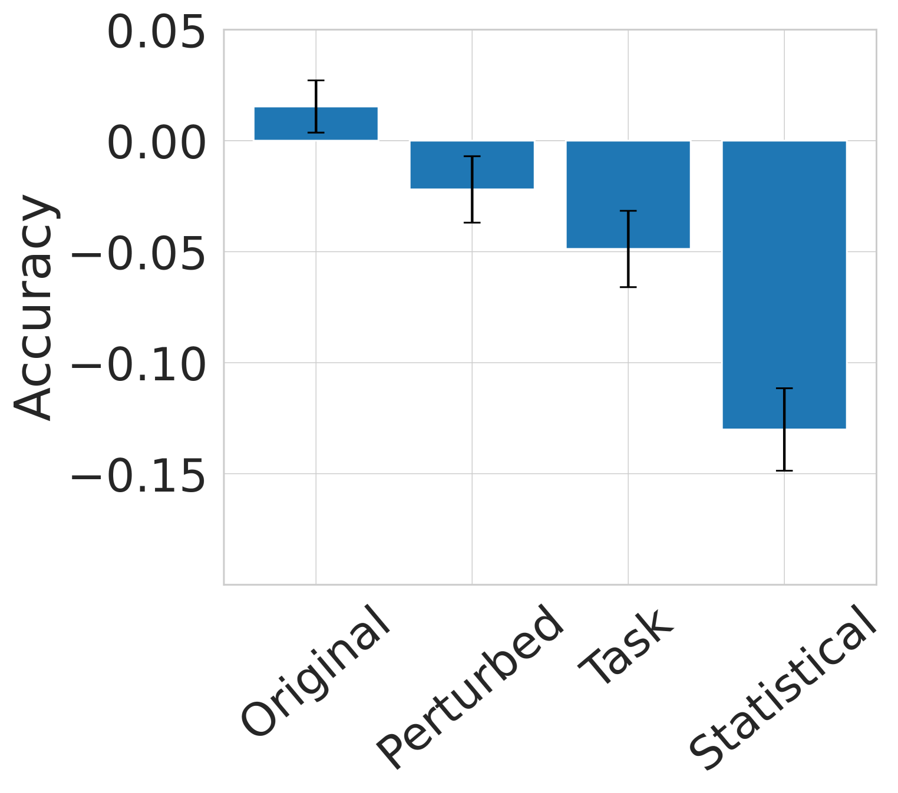

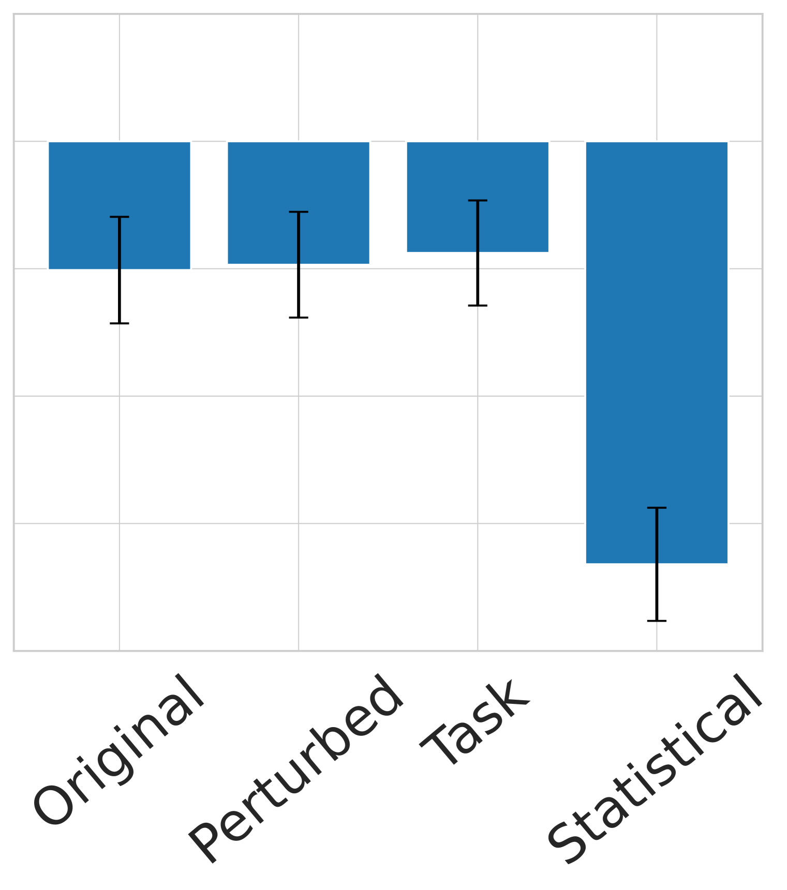

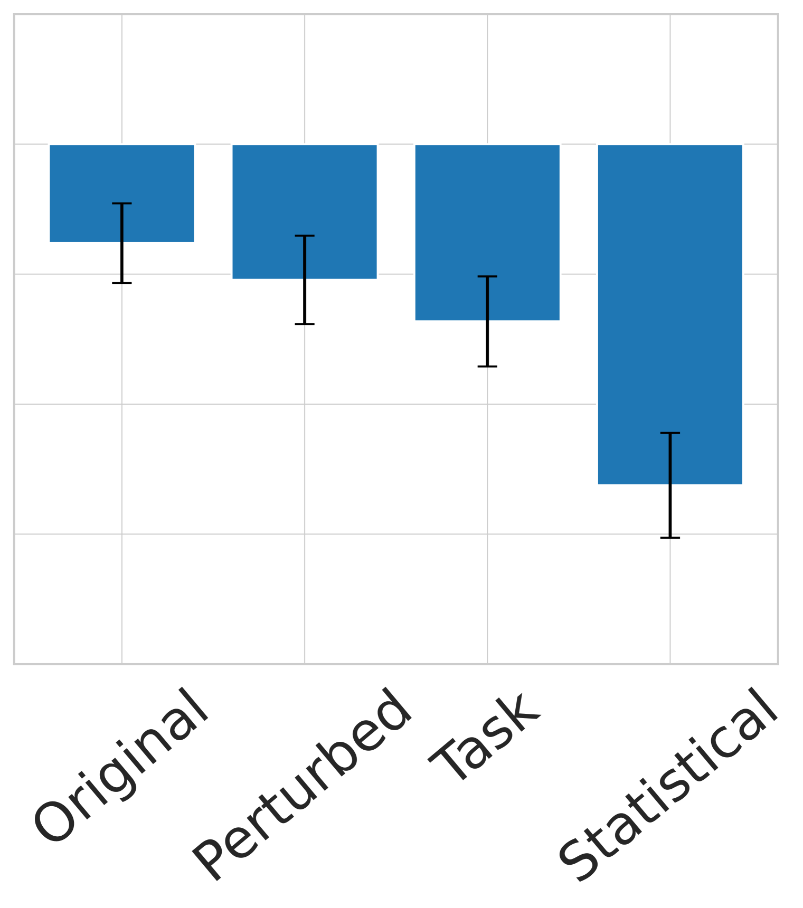

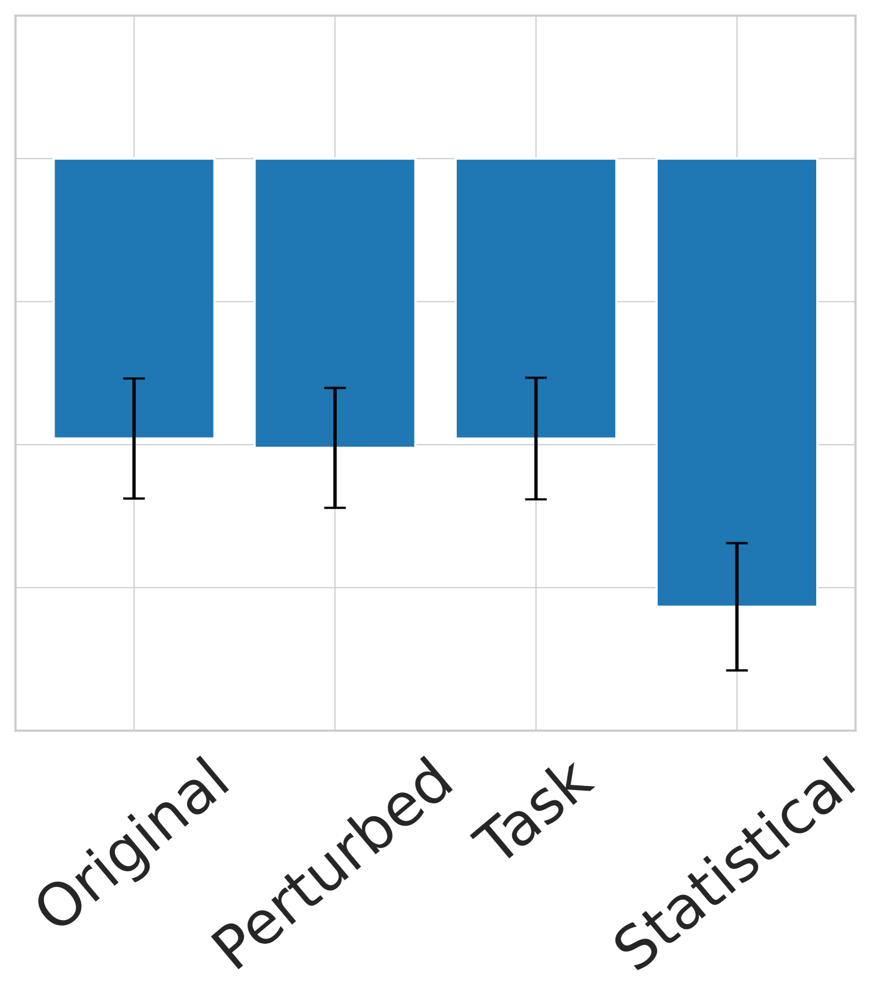

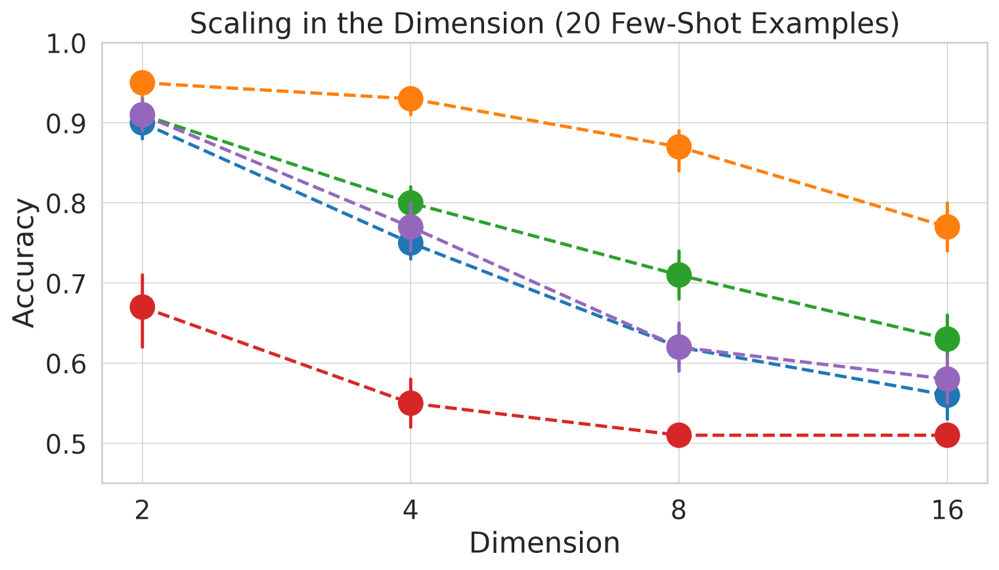

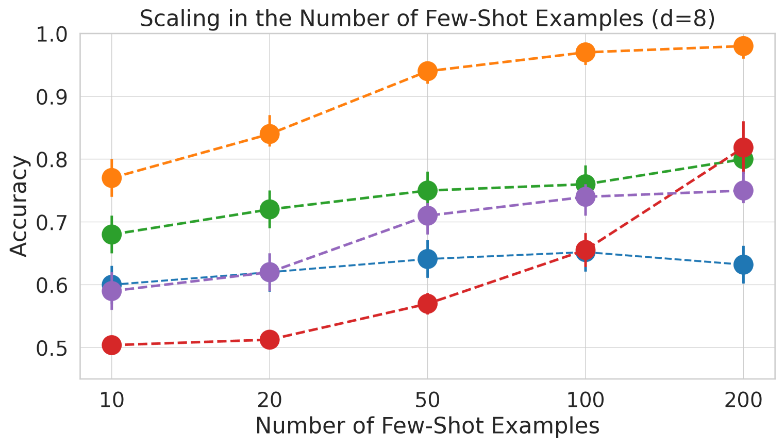

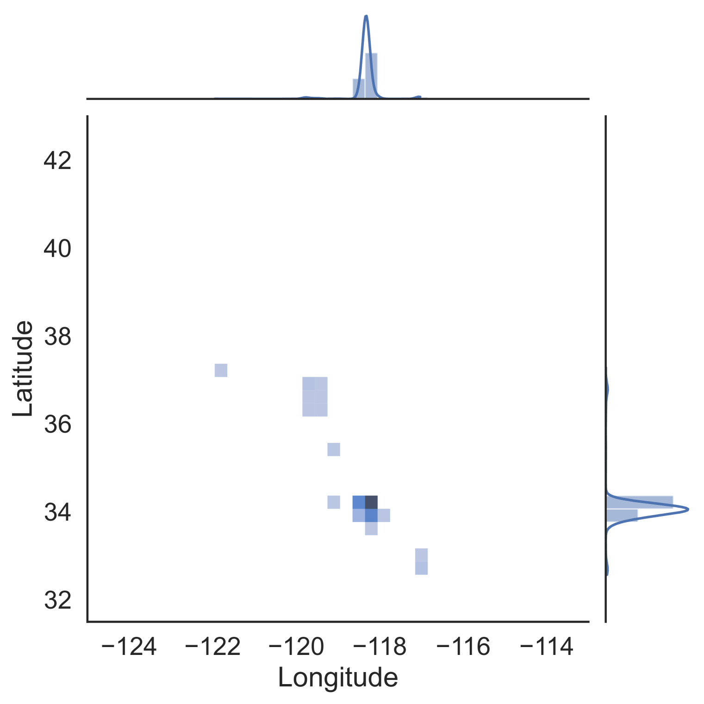

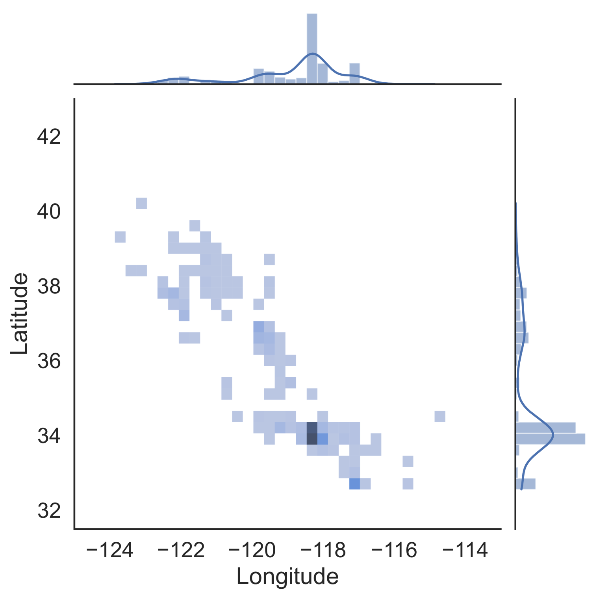

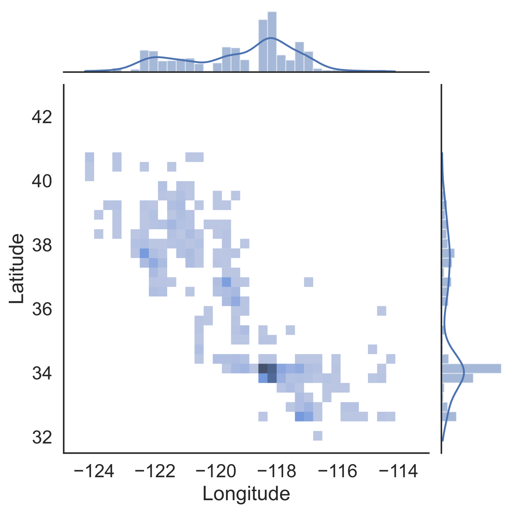

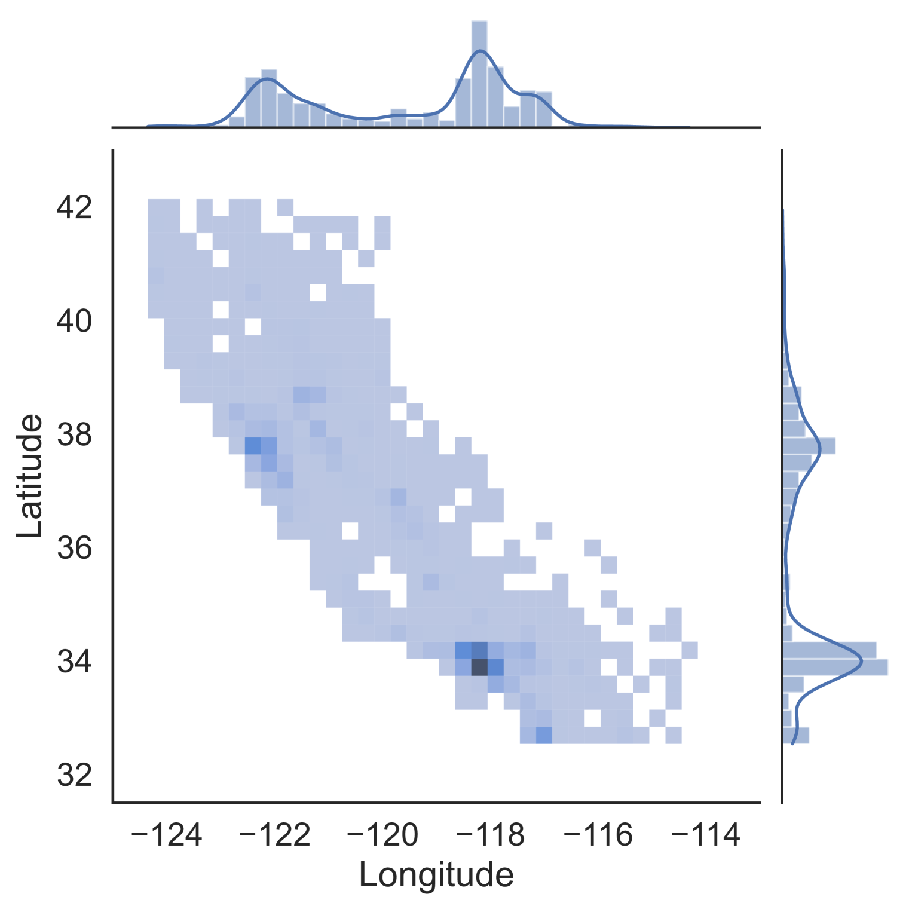

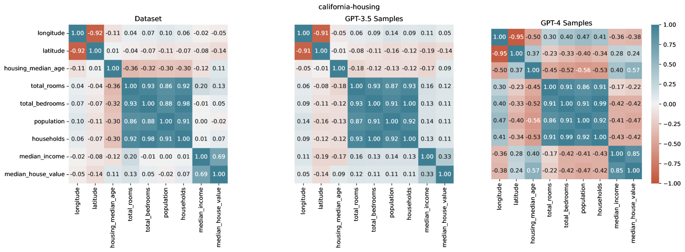

[Arxiv](https://arxiv.org/abs/2404.06209)