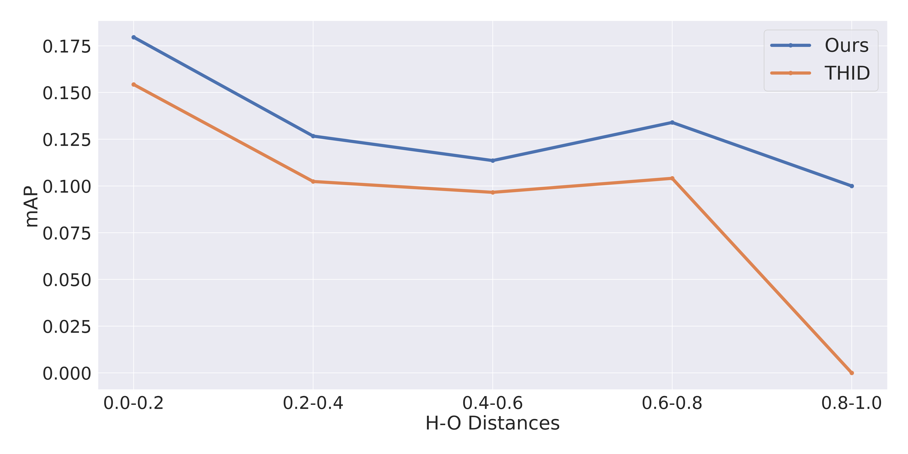
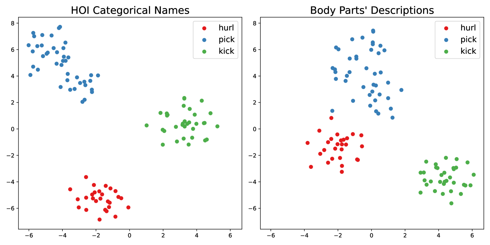
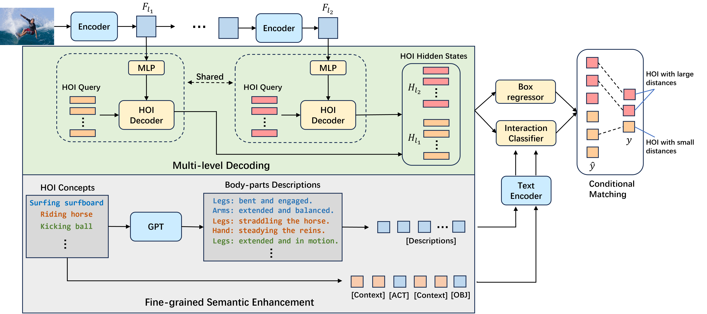
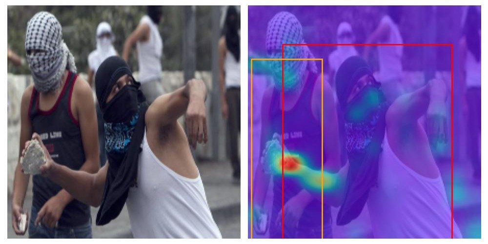
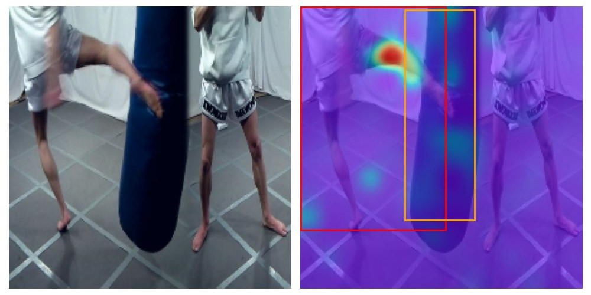

# 本研究旨在挖掘大型基础模型在开放词汇表人体姿态识别（HOI）检测中的应用潜力。

发布时间：2024年04月09日

`LLM应用` `计算机视觉`

> Exploring the Potential of Large Foundation Models for Open-Vocabulary HOI Detection

# 摘要

> 开放词汇的人体-物体交互（HOI）检测，旨在通过自然语言指引发现新的交互，这对洞悉人类主导场景极为关键。但传统的零样本HOI检测器常使用统一的特征图级别处理不同距离的交互，效果不尽人意。它们过于依赖类别名称，忽略了语言丰富的上下文信息，这对于捕捉开放词汇概念不可或缺。本研究提出了一种创新的端到端检测框架CMD-SE，借助视觉-语言模型（VLMs）的力量，为不同距离的人体-物体对采用不同级别的特征图建模，并在匹配过程中引入软约束。利用GPT等大型语言模型的世界知识，生成人体部位状态描述，进而整合这些语义信息，提升交互识别准确度。在SWIG-HOI和HICO-DET数据集上的实验显示，该方法在开放词汇HOI检测领域达到新高度。相关代码和模型已在https://github.com/ltttpku/CMD-SE-release发布。

> Open-vocabulary human-object interaction (HOI) detection, which is concerned with the problem of detecting novel HOIs guided by natural language, is crucial for understanding human-centric scenes. However, prior zero-shot HOI detectors often employ the same levels of feature maps to model HOIs with varying distances, leading to suboptimal performance in scenes containing human-object pairs with a wide range of distances. In addition, these detectors primarily rely on category names and overlook the rich contextual information that language can provide, which is essential for capturing open vocabulary concepts that are typically rare and not well-represented by category names alone. In this paper, we introduce a novel end-to-end open vocabulary HOI detection framework with conditional multi-level decoding and fine-grained semantic enhancement (CMD-SE), harnessing the potential of Visual-Language Models (VLMs). Specifically, we propose to model human-object pairs with different distances with different levels of feature maps by incorporating a soft constraint during the bipartite matching process. Furthermore, by leveraging large language models (LLMs) such as GPT models, we exploit their extensive world knowledge to generate descriptions of human body part states for various interactions. Then we integrate the generalizable and fine-grained semantics of human body parts to improve interaction recognition. Experimental results on two datasets, SWIG-HOI and HICO-DET, demonstrate that our proposed method achieves state-of-the-art results in open vocabulary HOI detection. The code and models are available at https://github.com/ltttpku/CMD-SE-release.

[Arxiv](https://arxiv.org/abs/2404.06194)