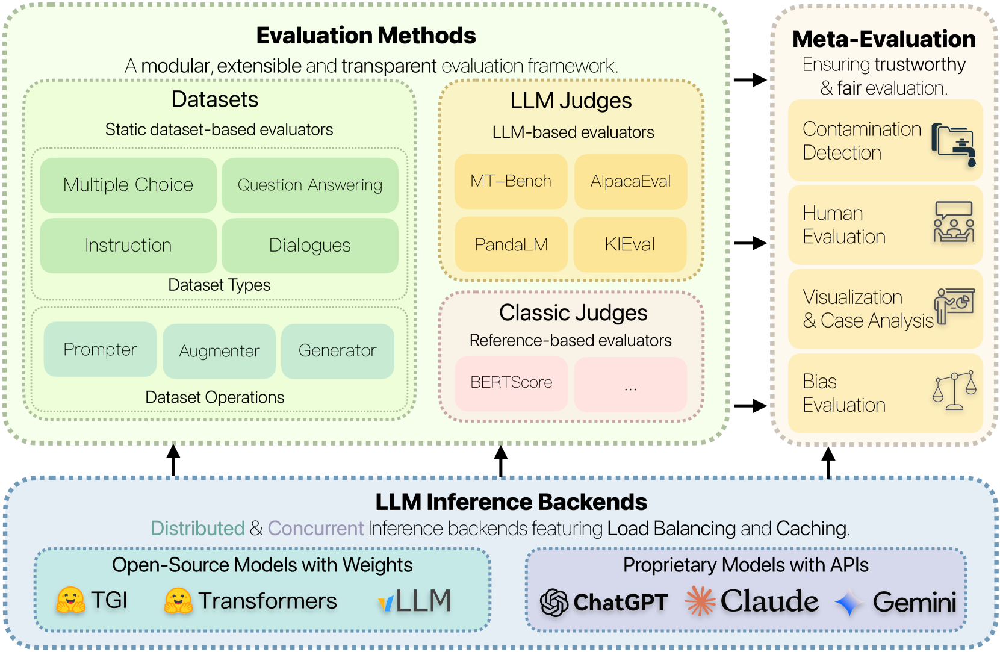
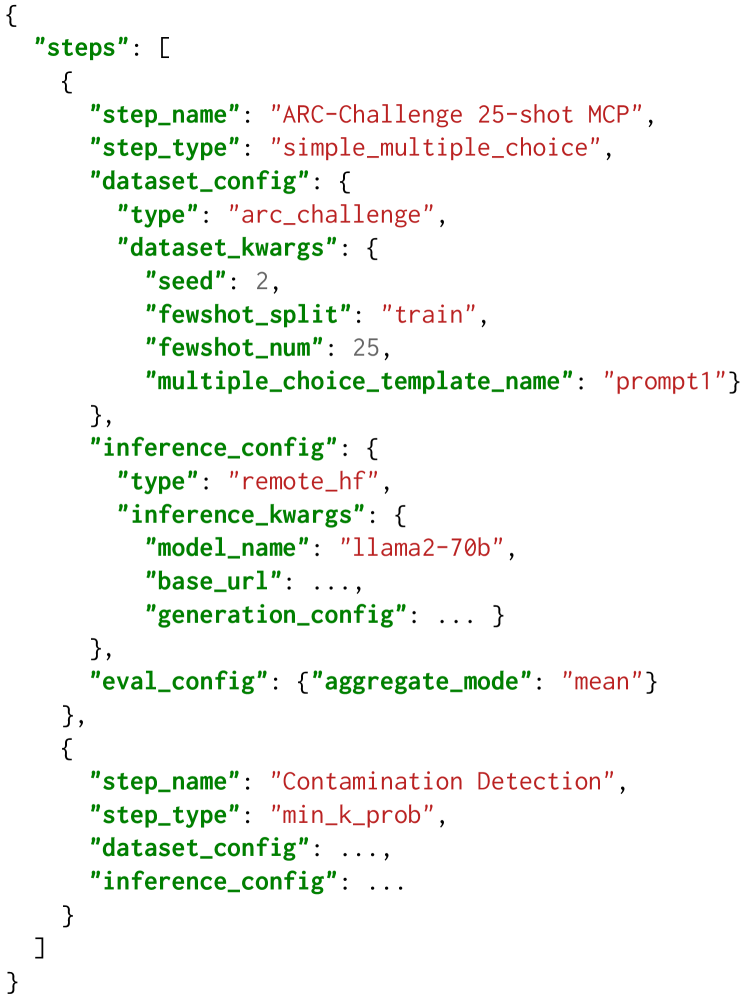
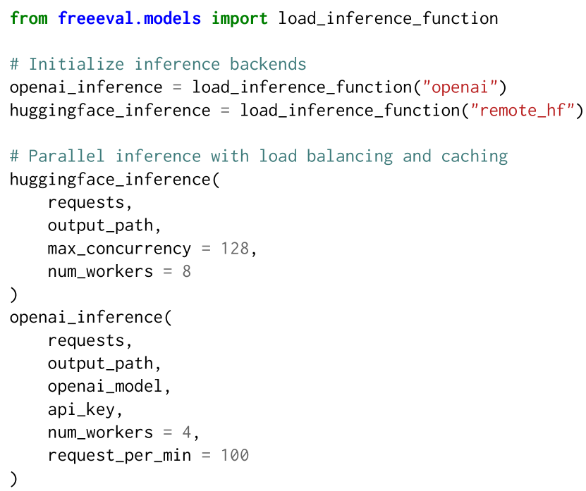

# FreeEval 是一个模块化的评估框架，旨在为大型语言模型提供可靠和高效的评估方法。

发布时间：2024年04月09日

`LLM理论` `自动评估` `大型语言模型
</example>`

> FreeEval: A Modular Framework for Trustworthy and Efficient Evaluation of Large Language Models

# 摘要

> 随着大型语言模型（LLM）评估方法和数据集的迅猛发展，我们面临着一个重大挑战：如何以成本效益的方式整合尖端评估技术，同时确保评估的可靠性、可重复性和高效性。目前，尚没有一个统一且具有适应性的框架能够无缝地融合多样的评估方法。此外，评估结果的可信度常常因为数据污染的潜在问题而受到质疑，而在处理LLM推理所带来的高昂成本时，评估的效率往往被忽略。为了解决这些问题，我们推出了FreeEval，这是一个模块化、可扩展的框架，致力于提供可信赖且高效的LLM自动评估。FreeEval通过统一的抽象概念简化了评估方法的整合，并提高了透明度，涵盖了需要复杂LLM交互的动态评估。框架还融入了元评估技术，例如人类评估和数据污染检测，这些与平台内的动态评估模块相结合，增强了评估结果的公正性。此外，FreeEval采用高性能基础设施设计，包括分布式计算和缓存策略，使其能够在多节点、多GPU集群上对开源和专有的LLM进行全面评估。

> The rapid development of large language model (LLM) evaluation methodologies and datasets has led to a profound challenge: integrating state-of-the-art evaluation techniques cost-effectively while ensuring reliability, reproducibility, and efficiency. Currently, there is a notable absence of a unified and adaptable framework that seamlessly integrates various evaluation approaches. Moreover, the reliability of evaluation findings is often questionable due to potential data contamination, with the evaluation efficiency commonly overlooked when facing the substantial costs associated with LLM inference. In response to these challenges, we introduce FreeEval, a modular and scalable framework crafted to enable trustworthy and efficient automatic evaluations of LLMs. Firstly, FreeEval's unified abstractions simplify the integration and improve the transparency of diverse evaluation methodologies, encompassing dynamic evaluation that demand sophisticated LLM interactions. Secondly, the framework integrates meta-evaluation techniques like human evaluation and data contamination detection, which, along with dynamic evaluation modules in the platform, enhance the fairness of the evaluation outcomes. Lastly, FreeEval is designed with a high-performance infrastructure, including distributed computation and caching strategies, enabling extensive evaluations across multi-node, multi-GPU clusters for open-source and proprietary LLMs.

[Arxiv](https://arxiv.org/abs/2404.06003)